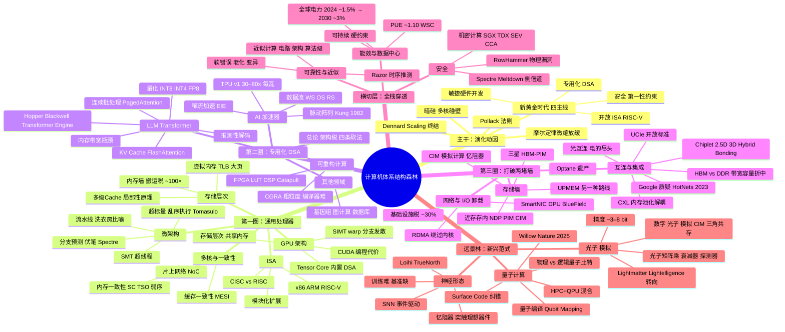

## 计算机体系结构「森林导览」

> 一篇面向研一新生的计算机体系结构综述——「地图式」体例：每章先讲这条分支解决什么问题、核心张力是什么，再点锚点文献。证据分级：奠基★ / 必读★★ / 有争议† / 推测性⚠。

---

### 目录

- [1.1 引言与动机](#11-引言与动机)
- [1.2 量化方法学：看懂性能数字](#12-量化方法学看懂性能数字)
- [2.1 指令集架构（ISA）](#21-指令集架构isa)
- [2.2 微架构](#22-微架构)
- [2.3 存储层次](#23-存储层次)
- [2.4 多核、一致性与片上互连](#24-多核一致性与片上互连)
- [2.5 数据并行与 GPU 架构](#25-数据并行与-gpu-架构)
- [3.1 领域专用架构总论](#31-领域专用架构总论)
- [3.2 AI / 深度学习加速器](#32-ai--深度学习加速器)
- [3.3 LLM / Transformer 加速](#33-llm--transformer-加速)
- [3.4 可重构计算](#34-可重构计算)
- [3.5 其他领域加速](#35-其他领域加速)
- [4.1 近存 / 存内计算](#41-近存--存内计算)
- [4.2 新型存储与内存解耦](#42-新型存储与内存解耦)
- [4.3 互连与集成：Chiplet 与先进封装](#43-互连与集成chiplet-与先进封装)
- [4.4 网络与 I/O 卸载：SmartNIC 和 DPU](#44-网络与-io-卸载smartnic-和-dpu)
- [5.1 微架构安全](#51-微架构安全)
- [5.2 可靠性与近似计算](#52-可靠性与近似计算)
- [5.3 能效与数据中心](#53-能效与数据中心)
- [6.1 神经形态计算](#61-神经形态计算)
- [6.2 量子计算体系结构](#62-量子计算体系结构)
- [6.3 光子 / 模拟计算](#63-光子--模拟计算)
- [7.1 趋势综合](#71-趋势综合)
- [7.2 研一学习路线图](#72-研一学习路线图)

---

### 森林全图



> **图例**：这张思维导图是整本综述的「一张纸地图」——每一片叶子对应一节正文。森林最内圈（第一圈）是通用处理器，往外一圈（第二圈）是专用化，再往外（第三圈）是打破存储墙和互连墙，最外圈是远景林。横切层穿过所有圈。读完正文后回到这张图，你可以在每一片叶子旁边补上一句「它要解决的墙是什么」。

---

## 1.1 引言与动机

### 你要带走的一句话

> **通用处理器的「免费午餐」吃完了。不是一项技术，而是四重天花板（频率、功耗、暗硅、微缩）同时压下来——体系结构被迫重新发明自己。**

---

### 一条逐级跌落的曲线

打开任何一本计算机体系结构教材的第一章，你大概率会看到一张图——过去四十年里单线程性能的年增长率曲线。它不是一条平滑的下降线，而是逐级跌落的阶梯：

| 时间段 | 单线程性能年增长率 |
|--------|-------------------|
| 1986 – 2003 | **~52%** |
| 2003 – 2011 | **~23%** |
| 2011 – 2015 | **~12%** |
| 2015 至今 | **~3.5%** |

> 数据来源：Hennessy & Patterson, *Computer Architecture: A Quantitative Approach* 第 6 版, 图 1.1

52% 的年增长率意味着什么？每两年性能翻一倍——你大一时买的电脑，到大四时已经慢了四倍。这个速度持续了将近二十年，不管是写程序的人还是做芯片的人，都习惯了「下一代自然就更快了」。不需要改代码，不需要学新架构——等着就行。

然后它停了。

不是一次突然的崩溃，而是一级一级地往下掉：先掉到 23%，再掉到 12%，最后在 2015 年前后跌到每年 3.5%——大致等于通货膨胀率。换句话说，**如果只看单线程性能，你今天买的新电脑，跑单线程程序大概只比五年前的快不到 20%。**

这条曲线是整篇综述存在的理由。如果那根 52% 的线一直往上走，我们不需要专用加速器，不需要存内计算，不需要 Chiplet——通用 CPU 自己就能把所有问题搞定。所以在你进入任何新技术分支之前，先把这张图刻在脑子里。后面的每一章，都是在回答「既然通用 CPU 不行了，那什么行」。

---

### 摩尔定律的真相：两个容易搞混的东西

「摩尔定律死了」这句话你在各种地方都听过。但这句话同时包含两个不同的意思，混在一起就会误判。

**摩尔定律（Moore's Law）**说的是：芯片上晶体管的数量每隔大约两年翻一倍。这条曲线到今天还在（缓慢地）继续——2026 年的最新 GPU 上晶体管数量已突破数千亿（NVIDIA Blackwell B200 单芯片约 2080 亿），戈登·摩尔 1965 年预测的时候，一个芯片上只有 64 个。

**Dennard scaling（登纳德缩放定律）**说的是另一件事：当晶体管尺寸缩小到原来的 1/K，电压和电流也按比例缩小，结果是**同一块硅面积的功耗保持不变，但晶体管数量翻了 K² 倍，每个晶体管还快了 K 倍**。Robert Dennard 在 1974 年提出的这条定律，才是真正的「免费午餐」——工艺缩小的同时，芯片自动变得更密、更快、还不更费电。

摩尔定律管的是「能塞进多少晶体管」；Dennard scaling 管的是「塞进去之后能不能跑得更快、会不会烧掉」。

**Dennard scaling 大约在 2004–2005 年终结了。** 原因是物理上的：当晶体管缩小到纳米级，漏电流（leakage current）不再能忽略——即使晶体管「关着」，也有电流漏过去。阈值电压不能再跟着缩小，否则漏电流会让芯片的静态功耗吃到不可接受。

这就是那条跌落曲线的根源。频率上不去了——不是因为不知道怎么设计更高频的电路，而是因为**再高频就要烧掉了**。

> **本节关键区分**：摩尔定律（晶体管密度）还在缓慢继续。Dennard scaling（同功耗下自动变快）在 2004–2005 年死了。一个还活着，一个已经死了二十年——但「摩尔定律死了」这句话常常把两个混在一起说。

---

### 暗硅：为什么多核也碰了壁

频率上不去，最自然的转向是什么？**多核。** 一个核跑不到 5GHz，那就放四个核、每个跑 2.5GHz——加起来的吞吐量一样。

这确实管用了几年。从 2005 到 2011 年前后，CPU 的核数从单核变成双核、四核、八核。但很快，多核也撞上了同一堵墙——功耗。

这里有一个只用一句话就能理解的关键洞察，叫做 **Pollack 法则（Pollack's Rule）**：**处理器的性能大致正比于其面积的平方根。** 换成人话：把单核的面积翻倍，你只能拿到约 1.4 倍的性能提升。剩下的面积花在了更宽的超标量发射、更大的乱序窗口、更复杂的分支预测器上——这些都会吃功耗。所以把一个大核拆成两个小核，理论上可以用同样的功耗拿到更高的吞吐——这就是多核时代的理论基础。

但 Polack 法则也提供了一个反面推论：如果继续堆核数，每个核能分到的功耗预算越来越小，总有一个点，**一部分晶体管必须同时处于关闭状态——因为你没有足够的功耗预算把它们全点亮。**

Esmaeilzadeh 等人在 2011 年的 ISCA 会议上给这种现象起了个名字：**暗硅（Dark Silicon）**。他们用实测数据做了推演，得出的结论相当直接：

> 在 22nm 工艺节点，约 21% 的芯片面积必须是「暗的」（不能同时工作）；到 8nm 节点，这个比例**超过 50%**。保守工艺缩放下，跨多种基准测试的几何平均加速比在 8nm 只有 **约 7.9 倍**，而理想情况应该是 **约 32 倍**。

> Esmaeilzadeh et al., "Dark Silicon and the End of Multicore Scaling", ISCA 2011, DOI: 10.1145/2000064.2000108. 数据出自正文关键曲线与加速比分析。

翻译成人话：即使晶体管的数量还在按摩尔定律增长，你**有超过一半的晶体管根本没法同时通电**，因为它们全开的话芯片的功耗会超过散热系统的极限。继续堆核数不能线性地给你带来性能——多核时代也碰到了自己的天花板。

暗硅的核心信息不是「晶体管浪费了」，而是更深的一层：**工艺可以继续给你更多晶体管，但这些晶体管在能效约束下没法全用来做通用计算。它们必须被用来做别的事——或者不做。** 「做别的事」就是我们后面 Part III 要讲的专用化；「不做」就是继续推高暗硅比例。

---

### 体系结构的回应：四条出路

面对三重天花板——频率（Dennard 终结）、功耗（暗硅）、微缩（摩尔放缓）——计算机体系结构社区并没有坐以待毙。2017 年的图灵奖授予了 John Hennessy 和 David Patterson，他们在获奖演讲中画了一张地图。这篇后来发表在 *Communications of the ACM*（2019）上的文章，标题就叫「计算机体系结构的新黄金时代」（A New Golden Age for Computer Architecture），提出了四条主线：

> Hennessy & Patterson, "A New Golden Age for Computer Architecture", *Communications of the ACM*, Vol. 62, No. 2, pp. 48–60, 2019, DOI: 10.1145/3282307. 这篇全文不到 10 页，是研一新生进入这个领域最应该先读的文章——它不教技术，它教你「为什么要做这些技术」。

**第一条：专用化（Domain-Specific Architectures, DSA）。** 既然通用处理器在有限功耗预算内做不了所有事，那就为特定领域设计专用芯片——砍掉不需要的指令、不需要的 Cache 逻辑、不需要的乱序调度，把省下的功耗全花在真正重要的计算上。TPU（Google 的张量处理器）是最知名的案例：它只做矩阵乘法加速这一件事，但在这一件事上的每瓦性能是同期 CPU 的 30–80 倍。这是我们 Part III 要讲的故事。

**第二条：开放指令集架构（Open ISA）。** 如果专用化意味着要为每个领域设计不同的芯片，那么芯片设计的门槛必须大幅降低。RISC-V 的出现从根本上改变了游戏规则——它是一套「开放源代码」的指令集，不需要向任何公司付授权费，任何人都可以在此基础上设计自己的处理器。这是我们 Part II 的 2.1 节要展开的故事。

**第三条：敏捷硬件开发（Agile Hardware Development）。** 芯片设计传统上是一个极其缓慢的流程——从 RTL 设计到流片到验证，一个芯片从开始设计到拿到硅片往往需要 12–24 个月。如果把现代软件工程的方法论（持续集成、模块化测试、快速原型）搬到硬件设计上，这个周期可以大幅缩短——而这正是专用化路线的使能器：如果造一个专用芯片的成本和时间降到和「写一个大软件项目」差不多，专用化就真的变成可行的策略了。

**第四条：安全（Security）。** 计算机体系结构在历史上从未把安全作为第一性设计目标——分支预测器、Cache、乱序调度这些结构的出发点全是性能。2018 年的 Spectre 和 Meltdown 把这一切打翻了：性能优化本身成了安全漏洞的通道。从此以后，体系结构的设计必须在「快」和「安全」之间做显式的折中。这是我们 Part V 要讲的故事。

---

### 这篇综述不是百科全书——是一张森林地图

上面讲了一大堆问题，你可能已经觉得信息量很大了。在这篇综述正式开始之前，先给你一张「不迷路」的结构图。

把这本综述想象成一张**年轮地图**：

- **最内圈（Part II：通用处理器的演化）**——CPU、Cache、多核、GPU。这是过去四十年体系结构的「主战场」。我们不讲课本——我们讲「每棵树碰到了哪堵墙」，所以你知道为什么需要往外走。

- **第二圈（Part III：专用化浪潮）**——DSA、AI 加速器、LLM 推理优化、可重构计算。这是在回答「通用行不通了，专用怎么赢」。

- **第三圈（Part IV：打破存储墙与互连墙）**——近存/存内计算、CXL 内存解耦、Chiplet、DPU/SmartNIC。这是在问「数据和计算离得那么远——能不能搬到一起去」。

- **最外层——横切（Part V）和远景（Part VI）**。横切（安全、可靠性、能效）穿过所有圈层。远景（神经形态、量子、光子）可能十年后才长成大树——也可能长歪。我们诚实告诉你现在走到哪了。

读完这篇综述，你应该不是「学完了一本体系结构教材」，而是「脑子里有了一张地图」——你知道每个研究方向在森林里的什么位置，知道它们各自要解决什么问题、碰到了什么墙、下一堵墙在哪。我们出发。

---

### 本节锚点文献

| 文献 | 证据等级 | 为什么读 |
|------|----------|---------|
| Hennessy & Patterson, "A New Golden Age for Computer Architecture", *Communications of the ACM*, Vol. 62, No. 2, pp. 48–60, 2019, DOI: 10.1145/3282307 | ★ 奠基 | 整篇综述的「序言」。不到 10 页，研一直接读。它告诉你这个领域为什么在现在重新热闹起来 |
| Esmaeilzadeh et al., "Dark Silicon and the End of Multicore Scaling", ISCA 2011, DOI: 10.1145/2000064.2000108 | ★ 奠基 | 「暗硅」的原始论文。不需要读完——摘要 + 3.1–3.3 节的曲线和数据就够 |
| Rupp, "Microprocessor Trend Data"（GitHub 仓库，标题可能已更新至 "50 Years of Microprocessor Trend Data"） | ⚠ 数据源 | 不是学术文献——是一个维护了多年的 CPU 性能与晶体管趋势数据集，可用来验证或绘制文中的性能跌落曲线。标注 ⚠ 因为它是数据集而非同行评议文献 |

### 证据链

| 断言 | 证据来源 | 证据强度 |
|------|----------|---------|
| 「Dennard scaling 约 2004–2005 年终结」 | Hennessy & Patterson 2019, §2 + H&P CQA 6th ed., Ch.1 | 领域共识，无争议 |
| 「单线程性能四阶段跌落（52%→23%→12%→3.5%）」 | H&P CQA 6th ed., Fig. 1.1 | 教材级权威数据 |
| 「8nm 节点暗硅超过 50%，实际加速仅 ~7.9x / 理想 ~32x」 | Esmaeilzadeh et al. 2011, 正文关键曲线与加速比分析 | 单一研究，核心结论被后续工作多次验证 |
| 「专用化可在能效上提升至 30-80x（视工作负载）」 | H&P 2019, §3 + H&P CQA 6th ed., Ch.7 + TPU 实测数据 | 多案例总结，非精确公式——量级可信 |

### 下一步

读完这一节，你应该已经知道「为什么体系结构现在这么热闹」。但还有一个问题没解决：**你说 A 架构比 B 架构好，你怎么衡量「好」？** 1.2 节会给你一套贯穿全篇的量化工具——Amdahl 定律、Roofline 模型、基准测试——它们是你在森林里不会迷路的「指南针」。

---

## 1.2 量化方法学：看懂性能数字

### 你要带走的一句话

> **衡量计算机快不快，不是看一个数字，而是看三样东西：多快完成一件事（延迟）、同时能做多少事（吞吐）、每焦耳能量能做多少有用功（能效）。Roofline 把这三者的关系画在一张图里——后面几乎每一章你都会反复看到它。**

---

### 不要相信直觉

先看一个让很多大一新生困惑的问题：

> 「这台 CPU 主频 4.0GHz，那台 3.5GHz，所以 4.0GHz 的更快——对吧？」

不一定的。因为 CPU 每个时钟周期能完成多少工作——这个量叫 **IPC（Instructions Per Cycle，每周期指令数）**——取决于微架构的设计。一台 3.5GHz 的 CPU 如果每周期能完成 3 条指令，实际吞吐是 10.5G 指令/秒；一台 4.0GHz 的 CPU 如果每周期只能完成 2 条指令，实际吞吐是 8G 指令/秒——**主频更高，反而更慢。**

这就是为什么我们需要一套量化的「尺子」。不是模糊地说「A 比 B 快」，而是精确地说「A 比 B 在某某指标上快几倍、代价是什么」。后面你会在每一章里看到不同架构之间的比较——TPU 比 GPU 每瓦性能高多少、HBM 比 DDR 带宽大多少、RDMA 比 TCP 延迟低多少——这些比较之所以有意义，是因为它们都站在同一套「度量衡」上。这一节就是建立这套度量衡。

---

### 性能的三张面孔：延迟、吞吐、能效

**延迟（Latency）**回答的是「完成一件事要多久」。你去银行柜台办业务，从坐下到办完起身，这中间的时长就是延迟。单位是时间——微秒（µs）、毫秒（ms）、或者用 CPU 的周期数（cycles）。

**吞吐（Throughput）**回答的是「单位时间内能做多少事」。银行一小时能服务多少位顾客，就是吞吐。单位是「每单位时间的操作数」——指令/秒、帧/秒、请求/秒。

**能效（Energy Efficiency）**回答的是「每焦耳能量能做多少有用功」。单位是 FLOPS/Watt（每瓦特每秒浮点运算次数）或 TOPS/Watt（每瓦特每秒万亿次运算）。**在今天，这是最重要的数字**——不是因为电费贵，而是因为芯片的散热能力有硬上限。你在后面会反复看到这个逻辑：不是「多花电费就能更快」，而是「电费花超了芯片直接烧了」。

一个经典的直观比喻：**地铁 vs. 高铁。**

- **地铁**：一趟车能装几百人（高吞吐），但每个人在城市里从 A 点到 B 点可能要花一小时（高延迟）。
- **高铁**：一趟车装的人少得多（低吞吐），但每个人到达目的地的绝对时间更短（低延迟）。

计算机里也是这样：GPU 像一个地铁系统——一次处理大量数据，但每个具体操作从发起到完成的时间并不短。CPU 像一个专车——每条指令的延迟极低，但单位时间能处理的数据总量远不及 GPU。

**真正的权衡不在于「吞吐和延迟谁更重要」，而在于你的应用关心哪一个。** 一个实时控制系统（如自动驾驶的碰撞检测）关心延迟——结果必须在 10ms 内出来，晚一毫秒就是事故。一个批处理系统（如视频转码）关心吞吐——一小时能转多少部电影比每一帧的处理延迟重要得多。

---

### Amdahl 定律：并行加速有天花板

如果一台计算机有 n 个处理器核，直觉告诉你它可以快 n 倍——对吧？Gene Amdahl 在 1967 年用一个简洁的公式证明了这个直觉是错的。

假设你的程序里有一部分必须串行执行（比如读输入文件、初始化数据结构），这部分占比是 *s*（0 ≤ *s* ≤ 1）。剩下的 (1 − *s*) 可以完全并行化。那么使用 n 个处理器核后，整体的加速比是：

> **加速比 = 1 / [ s  +  (1−s)/n ]**

当 n → ∞ 时，加速比的极限是 **1/s**。

这意味着什么？即使你有一百万个处理器核，如果你的程序只有 90% 可以并行——串行部分占比 *s* = 0.1——你的加速比永远不会超过 **10 倍**。如果串行部分占 1%（这已经是非常好的并行程序了），天花板就是 100 倍。

**Amdahl 定律的核心洞察不是「并行没用」，而是「串行部分决定了并行收益的硬上限」。** 这个洞察在后面会反复出现：2.4 讲多核、2.5 讲 GPU 分支发散、3.1 讲 DSA 能效时——底层都有 Amdahl 的影子。

#### Gustafson 定律：同一个公式，不同的假设

John Gustafson 在 1988 年给出了一个相反的视角。他指出，在实际的科学计算中，问题规模会随着可用算力增长而增长——你不会用 1000 个核去算 100 个数据点，而是会用它们算 1,000,000 个数据点。在这种设定下，串行部分的比例 *s* 随问题规模增大而被「稀释」，加速比可以接近 n。

用现代术语来说：
- **Amdahl 定律 = 强扩展（Strong Scaling）**：固定问题规模，增加处理器数，看快了多少。
- **Gustafson 定律 = 弱扩展（Weak Scaling）**：固定每个处理器的工作量，增加处理器数同时增大问题规模。这在 GPU 编程（2.5）和数据中心规模计算（5.3）中是最常用的概念。

两套定律讨论的是同一个公式，但 Amdahl 假设「任务量不变」，Gustafson 假设「执行时间不变」——哪个更接近你的实际情况，取决于你固定的是什么。

---

### Roofline 模型：一张图看清瓶颈

这一节的「主菜」来了。如果前面 Amdahl 是一把衡量并行度的尺子，**Roofline 模型**（Williams, Waterman & Patterson, CACM 2009）就是把架构的峰值能力和应用的实际需求画在一张图上的工具。这张图会在后文反复出现——3.2 讲 AI 加速器、4.1 讲存内计算时，我们都会回到它。

#### 怎么画 Roofline

坐标系有两个轴：

- **横轴：运算密度（Operational Intensity）**——单位是 FLOPS/byte，即「每从内存读一个字节的数据，能做多少次浮点运算」。这是应用本身的属性，和硬件无关。
- **纵轴：可达到的性能（Attainable Performance）**——单位是 FLOPS，即「每秒能做多少次浮点运算」。这是硬件和应用共同决定的实际值。

在图上画两条线：

1. **水平「天花板」线**——等于处理器的**峰值算力（Peak Compute）**。这是你无论怎么优化都不能超过的上限，由芯片上 ALU 的数量和频率决定。
2. **斜「天花板」线**——从原点出发，斜率等于**内存带宽（Memory Bandwidth）**，单位是 byte/s。这条线的方程是：**性能 = 带宽 × 运算密度**。这是你在「数据不够用」时的上限——因为每做一个 FLOPS 之前，你都得先从内存里把数据搬过来。

两条线相交。交点左边的区域叫**访存界（Memory-Bound）**——你的应用运算密度太低，大部分时间在等数据。交点右边的区域叫**算力界（Compute-Bound）**——你有足够的数据喂给 ALU，瓶颈在算力本身。

#### 一个你能自己动手的算例

假设有一台处理器，峰值算力是 500 GFLOPS，内存带宽是 100 GB/s。

- **Roofline 交点** = 500 GFLOPS / 100 GB/s = **5 FLOPS/byte**。如果你的应用运算密度低于这个值，就是访存界；高于它，就是算力界。

现在看两个经典操作：

- **向量加法**（`C[i] = A[i] + B[i]`）：读 2 个数（A[i]、B[i]），做 1 次加法，写 1 个数（C[i]）。运算密度 = 1 FLOPS / (3 × 4 bytes) ≈ **0.083 FLOPS/byte**——远远低于 5，在访存界的深坑里。
- **矩阵乘法**（`C = A × B`，n×n 矩阵，n 很大）：计算量 ≈ 2n³ FLOPS，数据量 ≈ 3n² × 4 bytes。运算密度 ≈ (2n³) / (12n²) = **n/6 FLOPS/byte**。当 n = 1000 时，运算密度 ≈ **167 FLOPS/byte**——远超交点，稳稳落在算力界。

这就是为什么矩阵乘法是 GPU 和 TPU 的「甜区」——它的运算密度天然就高，瓶颈在算力，可以通过堆更多的 ALU 来解决。而向量加法的瓶颈在带宽，堆再多 ALU 也没用——数据根本搬不过来。

#### Roofline 不能告诉你什么

Roofline 是一个**上限模型**——它告诉你天花板在哪，但不能告诉你「为什么你没够到天花板」。没够到的原因可能是一百种微架构细节（Cache Miss、TLB Miss、分支误预测、内存访问不连续……）——这些是 Part II 的内容。Roofline 的任务是把「瓶颈是算力还是带宽」这个问题画成一张图。你需要它在 3.2 分析 DNN 加速器、在 4.1 分析存内计算时——随时能翻回来看。

---

### 基准测试的陷阱：只看 FLOPS 就上当

「这台芯片标称峰值 1 TFLOPS」——这个数字在实际负载上能打几折？答案可以差一个数量级。峰值 FLOPS 是「理论上所有 ALU 全速运转」的数字，但实际程序能不能把 ALU 喂饱，取决于前面 Roofline 讲的运算密度、以及大量的微架构开销。

这就是基准测试（Benchmark）存在的理由。它用一组**真实的、有代表性的程序**去跑，看芯片的实际表现。最值得知道的两个：

**SPEC CPU** —— 体系结构领域最老的通用基准。包含一系列真实应用（编译器、视频编码器、物理模拟……），分别测试整数性能（SPECint）和浮点性能（SPECfp）。它是过去三十年 CPU 评测的「普通话」——后文提到 2.2 微架构演进时频繁出现的 IPC 数字，很多就是用 SPEC 跑的。

**MLPerf** —— 2018 年由谷歌、英伟达、英特尔等联合发起的机器学习任务基准。覆盖训练和推理两大类，每类再分视觉（ResNet）、语言（BERT）、推荐系统（DLRM）等任务。你在 Part III 读到 TPU、GPU、NPU 的性能比较时，最可能看到的数字就来自 MLPerf。它不完美——不同的厂商在调优上投入的工程资源差异巨大，意味着 MLPerf 的第一名不一定说明架构最好，可能只是工程投入最大——但至少大家都在同一个擂台、用同一套规则。

> 这里不展开 SPEC 各子套件的细节和 MLPerf 的提交规则——这些是给做基准测试研究的人读的。对本节来说，记住一件事就够：**看到「峰值 FLOPS」时，先翻译成「理想条件下偶尔能碰到的一个数字」而不是「这台芯片的实际速度」。**

---

### 本节锚点文献

| 文献 | 证据等级 | 为什么读 |
|------|----------|---------|
| Williams, Waterman & Patterson, "Roofline: An Insightful Visual Performance Model", *Communications of the ACM*, Vol. 52, No. 4, pp. 65–76, 2009, DOI: 10.1145/1498765.1498785 | ★ 奠基 | 提出 Roofline 的原始论文。8 页，清晰易读。后文 Part III/IV 每次用 Roofline 分析瓶颈时，都是基于这篇的思想 |
| Hennessy & Patterson, *Computer Architecture: A Quantitative Approach*, 6th ed., Chapter 1 | ★ 奠基 | 教材第 1 章的 1.1–1.6 节直接覆盖了本节几乎所有内容（延迟/吞吐/能效、Amdahl、基准测试）。不是必读，但当你想深入任何一个主题时，这是最好的出发地 |

### 证据链

| 断言 | 证据来源 | 证据强度 |
|------|----------|---------|
| 「Amdahl 定律（强扩展）+ Gustafson 定律（弱扩展）」 | 经典定义，无单一原始文献。Amdahl 1967 AFIPS + Gustafson 1988 CACM 分别是两者的原始出处 | 领域共识，无争议 |
| 「Roofline 模型是贯穿全篇的分析框架」 | Williams et al., CACM 2009 + H&P CQA 6th ed., Ch.1 | 领域共识——Roofline 已成为体系结构分析的标准工具 |
| 「MLPerf 为 ML 训练/推理提供统一基准」 | MLPerf 公开规范与多轮提交结果（mlcommons.org） | 产业联盟公开数据，非学术文献但事实可靠 |

### 下一步

你现在手里有了两把「尺子」——Amdahl 定律（衡量并行化的天花板）和 Roofline 模型（一张图判断瓶颈是算力还是带宽）。从 Part II 开始，你会在每一章里反复用到它们。但在此之前，需要先走进最内圈的森林——**通用处理器到底是怎么演化的，又在每一层碰到了什么墙。** 下一节，2.1：指令集架构。

---

## 2.1 指令集架构（ISA）

### 你要带走的一句话

> **ISA 是合同，不是蓝图。合同划定了游戏规则（什么指令可以存在），但真正的性能来自合同下面一层的微架构——那就是 2.2 的故事。**

---

### ISA 是什么：软硬件之间的契约

ISA（Instruction Set Architecture，指令集架构）是你写程序时和硬件之间的那份「合同」。它规定了三样东西：

**第一，指令集**——硬件能执行哪些操作？加法、乘法、跳转、从内存读数据、往内存写数据……每一条指令对应硬件能做的一个基本动作。

**第二，寄存器**——操作数放在哪？一个 CPU 里有一组极快但容量极小的存储位置叫「寄存器」。ISA 规定了有多少个、每个多大、哪些是通用寄存器哪些有特殊用途。

**第三，内存寻址方式**——怎么找到数据？一个数据可能在寄存器里、可能在内存里、可能是「内存里某个地址加一个偏移量」……ISA 规定了哪些寻址方式合法。

这三样东西合在一起，组成了「软件和硬件的边界」。你在软件这侧写的任何程序（不管是什么语言，最终都会变成指令序列），都只能使用 ISA 白纸黑字写好的这些指令和寄存器。硬件那侧只需要保证：你给我的指令，我按照合同定义的语义执行正确。至于我是用 3 个晶体管还是 300 个晶体管完成这条指令——那不归合同管。那叫微架构（Microarchitecture），是下一节的事。

**ISA 不决定性能，但它划定了性能的天花板。** 如果你的 ISA 里没有向量指令，而你的应用要做大量向量运算，那你就只能把向量拆成标量、一条一条跑——编译器再聪明、微架构再精巧，也填不上指令集本身的窟窿。反过来，如果 ISA 提供了专门为你的应用设计的指令（比如现代 ISA 里的 AES 加密指令、矢量乘法指令），那哪怕微架构做得一般，这条指令本身就能省掉几十条通用指令的工作。

这就是为什么 ISA 这件事如此重要——**一份好的「合同」能让你事半功倍，一份坏的合同能让你在起跑线上就输了。**

---

### CISC vs. RISC：一场已经结束的战争

1980 年代，体系结构社区有一场著名的争论，吵了将近十年。争论的名字叫 **CISC vs. RISC**。

#### 两派的立场

**CISC（Complex Instruction Set Computer，复杂指令集计算机）**的主张是：指令应该「强大」。一条指令能干很多事——比如从内存里读一个数、做一个乘法、再把结果存回内存的不同位置。程序员（当时主要是汇编程序员）写起来省事，编译器也省事。代价是：硬件实现这些指令非常复杂。代表家族：x86，始于 Intel 8086（1978 年），四十多年来一直保持着向后的兼容性。

**RISC（Reduced Instruction Set Computer，精简指令集计算机）**的主张是：指令应该「简单」。每条指令只干一件事——比如只有 Load 从内存读、只有 Store 往内存写、计算操作全在寄存器上完成（这叫 **Load/Store 架构**）。指令长度固定（比如全部 32 位），硬件解析非常快。代价是：编译器要多做工作——把复杂的高级语言语句拆成多条简单的 RISC 指令。

RISC 在 1980 年代由 David Patterson（UC Berkeley）和 John Hennessy（Stanford）各自领导的团队分别提出——Berkeley 的 RISC-I/II 和 Stanford 的 MIPS——就是在 1.1 里提到的那两个人，同一个 Hennessy 和 Patterson。

#### 谁赢了？

今天的答案是：**在微架构层面，RISC 的设计哲学渗透进了所有 CPU。但从商业版图看，CISC（x86）在桌面和服务器端统治了三十年。**

这不是自相矛盾。这背后有一个技术事实：现代 x86 CPU **在内部把复杂的 CISC 指令翻译成类似 RISC 的微操作（µop, micro-operation），然后在这些 µop 上用全套 RISC 式技术（流水线、超标量、乱序执行、寄存器重命名）跑。** 一条 x86 的复杂指令，进了处理器之后先被「拆开」——比如 `ADD [mem], reg`（将寄存器的值加到内存地址上去）被拆成：Load → Add → Store 三条微操作，每一条都和 RISC 指令差不多简单。

也就是说，x86 在外部保持着 CISC 的「合同条款」——程序员看到的仍然是那些功能强大、长度不一的指令。但在芯片内部，「执行团队」是按 RISC 哲学组织起来的。这就是 **CISC 译码 + RISC 执行内核** 的融合架构。

**所以这场战争的结果不是「一方消灭另一方」，而是「RISC 的思想赢了——但 CISC 靠着兼容性包袱继续存在于最主流的处理器上」。** 兼容性本身是一个巨大的商业护城河：全球有多少行 x86 的二进制代码？数万亿行。任何一家芯片公司如果能造出比 Intel 更高效的 x86 处理器，这些代码一个都不用改就能跑——但这需要 Intel/AMD 的 x86 授权。而 RISC-V 的出现，正在从根本上改变这个授权壁垒。

---

### 三大家族的对照：出身如何塑造设计

讲了这么多原理，我们把镜头拉近到三个具体的 ISA 家族。不是比技术指标，而是看它们的**出身**如何塑造了它们今天的样子。

#### x86：背着四十年的兼容性包袱

x86 的起点是 1978 年 Intel 8086——一颗 16 位 CPU。从那以后，x86 经历过 32 位扩展（80386, 1985）、64 位扩展（AMD 发明的 x86-64, 2003）、以及几十次指令集扩展（MMX、SSE、AVX、AVX-512……）。每一次扩展都**不能删掉旧的指令**——因为世界上有数不清的软件在依赖旧指令。今天的一颗 Intel Core Ultra（2024）仍然可以执行 1978 年的 8086 指令。这是一项令人震撼的工程成就——然而它的代价是：ISA 变得极度臃肿。指令长度从 1 字节到 15 字节不等，译码器要先识别长度再拆微操作——光译码这一个步骤就是现代 x86 CPU 功耗大户。

x86 是**双寡头垄断**的产物——只有 Intel 和 AMD（加上刚起步的一些新玩家）拥有完整的设计和销售权。这意味着稳定性极高（每个细节都有两家公司交叉验证），但创新由两家公司控制节奏。在桌面和服务器市场，x86 统治了三十年。

#### ARM：移动时代的「简约派」

ARM 的故事和 x86 完全不同。它的起点是 1980 年代的英国 Acorn 计算机公司（一个卖教育电脑的小厂），因为买不到满意的 CPU，决定自己设计——ARM 的第一个版本由一小队工程师在一间小办公室里完成，功耗极低，因为当时只是想着「能跑就行」。从那时起，ARM 的基因就和两个字绑定：**低功耗。**

ARM 是一家不生产芯片的芯片公司——它只设计 ISA 和 CPU 核的 IP（知识产权），然后把设计授权给苹果、高通、三星、华为、联发科……这些授权商再去设计和流片。这个商业模式的优势是：ARM 自己不建晶圆厂，而它的每一个授权商都在为它摊薄设计成本。

ARM 在移动端（智能手机、平板、嵌入式设备）占有压倒性的份额。2020 年，苹果将 Mac 产品线从 x86 转向 ARM（Apple Silicon M 系列），震惊了业界——它证明了 ARM 不只是「省电」，在绝对性能上也可以和同代 x86 竞争。ARM 的 ISA 也是 RISC 哲学——Load/Store 架构、固定 32 位（或 16 位 Thumb 压缩模式）指令。和 x86 的关键区别之一：ARM 的内存一致性模型是**弱序（Weak Ordering）**——允许多核之间看到的内存写入顺序比 x86 更「松」。这给它更多微架构优化的自由度，但也给程序员带来了更高的心智负担（2.4 展开讲）。

#### RISC-V：开放源代码的 ISA

RISC-V（读作「risk-five」）诞生于 2010 年的 UC Berkeley。它的核心理念极其激进：**ISA 本身应该是开放和免费的。** 任何公司、研究机构、个人都可以下载 RISC-V 规范，在此基础上设计自己的处理器，无需向任何人付费，也无需签署任何授权协议。

这不是开源软件。这是**开放标准**——就像 USB 标准所有人都能用来造 USB 设备，WiFi 标准所有人都能用来造 WiFi 路由器。RISC-V 国际基金会（RISC-V International）管理这个标准——它发布由全球工程师协作设计、审核的规范，任何芯片商都可以合法使用。

RISC-V 最聪明的一招是它的**模块化扩展哲学**。RISC-V 的指令集分为两部分：

- **基础整数指令集（Base ISA）**——最少够跑一个操作系统的必需指令。有 32 位版（RV32I）、64 位版（RV64I）、甚至 128 位版（RV128I）。RV32I 只有 47 条指令。
- **标准扩展（Standard Extensions）**——每一组是一个字母，想加什么就加什么：「M」= 整数乘法/除法，「F」+「D」+「Q」= 单/双/四精度浮点，「A」= 原子操作（多核必需），「C」= 压缩指令（16 位指令，省代码体积），「V」= 向量运算……你可以在一个处理器上只实现 RV32I，不加任何扩展。也可以实现 RV64IMAFDC——一个功能完整的 64 位处理器。

这套机制的精妙之处在于：**一个嵌入式设备可以只要最精简的 RV32I（面积极小、功耗极低），而一台超级计算机可以用带完整 V（向量）扩展的版本——但所有处理器都共享同一套基础指令和同一套软件生态。** 用一段话讲清楚：x86 的扩展是「一代一代往上堆，没法往下拆」；RISC-V 的扩展是「乐高积木，你可以自己决定拼哪些」。

RISC-V 的开放标准性质带来的另一个后果是：**学术界和小公司第一次能设计自己的处理器了。** 在过去，如果你想造一颗处理器芯片，你先得从 ARM 买 IP 授权（数百万美元起步），或者你只能做纯理论、永远无法流片。现在，全球已经有数十所大学开设了「基于 RISC-V 设计你自己的 CPU」的课程——从指令设计到 RTL 到流片，全部用开源工具链和开放 ISA。这件事对体系结构教育的改变是根本性的。

当然，RISC-V 还在它的「青春期」。它的软件生态还不够成熟——虽然 Linux、GCC、LLVM 都已经支持 RISC-V，但大量的闭源软件（特别是在桌面计算领域）还没有编译 arm64/x86 之外的版本。它的开放标准性质也带来了「碎片化」的风险：如果每个公司都自己加一套私有扩展而不贡献回标准，那「同一个 RISC-V」就会变成「一堆互相不兼容的 RISC-V 方言」。

---

### ISA 扩展：为什么标准永远在变

你可能会觉得：一个 ISA 不是应该设计好了就不变吗？但现实是——每一种 ISA 都一直在变。这不是因为原始设计没做好，而是因为**应用在变，ISA 得跟着变。**

每次出现一个新的、重要的、且现有指令不够高效的应用需求时，ISA 就被「扩展」——加一组新指令。

- 当多媒体处理（视频编码/解码）变得重要，x86 加了 MMX（之后是 SSE / AVX），ARM 加了 NEON。
- 当加密计算变得关键（TLS/SSL 对 HTTPS 连接的建立了不可或缺），x86 和 ARM 都加了 AES 硬件加密指令——一条指令替代几十条通用指令，快几十倍。
- 当虚拟化（在一台物理机上跑多个操作系统）成为云计算的标配，所有主流 ISA 都加了虚拟化扩展（x86 的 VT-x/VT-d、ARM 的虚拟化扩展、RISC-V 的 H 扩展）。
- 当机器学习推理变成日常负载，ARM 加了矩阵乘法指令，x86 加了 VNNI（矢量神经网络指令）——然后 GPU 厂商（NVIDIA、AMD）直接在芯片里加了 Tensor Core，因为你已经知道这个操作太重要、通用指令永远不够快。

**扩展就是 ISA 的进化机制。** 一种 ISA 如果停止了扩展，它就等于在向世界宣告「我不再适应新的应用了」。正是在这一点上，RISC-V 的模块化扩展哲学最显出结构性优势：它从一开始就被设计成「容易扩展、且扩展是标准化的」——而不是像 x86 那样在几十年的壳上「打补丁」。当然，这个优势也是一柄双刃剑：RISC-V 现在有几十个标准扩展，有些已完成（ratified）、有些还在草案阶段——如果每个扩展都涉及工具链的适配，生态的复杂性也会随之增加。

---

### 本节锚点文献

| 文献 | 证据等级 | 为什么读 |
|------|----------|---------|
| Waterman & Asanović, "The RISC-V Instruction Set Manual, Volume I: User-Level ISA"（持续更新，最新版本见 RISC-V International 官网） | ★ 奠基 | 不只是一份技术规范——开篇的「设计哲学」（为什么这么设计）本身就是一篇好论文。读前 10 页即可建立对 RISC-V 的框架性理解 |
| Cui, Li & Wei, "RISC-V Instruction Set Architecture Extensions: A Survey", *IEEE Access*, Vol. 11, pp. 24696–24711, 2023, DOI: 10.1109/ACCESS.2023.3246491 | ★★ 必读 | 2023 年 RISC-V 扩展的全景综述——向量、加密、虚拟化、位操作等全覆盖。用它建立对 RISC-V 生态全貌的认识。已核实作者为 Cui/Li/Wei |
| Hennessy & Patterson, *Computer Architecture: A Quantitative Approach*, 6th ed., Appendix A（ISA 设计原理） | ★ 奠基 | 教材附录，10 页左右。不是必读——是给「想深入理解 ISA 究竟该怎么设计」的人准备的入口 |

### 证据链

| 断言 | 证据来源 | 证据强度 |
|------|----------|---------|
| 「现代 x86 CPU 内部将 CISC 指令译码为类 RISC 微操作」 | H&P CQA 6th ed., Ch.3; 工业界公开文档（Intel/AMD 优化手册） | 领域共识 |
| 「RISC-V 模块化扩展哲学是其区别于 x86/ARM 的结构性优势」 | Waterman & Asanović, RISC-V Manual §Design Philosophy | 规范级文档 |
| 「CISC vs. RISC 争论在微架构层面已收敛——RISC 思想赢得了微架构设计」 | H&P CQA 6th ed., App. A; Smith & Sohi 1995（下一节锚文献） | 领域共识 |
| 「RISC-V 的开放标准降低了学术界的芯片设计门槛」 | RISC-V International 公开数据 + 国际开设 RISC-V 处理器设计课程的大学数量（数十所）| 可观察的产业事实 |

### 下一步

读完这一节，你知道 ISA 是软硬件的合同——它不决定性能但划了天花板。但同一个 x86 指令集，为什么 1995 年的 Pentium Pro 和 2025 年的 Core Ultra 速度差 10 倍以上？因为真正决定性能的，是这份合同下面一层的**微架构**——乱序执行、分支预测、SMT——它们就是下一节的内容。

---

## 2.2 微架构

### 你要带走的一句话

> **微架构是一台榨汁机——它在 ISA 这份合同允许的范围内，尽量多榨出并行度。但它快榨干了。这就是为什么 2.5 要讲 GPU、Part III 要讲 DSA——换一种水果，比继续压榨同一种水果划算。**

---

### ISA 相同，速度不同

先看两组数据，来自同一个 x86 指令集：

- **Intel Pentium Pro（1995）**：3 发射（每周期最多发 3 条指令），有限的乱序执行能力，单核。
- **Intel Core Ultra（2024）**：8 发射，深度乱序执行窗口（几百条指令同时在「天上飞」），分支预测器覆盖几十 KB 的历史表，多核。

两者运行的是同一套 x86 ISA。你写一个 1995 年的程序，不修改任何代码，在 2024 年的 CPU 上跑，速度可以快 10 倍以上。

**这个速度差不来自 ISA，来自微架构。** ISA 是合同——它只规定「有哪些指令」和「每条指令的语义是什么」。微架构是合同的实现方式——同样的指令集，不同工程师用不同的硬件组织方式来「执行」它，性能天差地别。

但下面这个数字更能说明问题：从 Pentium Pro 到 Core Ultra，晶体管的投入量增长了不止一个数量级，而衡量「每个周期完成的平均指令数」的 **IPC（Instructions Per Cycle）**翻了不到两倍。**剩下的晶体管去哪了？** 这三十年的微架构史，本质上是在回答这个问题。

---

### 流水线：洗衣房里的并行原理

微架构最基础的思想——流水线（Pipelining）——不用计算机也能讲清楚。

想象一个洗衣房。洗一桶衣服需要四步：洗（30 分钟）、烘干（30 分钟）、折叠（30 分钟）、收进柜子（30 分钟）——总共 2 小时。如果有四桶衣服要洗，你当然可以一桶一桶做：4 × 2 = 8 小时。

但你也可以这样组织：第一桶在洗的时候，烘干机是闲置的。所以第一桶洗完进烘干机的同时，第二桶立刻进洗衣机。到第四个 30 分钟时，四台机器全在运转——第一桶在收进柜子，第二桶在折叠，第三桶在烘干，第四桶在洗。这之后，每 30 分钟就有一桶衣服全部完成。四桶衣服的总完成时间从 8 小时降到了 2.5 小时（第一桶 2 小时，之后每 30 分钟多一桶）。

**这就是流水线。** 一条 CPU 指令的「洗衣房」大致是五步：取指（IF）、译码（ID）、执行（EX）、访存（MEM）、写回（WB）——经典的 **五级流水线**。每个时钟周期，五个阶段各处理一条不同的指令；理想情况下，每周期有一条指令完成。

流水线让你的**吞吐**翻了倍（从一周期一条到一周期接近一条），但单条指令的**延迟**没有变——就像你个人的那桶衣服还是花了 2 小时才全做完。吞吐和延迟的区别，1.2 里的「地铁 vs. 高铁」在这里又一次出现了。

#### 流水线冒险：一件事卡住，后面全部排队

流水线听起来完美，但条件很苛刻。它出问题的原因分三类，统称**冒险（Hazard）**：

**结构冒险（Structural Hazard）**：硬件资源不够。比如你只有一个内存端口，但 IF 阶段要取指令、MEM 阶段要读写数据——两个人同时叫一辆出租车。解决方式：把指令 Cache 和数据 Cache 拆开（这是现代 CPU 的「哈佛架构」变体）。

**数据冒险（Data Hazard）**：下一条指令需要上一条指令的结果，但上一条指令还没算完。比如 `R1 = R2 + R3` 后面接着 `R4 = R1 + R5`——第二条指令的 R1 还在流水线的执行阶段，还没有写回寄存器。等它？停顿一个周期——浪费了。不等？第二条读到的是 R1 的旧值——算错了。

数据冒险的解决方案是一套叫**转发（Forwarding / Bypassing）**的技术：ALU 算出结果的那一刻，还没写回寄存器，就直接通过一条额外的数据通路「转发」给等待这个结果的下一条指令——不经过寄存器文件，不浪费周期。对于少数转发也赶不上的情况，只好停顿一两个周期——这是流水线里没法完全消灭的「税」。

**控制冒险（Control Hazard）**：程序里有条件分支指令（`if`/`else` 的底层形态）。你在 IF 阶段取了一条分支指令，但你还不知道分支方向——下一周期该取哪条指令？如果你等分支结果算出来再取指，流水线就要空转好几个周期。这就引出下一节的主题：分支预测。

---

### 超标量 + 乱序执行：Tomasulo 的三大遗产

五级流水线每周期最多完成一条指令。想更快？一个周期发多条指令——这叫**超标量（Superscalar）**。现代 CPU 每周期能发 4–8 条指令。

但超标量有个基本矛盾：程序里的指令不全是互相独立的。第二条指令可能依赖第一条指令的结果（「数据依赖」）——如果你同时发射它们，第二条读到的操作数是错的。按原程序的顺序一条条来是最安全的——但也是最慢的。

**乱序执行（Out-of-Order Execution）**的思路是：打破程序的原始顺序。只要一条指令的操作数都就绪了，就立刻把它送到 ALU 去执行——不管它前面还有多少条「和它无关」的指令在排队。算完之后，结果暂存起来，等前面的指令全部完成后，再按程序顺序「退休」（Retire），保证外界看到的最终状态（寄存器值、内存内容）和顺序执行一模一样。

这需要三样东西，它们全部出自一篇 1967 年的论文——Robert Tomasulo 在 IBM 为 System/360 Model 91 设计的算法：

#### 保留站（Reservation Station）——「到站就走」

指令从译码阶段出来后，不直接去 ALU，而是先进入一组叫「保留站」的缓冲。每条指令在保留站里等着——它不看自己在原程序中的序号，只看一件事：**我的操作数到了没有？** 到了，就立刻发车去 ALU。没到，就等着。多条指令可以同时在保留站里「就绪」——只要 ALU 有空位，就可以并行执行。

#### 寄存器重命名（Register Renaming）——「拆掉假依赖」

程序员的代码里经常出现「假依赖」：两条指令用了同一个寄存器名，但实际上数据并不相关。比如：

```
R1 = R2 + R3   // 指令 A
R1 = R4 + R5   // 指令 B（和 A 完全无关，只是恰好也叫 R1）
R6 = R1 + R7   // 指令 C（依赖 B，不依赖 A）
```

如果只看寄存器名（R1），C 似乎必须等 A 和 B 都做完——但实际上 C 只需要等 B。乱序执行用一个物理寄存器文件（比 ISA 定义的逻辑寄存器多得多的物理寄存器）来解决这个问题：A 写到物理寄存器 P1，B 写到物理寄存器 P2。到 C 取 R1 时，硬件查一张表，知道「我应该读的是 P2」。A 和 B 之间没有真正的数据依赖——它们可以并行执行。

**这就是乱序执行的核心戏法：在 ISA 规定的逻辑寄存器名字之下，硬件维护了一个大得多的物理寄存器池，通过映射表动态分配和回收。** 一个寄存器名在不同时间点可以对应不同的物理寄存器——就像同一个变量名在不同函数调用里可以指不同对象。

#### 公共数据总线（Common Data Bus）——「算出来就广播」

当 ALU 算出结果时，它不仅把结果写回物理寄存器，还把结果同时广播到所有保留站——任何一个在等这个结果的保留站可以立刻捕获它。这意味着数据不需要经过寄存器文件再转发一次——结果在「出生」的那一刻就被所有需要它的人看见了。

Tomasulo 的三大结构——保留站、寄存器重命名、公共数据总线——在 1967 年就已经全部就绪。它们不是「被后人慢慢加上去的」——Tomasulo 在一篇论文里就画出了完整图纸。五十年后的今天，任何一款高性能 CPU 的乱序执行内核，从结构上看仍然是 Tomasulo 的变体。

> Tomasulo, "An Efficient Algorithm for Exploiting Multiple Arithmetic Units", *IBM Journal of Research and Development*, Vol. 11, No. 1, pp. 25–33, 1967.

#### 重排序缓冲（ROB）：怎么保证「看起来是顺序的」

乱序执行有一个必须解决的结尾问题：指令在乱序执行，但**异常必须是精确的**。什么意思？如果一条指令访问了非法地址，程序计数器必须精确指向出错的那条指令。如果前面的指令还没退休而后面的指令已经算完写到寄存器里了，那一旦发生异常，你需要能把已经「偷跑」的结果全部撤销——把处理器的状态恢复到「出错指令之前」。

重排序缓冲（Reorder Buffer, ROB）负责这件事。所有指令不管实际上什么时候执行的，都按程序顺序一个接一个地「退休」（Retire）——只有退休时才把结果真正写入程序员可以看到的寄存器（从物理寄存器提交到「逻辑寄存器状态」）。如果其间某条指令触发了异常，处理器清空 ROB 中该指令之后的所有条目——所有比它后退休的指令结果被丢弃，程序恢复到干净状态。

ROB 的大小就是处理器的「飞行窗口」——现代 CPU 的 ROB 可以容纳 200–600+ 条「已执行但不退休」的指令。换句话说，你的程序里可能已经有几百条指令悄悄执行完了，只是因为前面的指令还在等 Cache 返回数据，它们就乖乖在 ROB 里排队等「叫号」。

---

### 分支预测：流水线的续命技术

如果没有分支预测，超标量和乱序执行都会被废掉一大半武功——因为程序里大约每 4–7 条指令就有一条分支。没有分支预测，流水线每隔几个周期就会被分支打断一次。

现代分支预测器的任务：在取指阶段就猜出「这条分支走哪条路」。猜对了？流水线流水般跑下去。猜错了？**冲刷（Flush）**——把猜错之后取进来的指令全部丢掉，从正确地址重新取指。一次猜错的代价是 15–30 个周期的浪费——在深度流水线上可能更多。

#### 怎么猜？两张表

现代分支预测器靠两张「历史记录表」来猜：

**分支历史表（Branch History Table, BHT）**——每条分支的「上次走了哪条路」。如果上次这条分支是「跳转」，这次大概率还是跳（按规律多数分支的方向是稳定的）。这可以搞定 80-90% 的分支。

**分支目标缓冲（Branch Target Buffer, BTB）**——如果这条分支是跳转，目标地址在哪？不用等到译码就知道可以一下个取指的地址。

对于「按规律变化」的分支——比如一个循环里 pattern 是「1 0 1 0 1 0」（每次循环条件交替成立/不成立）——简单的「上次走了哪」毫无帮助。现代分支预测器使用**两层级自适应预测**：记录的不是「分支上一次走哪」，而是「分支在一段历史模式下的行为」。如果近两次的历史是「11」（前两次都跳转），那么这次——根据过去在「11」模式下的行为记录——该分支大概率走某条路。每一级预测把预测准确率推高一些——现代预测器（TAGE、Perceptron 类）在 SPEC 基准上可以达到 **>97% 的准确率**。

#### 这里埋一个伏笔

分支预测器的准确率来源于它「记住了程序的分支行为历史」。但这个记忆是跨安全域共享的——一个程序的执行可以「训练」分支预测器，然后另一个程序（在不同的安全域里运行）可以通过测量分支的执行时间**反向读出**预测器的状态。这就是 Spectre V1/V2 的起点。我们现在不提它——5.1 会完整的讲回来。先记住这个词：**预测器状态 = 侧信道。**

---

### SMT：一个核当两个用

超标量处理器的指令槽（Issue Slots）经常填不满。不是核不够宽——是程序里相邻指令之间的依赖链太长，或者某条 load 指令在等 Cache Miss 还没返回。这些空闲的指令槽白占了晶体管却什么都不做。

**SMT（Simultaneous Multithreading，同步多线程）**——Intel 品牌名叫「超线程」（Hyper-Threading）——把两个（或更多）线程的指令混在一起送进同一个物理核里的流水线。核心逻辑：如果线程 A 因为 Cache Miss 在等内存，线程 B 的指令可以立刻填补空闲槽。

SMT 几乎不需要额外的 ALU——它复制的东西很少，主要是程序计数器、寄存器映射表、以及一些队列的 tag 位（区分「这条指令是线程 A 的还是线程 B 的」）。硬件成本极低，但吞吐增益在某些负载上可以达 20–40%。

代价在两个方面。第一，两个线程争抢同一块 L1 Cache——如果它们访问的内存区域重叠，互相逐出对方的 Cache 行，性能反而下降。第二——和上面那支伏笔一样——SMT 在安全上有后果。Spectre/Meltdown 的后续漏洞（特别是 MDS 和 L1TF 这一类）利用了同一个物理核上的两个线程之间对微架构缓冲区的共享——如果两个线程属于不同的安全域，攻击者可以「搭车」读取另一个线程的微架构状态。**安全社区对此的回应是：在受监管或高安全环境中，关闭 SMT。** 我们 5.1 见分晓。

---

### 本节锚点文献

| 文献 | 证据等级 | 为什么读 |
|------|----------|---------|
| Tomasulo, "An Efficient Algorithm for Exploiting Multiple Arithmetic Units", *IBM Journal of Research and Development*, Vol. 11, No. 1, pp. 25–33, 1967, DOI: 10.1147/rd.111.0025 | ★ 奠基 | **乱序执行的历史原典。** 保留站、寄存器重命名、公共数据总线——Tomasulo 在一篇论文里画完了现代乱序执行的全部骨架。读它不是为了学技术细节（现代实现已远超原版），而是理解「思想比硬件早跑五十年」 |
| Smith & Sohi, "The Microarchitecture of Superscalar Processors", *Proceedings of the IEEE*, Vol. 83, No. 12, pp. 1609–1624, 1995, DOI: 10.1109/5.583640 | ★ 奠基 | 从顺序→超标量→乱序的思想演进综述。它不聚焦任何一款具体 CPU，而是讲「思想谱系为什么这样演化」。1995 年的框架至今不过时 |
| Hennessy & Patterson, *Computer Architecture: A Quantitative Approach*, 6th ed., Chapter 3 | ★ 奠基 | 本节所有技术细节的标准参考。从五级流水线到 Tomasulo 到 ROB 到分支预测——需要深入任何一个话题时的出发地 |

### 证据链

| 断言 | 证据来源 | 证据强度 |
|------|----------|---------|
| 「复杂度增长 10x 以上，IPC 翻不到 2x」 | H&P CQA 6th ed., Ch.3 数据 + 多代 x86 架构案例对比（Pentium Pro → Core Ultra） | 定性趋势有共识，精确倍数因工作负载而异 |
| 「Tomasulo 算法的三大结构是现代乱序执行的起源」 | Tomasulo 1967 + Smith & Sohi 1995 | 历史事实，无争议 |
| 「现代分支预测器准确率 >97%（SPEC）」 | 各类现代 CPU 评测数据（SPEC CPU 分析）+ 厂商优化手册 | 领域共识，具体数字因负载而异（科学计算 >97%，数据库/搜索类负载可能低至 90%） |
| 「分支预测器状态 = 侧信道伏笔」 | 此处仅埋伏笔，Part V 中 Kocher et al. S&P 2019 提供完整证据 | — |

### 下一步

微架构把 ILP（指令级并行）榨到了极限。但即使是最宽的乱序窗口、最高命中率的分支预测器、最暴力的 SMT，都有一个它们无法克服的死敌——数据等不到。当 CPU 可以在一个周期做几十次运算但一次内存访问要几百个周期时，所有的乱序技巧都在帮 CPU「假装没看见这个尴尬」。下一节，我们翻开这个尴尬本身——**存储层次和内存墙**。

---

## 2.3 存储层次

### 你要带走的一句话

> **计算机是数据搬运的工具——只有当你需要计算时，你才把数据搬到最靠近计算的地方。剩下的 90% 的时间，你都在等数据。**

---

### 内存墙的由来：三十年前就有人警告过

1995 年，DEC 的研究员 Wm. Wulf 和 Sally McKee 在 ACM 的体系结构通讯上发了一篇只有 4 页的短文，标题叫《撞上内存墙：一个显而易见的后果》（*Hitting the Memory Wall: Implications of the Obvious*）。文章的核心观点用一句话就能说完：

> 处理器每代都在变快，但 DRAM 的延迟几乎原地不动。总有一天——而且不会太久——处理器的速度会被等内存这件事卡死，不管你用什么体系结构技巧都绕不开。

三十年后回头看，他说对了。下面是经典数据口径——这个数字你在很多体系结构教材和演讲里都会撞见：

- **处理器单线程性能**（放缓前，约 1986–2003）：每年增长 **~50%**。
- **DRAM 容量**：二十年涨了约 128 倍。
- **DRAM 带宽**：二十年涨了约 20 倍。
- **DRAM 延迟**：二十年只改善了约 **1.3 倍**——几乎是一条水平线。

> 数据来源：Patterson 等经典的「内存墙」趋势图（H&P CQA 各版本持续更新）以及 Wulf & McKee 1995 提出的原始论据。精确斜率因时间段而异，但二十年的累积趋势分歧是压倒性的。

把这两组数字放在一起：处理器的「单线程速度」每年以大约 50% 的复合速率增长，DRAM 的延迟在二十年里只快了不到 30%。**差距以每年约 50% 的速度不断拉大——这个累积效应在三十年的时间轴上不是「快了 vs. 慢了」，而是「几个数量级」的错位。**

而且这个错位在物理上是根本性的：DRAM 的读取依赖电容充放电（物理时间常数无法随意压缩），CPU 的运算依赖晶体管开关（开关速度可以随工艺缩减）。两者遵循不同的物理规律——**这是一面「物理墙」，不是工程疏忽。**

---

### 多级 Cache：用局部性骗过物理

既然 DRAM 慢是物理定数，唯一的出路是：**尽量不访问 DRAM。**

怎么做到？用更贵、更快的存储介质，在 CPU 旁边放一块「缓存区」——把 CPU 正在用和估计马上会用到的数据放在这个缓冲区里。这块缓冲区就叫 **Cache（高速缓存）**。

但这引出第二个矛盾：容量 vs. 速度 vs. 成本——**三者只能选其二。** SRAM（Cache 用的存储技术）极快但密度低、每字节贵；DRAM 慢得多但是密度高、每字节便宜。于是有了「多级 Cache」——用一小块 SRAM 当 L1（最靠近 CPU，最快，最小），大一点的当 L2，更大的当 L3/LLC（最后一级缓存，稍慢，但还远快于 DRAM）。

一个现代 CPU 的存储层次大致是这样的——数字是量级参考，精确值因芯片和工艺而异：

| 层次 | 典型大小 | 典型访问延迟 | 比上一级慢几倍 |
|------|---------|-------------|-------------|
| 寄存器 | ~几百 byte | ~0 周期（指令调度层面） | — |
| L1 Cache（SRAM） | ~32–64 KB | ~4–5 周期 | — |
| L2 Cache（SRAM） | ~256–512 KB | ~12–15 周期 | ~3× |
| L3 / LLC（SRAM） | ~几 MB–几十 MB | ~40–50 周期 | ~3–4× |
| DRAM（主存） | ~几 GB–几百 GB | ~200+ 周期 | ~4–5× |
| SSD / NAND | ~TB 级 | ~10–100 µs（微秒） | ~100–1000× |
| HDD（机械硬盘，几乎淘汰） | ~TB 级 | ~几 ms（毫秒） | ~100× SSD |

这张表里最刺眼的一行是 DRAM：从 L3 到 DRAM，延迟跳了将近一个数量级。而从 L1 到 DRAM，差了将近两个数量级——你在一级缓存里访问一个数据的时间，同样的周期数在 DRAM 上够算几十次加法。这就是为什么**一次 Cache Miss（缓存未命中）的代价惨重**——CPU 只能空转，等 DRAM 把数据送上来。

#### 局部性原理：凭什么一块小 Cache 能「骗」过大内存

Cache 有效的前提是一个经验事实——**程序的访问模式不是随机的。** 这个事实叫**局部性原理（Principle of Locality）**，分为两种：

**时间局部性（Temporal Locality）**：你刚访问过的数据，大概率很快会再次访问。比如循环里的 `i` 变量、函数内的局部变量——这些「热数据」在 L1 里可以被反复命中。

**空间局部性（Spatial Locality）**：你访问了一个地址，你大概率马上会访问它附近的地址。比如遍历数组、执行相邻的指令——Cache 一次搬 64 字节（一个 Cache Line），你访问第一个 byte，旁边的 63 个 byte 就算白送——下次访问大概率命中。

这两条原理是 Cache 的灵魂。如果程序没有局部性（确实有这种程序——比如随机访问一个大哈希表），Cache 不但不会加速，反而会拖累——因为它在忙着「搬错东西」。

#### Cache 的「搬运税」从哪来

Cache 不是免费的。一次 Cache 访问本身也耗费能量——Tag 比较（查「这个地址在 Cache 里吗」）、Cache Line 替换（L1 装不下新数据时要把旧数据逐出一个 Cache Line）、多核之间的一致性消息——这些统统是「搬运税」。真正聪明的不是「Cache 大就好」，而是 **「让数值和数据搬运的比值最大化」**——你在 1.2 的 Roofline 模型里其实已经见过这个概念了。

而从能耗的角度看，这个搬运税更刺眼：

> **片外访问（DRAM）的能耗大约是一次片上加法（ALU 操作）的几百倍。** 这不是「DRAM 比 SRAM 慢」的问题——是「DRAM 根本不在片上」，数据要从芯片管脚跨 PCB 走线到另一个封装——这中间的电容和信号损耗是电费大头。

> 能耗标度来源：Horowitz, "1.1 Computing's Energy Problem (and what we can do about it)", *ISSCC 2014*, pp. 10–14, DOI: 10.1109/ISSCC.2014.6757323——45nm 工艺上片上算术约 1 pJ，SRAM 访问约 10 pJ，DRAM 访问约 1-2 nJ（即 1000-2000 pJ）。各工艺节点绝对数字变化，但片上：片外的比值量级（约 100-200×）已稳定多年。这个「100× 搬运税」是全书的立论根基之一——4.1 近存计算和 6.3 模拟存内计算都在想办法绕过它。

---

### Cache 一致性的一瞥

到这里为止，我们假定只有一个 CPU 核在访问内存。但 2.4 要讲多核——多个核各自的 L1 里可能有同一个变量的不同「拷贝」。如果一个核修改了它自己 L1 里的这份拷贝，其他核的 L1 里的那份拷贝就「过期」了——怎么保证所有核看到的同一地址的值是一致的？

這就是**缓存一致性协议（Cache Coherence Protocol）**要解决的问题。我们现在不展开——只记住一个关键词：**MESI**。这四个字母代表四个状态：Modified（独享且改了）、Exclusive（独享且没改）、Shared（和别的核共享同一份）、Invalid（这份拷贝已作废）——一条消息在这些状态之间转换。下一节，2.4，会把这条线接过去。

---

### 虚拟内存与 TLB：另一层「搬运」

CPU 和你写的程序之间还有一层翻译层——**虚拟内存（Virtual Memory）**。

你程序里用的地址（虚拟地址）不是 DRAM 里的物理地址。中间的翻译靠页表（Page Table）——通常放在 DRAM 里。每次 CPU 访问内存时它得先把「程序想访问的虚拟地址」翻译成「DRAM 里的物理地址」——这意味着每次内存访问光翻译就要先去查一次页表，而页表本身在 DRAM 里。**在 DRAM 里查一次表再去 DRAM 里读数据 = 两次 DRAM 往返 = 几百个周期。**

**TLB（Translation Lookaside Buffer，旁路转换缓冲）**就是专门缓存「虚拟地址 → 物理地址」翻译的小 Cache。它极小（通常几千个条目），但极快——在 L1 的「隔壁」。TLB 命中时，翻译和 Cache 访问几乎同时完成，开销忽略不计。TLB Miss 时——地址翻译本身也需要去 DRAM 里查页表——**代价比 Cache Miss 还要贵。**

这里有个特别容易在「大数据」时代被忽略的问题：**TLB 的覆盖范围。** 如果 TLB 有 64 个条目，每个条目对应 4KB 的页，那 TLB 总共覆盖 256KB——超过这个范围，每篇新的 4KB 页都触发一次 TLB Miss。如果你的应用有几十 GB 的「虚拟内存足迹」，TLB 根本装不下——每次访问都可能查页表。这就是为什么现代 CPU 提供了大页（Huge Page, 2MB 或 1GB）——用一个 TLB 条目覆盖比以前 512 倍的内存区域。大页是数据库和 AI 推理里的一个关键优化——你不知道它存在的时候没关系，一旦你的应用慢下来了而你用 Roofline 找不到原因，看一眼 TLB。

---

### 本节锚点文献

| 文献 | 证据等级 | 为什么读 |
|------|----------|---------|
| Wulf & McKee, "Hitting the Memory Wall: Implications of the Obvious", *ACM SIGARCH Computer Architecture News*, Vol. 23, No. 1, pp. 20–24, 1995 | ★ 奠基 | 4 页短文，命名了「内存墙」这个概念。1995 年看透了三十年的问题——读它不是为了学技术，是理解「为什么这个问题不是新问题」 |
| Drepper, "What Every Programmer Should Know About Memory", 2007（个人长文，非学术出版物） | ★ 奠基 | 114 页的「技术长文」。不用全读——2.1–2.3 节（DRAM 访问延迟的物理原因）和 3.1–3.3 节（Cache 基本结构）就够。它不是论文，但对「内存是怎么办事的」的解释力超过任何单篇论文 |

### 证据链

| 断言 | 证据来源 | 证据强度 |
|------|----------|---------|
| 「处理器单线程性能（放缓前）~50%/年，DRAM 延迟二十年仅约 1.3x」 | Patterson 等的经典内存墙趋势图 + Wulf & McKee 1995 + H&P CQA 各版本持续追踪 | 领域共识，经典口径 |
| 「片外访问（DRAM）能耗 ≈ 几百次片上加法」 | Horowitz, ISSCC 2014（45nm 工艺）。具体 pJ 数随工艺节点变化，但比值量级（~100–200×）已稳定多年 | 多工艺节点交叉验证的比值估计，非单点测量 |
| 「TLB Miss 代价比 Cache Miss 还大——因为触发 DRAM 级页表查表」 | 工业界共识 + 处理器架构文档 | 无争议 |

### 下一步

Cache 是多级缓冲带——它们在 CPU 和 DRAM 之间反复堵漏，但前提是只有**一个** CPU 做事。一旦有几个 CPU 在自己的 L1 里各自有同一个数据的拷贝——谁改的算有效？下节，**多核、一致性与片上互连**。

---

## 2.4 多核、一致性与片上互连

### 你要带走的一句话

> **多核引入了两个互锁的问题：缓存一致性（让硬件在幕后保持数据一致）和内存一致性（给程序员一把能理解「数据什么时候对其他核可见」的尺子）。铁律：一致性模型越弱，程序员责任越大，硬件效率越高。**

---

### 为什么要多核——一段简短的回顾

1.1 已经讲了暗硅的故事——单核做不大不是因为设计不出更大的核，而是因为功耗顶不住。把一个大核拆成一堆小核，用同样的总功耗换取更高的总吞吐，是多核时代的逻辑。

但多核不是「把几个单核贴在同一个芯片上」就完了。当两个核的 L1 Cache 里各有同一份内存地址 *X* 的拷贝时——一个核往 *X* 写了新值——**另一个核什么时候能看到新值？它能不能看到新值？** 这和单核时代是完全不同的两件事。单核不需要担心「一致」——核只有一个，它写的值它自己立刻看到。多核时代，这是一级问题。

---

### 缓存一致性协议：硬件在幕后做的事

#### 问题是什么

用一段 C 代码把问题具象化。假设两个核几乎同时执行下面两段：

```
// 核 0                            // 核 1
x = 1;                             while (flag == 0) { /* spin */ }
flag = 1;                          print(x);
```

核 0 先写 `x`、再写 `flag`。核 1 等 `flag` 变成 1，然后打印 `x`。你以为打出来的一定是 1——但打出来可能是 0。

**为什么？** 因为核 0 对 `x` 的修改可能还呆在核 0 的 L1 里，没有传到主存——尽管核 0 自己看 `x` 已经是 1 了。核 1 等到的 `flag=1` 可能是从核 0 的 Cache 里传下来的，但它看 `x` 时——如果核 0 的 `x` 缓存在核 1 的 L1 还没有失效——看到的还是旧值 0。

**缓存一致性协议（Cache Coherence Protocol）**就是用来解决这个问题的——它是一套硬件自动运行的规则，保证所有核最终看到的同一地址的值是「一致」的。程序员不需要手动刷新 Cache、不需要手动发同步信号——硬件在幕后把一切都做了。

#### MESI：四个字母，一套规则

MESI 是 SNUPPING 协议（通过总线广播监听）的历史标准，也是理解所有一致性协议最好的起点。一个 Cache Line 同时处于四种状态之一：

| 状态 | 缩写 | 含义 | 本核有没有数据 | 其他核有没有同样数据 |
|------|------|------|-------------|-------------------|
| **Modified** | M | 本核独占，且已经修改过 | ✅，是最新版本 | ❌（其他核的拷贝已失效） |
| **Exclusive** | E | 本核独占，但还没改 | ✅，和主存一致 | ❌ |
| **Shared** | S | 多个核共享，数据是只读的 | ✅，和主存一致 | ✅（同样有 S 状态的拷贝） |
| **Invalid** | I | 该缓存行作废 | ❌ | ✅（其他核有，或者都没有） |

关键在于状态的转换规则。当一个核做了一次写操作：

- 如果它是 **M 或 E**：直接写进自己的 Cache Line，状态变 M。
- 如果它是 **S**：它先广播一条「我要改 X」的请求——其他所有持有 S 拷贝的核把自己的 S 变成 I，然后该核升到 M 状态，再写。
- 如果它是 **I**（自己没有拷贝）：它发一条「给我独占 X」的广播——把其他核持有的拷贝全变 I，然后从主存或其他核的 Cache 里拉最新版本，升到 M，再写。

这套规则保证了任何时候**只有一个核持有某个 Cache Line 的 M 或 E 状态——即只有该核能修改 X。**同时持有 S 状态的核不能写，只能读。

#### 两个协议族：Snooping vs. Directory

MESI 的「大家都听到」模式有一个前提——所有核挂在同一条共享总线上，每条广播消息能被所有核同时看到。这叫**监听式（Snooping）**——每个核默默地「监听」总线，当听到某条消息和自己持有的 Cache Line 相关时，自己做对应的状态转换。

但当核数超过十几个后，共享总线的广播带宽不够用了——每个信号都要送到每一个核，总线成了瓶颈。

**目录式（Directory-Based）**协议是另一条路：在 DRAM 控制器旁边放一个目录（Directory），记录每一个 Cache Line 有哪些核持有拷贝。当一个核需要写时，它不广播——它给目录发一条消息，目录查表，只把「无效化」消息发给相关的那几个核。核少的时候目录比广播慢（多了一跳），核多的时候目录比广播快（不浪费无关核的带宽）。

现代多核处理器（几十到几百个核）无一例外用目录式协议。一个小型多核处理器（4–8 核）可能用 Snooping——简单、延迟低。

---

### 内存一致性模型：软件看到的内存顺序

缓存一致性解决的是「同一地址 X 在所有核上最终看到的是什么值」。但它不管另一个问题：**不同地址 X 和 Y 在多核之间是以什么顺序「被看见」的——以及这个顺序是否在所有核上都是一样的。**

回到最开始的例子：

```
// 核 0                            // 核 1
x = 1;                             while (flag == 0) { /* spin */ }
flag = 1;                          print(x);
```

缓存一致性保证了当 `flag` 的更新从核 0 传到核 1 时，如果核 1 读到 `flag = 1`，它可能还是读到 `x = 0`——因为即使 `x` 和 `flag` 都是缓存一致的，**硬件可能把核 0 两条 Store 的传播顺序弄反了**——先传 `flag`，再传 `x`（这在 CPU 看来完全合法：两条 Store 之间没有数据依赖，也没有程序顺序约束）。

#### 三个级别的「顺序承诺」

**顺序一致性（Sequential Consistency, SC）**——最严格的一级。要求：所有核对所有地址的读写看到的顺序是**某一个按程序顺序排列的全局顺序**。对程序员最友好——写多核程序就像写单核程序。但硬件实现 SC 代价极高——等于禁止了 Store Buffer、Write Combining、Load Speculation 等几乎所有 Store 侧的优化。现代 CPU 没有用 SC 的。

**Total Store Order（TSO）**——x86 用的这一级。放宽了一个地方：**Store 可以先进入一个 Store Buffer 暂存，稍后再写到 Cache。** 这意味着：核 0 自己写的值，自己马上看见（Store → Load 转发）；但其他核可能要等 Store 被真正写入 Cache 后才能看到——可能在几条 Load 之后还不看到。程序员需要在关键的「Store→其他核读」点插入一条 Store Fence（`SFENCE` 指令），强制 Store Buffer 排空。除此以外，TSO 保持 SC 的大多数约束，所以 x86 程序员能看到一个「大部分时候像 SC」的行为。

**弱序（Weak Ordering）**——ARM/RISC-V 用的这一级。进一步放宽：硬件不仅可以把 Store 乱序，还可以把 Load 乱序——**Load 可以在前面的 Load 之前完成，Store 同理。** 除非程序显式插入同步指令（ARM 的 `DMB`/`DSB`、RISC-V 的 `FENCE`），否则硬件可以任意重排不相关地址的 Load/Store。弱序给了硬件极大的优化空间——在移动设备和嵌入式场景下，这意味着更低的每指令功耗。代价是程序员的责任大幅上升——你不可以说「我觉得这个 Load 应该在那个 Store 之前」——你要明确写同步。

#### 为什么 x86 和 ARM 选了不同的路

这不是偶然。x86 有四十年的二进制兼容包袱——数万亿行已编译的 x86 代码里，大量代码**假设**了 TSO 级的内存访问顺序（因为当时的 CPU 就是这么干的）。如果 Intel/AMD 突然推弱序，这些代码在某些场景下会悄悄出错。x86 被锁在 TSO 上了——不是因为技术上做不到弱序，而是因为生态做了这个假设。

ARM 没有这个包袱。移动端的 ARM 核不运行 1985 年的二进制。同时移动端对功耗极度敏感——每一个 Store Buffer 里的延迟宽限和 Load 重排自由都直接表现为更低的功耗。所以 ARM 选了弱序：把更多的顺序责任推给程序员，换低功耗。

RISC-V 在内存一致性模型上很大程度参考了 ARM 的「弱序」体系——并且往前走了一步——把同步指令分成 `FENCE`（全顺序）和 `FENCE.I`（指令同步）等细粒度——让程序员为不同场景选择最便宜的「足够用」的同步。

> **本节的核心洞察：一致性模型越弱，硬件越灵活，电力花的越少——但程序员的编程难度越高。这是一笔在硬件和软件之间分摊的账。谁出这份账单，决定了你想在哪一边工作。**

---

### 片上网络（NoC）：当几百个核需要通信时

前面讲的 Snooping 和 Directory，都在讲「协议」——哪些消息、怎么发。但还有一个更底层的问题：如果芯片上有几百个核，这些核之间的消息用什么物理介质传过去？

总线（Bus）是最简单的方式——所有核挂在一根线上。但总线只能同时送一个消息，几十个核上去就堵死。

交叉开关（Crossbar）——每个核和其他核之间有一条专线。核少时带宽最高——但核数是 n 时，交叉开关的线束数是 n²。几百个核 = 几十万条线 = 面积爆炸。

环（Ring）——把核排成一圈。数据包绕圈传——比总线并行度高，比交叉开关省面积。但 N 个核之间传输的平均延迟是 O(N)——数据包要路过中间的核。

**片上网络（Network-on-Chip, NoC）**的思想：把计算机网络搬到芯片上。把芯片划分为网格（Mesh），每个格子是一个路由器连接一个核。一个数据包从「网格左上角」到「网格右下角」需要经过几个中间路由器——这就叫**跳（Hop）**。内存一致性和缓存一致性协议在消息层面定义了谁发什么，NoC 在物理层面把消息从发送者路由到接受者——有路由算法、有流控、有可能死锁（和计算机网络一样）。

**Dally & Towles 2001 年的「Route Packets, Not Wires」正是在做这个迁移——用「路由数据包」的思维替代「走专线」的思维。** 这一思想直接影响了现代众核处理器的互连设计——从 Intel Xeon Phi 到 AMD EPYC，内部的核间通信骨架就是一个微型互联网。

对于本章的意图——理解通用处理器各层碰到的墙——知道「多核的通信骨架是一个微型互联网」就够。NoC 的更深入话题（拓扑选择、路由表、死锁避免）在 4.3 Chiplet 和互连里会自然接过来——当芯片不再是单芯片、而是拼装的多个小芯片，互连问题从 NoC 升级到 Die-to-Die。

---

### 本节锚点文献

| 文献 | 证据等级 | 为什么读 |
|------|----------|---------|
| Nagarajan, Sorin, Hill & Wood, *A Primer on Memory Consistency and Cache Coherence*, 2nd ed., 2020（合成体数讲义的合集，开放获取 PDF） | ★ 奠基 | 整本书是一张桌子——读完前 3 章（~40 页）就能同时理解一致性协议和一致性模型。教材级，放在这里而不是一篇论文——因为没有任何单篇论文能像它一样把两个互锁的问题解释清楚。新版含 GPU 一致性章节 |
| Dally & Towles, "Route Packets, Not Wires: On-Chip Interconnection Networks", *DAC (Design Automation Conference)*, 2001 | ★ 奠基 | NoC 概念的奠基论文。理解了「把芯片当网络来设计」这个类比，整个 NoC 领域就通了 |

### 证据链

| 断言 | 证据来源 | 证据强度 |
|------|----------|---------|
| 「MESI 协议是现代 CPU 一致性协议的基础」 | H&P CQA 6th ed., Ch.5 + Primer 2nd ed., Ch.2–4 | 领域共识 |
| 「x86 = TSO，ARM/RISC-V = 弱序」 | 各 ISA 官方手册 + Primer 2nd ed. 的系统对比 | ISA 规范级证据 |
| 「x86 的严格模型源于兼容性包袱——数万亿行已编译代码依赖 TSO 行为」 | Primer 2nd ed. + 体系结构社区共识 | 定性共识，具体的历史选择细节在不同团队回忆录中有不同叙述 |
| 「NoC 的设计思想从「走专线」转向「路由数据包」」 | Dally & Towles, DAC 2001 | 原始论文，无争议 |

### 下一步

多核的一致性模型给了每个程序员一把尺——知道什么时候该插同步、什么时候不用。但它所有的讨论都有一个前提：程序在「不止一个」处理器上运行。如果程序里有大量相同的操作需要在成千上万个数据点上同时做——你不一定需要 CPU 那样的单体核。你需要 GPU——一个专门为数据并行从头设计执行模型和存储层次的世界。下节，**2.5 数据并行与 GPU 架构**。

---

## 2.5 数据并行与 GPU 架构

### 你要带走的一句话

> **GPU 告诉你一件事：当「最快地做完一件事」不可能时，就改成「同时做一万件事，把等待时间填满」。它的代价是——你必须找到一万件独立的事情。不是所有问题都能这样做。而 GPU 自己也在进化——它在 SM 里塞进了 Tensor Core，等于承认了「纯 SIMT 解决不了矩阵乘法」，DSA 的逻辑已经从外面渗透进了通用芯片的内部。**

---

### 从画图卡到超级计算机

GPU 的出身和 CPU 完全不同。CPU 从第一天起就是为「通用计算」设计的——加减乘除、分支跳转、函数调用。GPU 的出身是**画三角形**。

1990 年代的图形处理器是一块固定功能流水线：顶点变换 → 光照计算 → 光栅化 → 纹理映射 → 像素输出。每个步骤由专门的硬件单元完成，程序员基本不能改里面的计算逻辑。2001 年，NVIDIA GeForce 3 第一次引入了**可编程着色器（Programmable Shader）**——这意味着一小部分流水线可以由程序员用自定义的程序替代。

就是从这个裂缝开始，一群研究者尝试把「着色器」当成「通用计算单元」来用——他们写一段「假装是在算颜色」但实际在做矩阵乘法的代码，让 GPU 不知情地干了通用计算的活。这叫 **GPGPU（General-Purpose Computation on Graphics Processing Units，图形处理器上的通用计算）**。

2007 年，NVIDIA 发布了 **CUDA（Compute Unified Device Architecture）**——一套直接用 C 语言写 GPU 并行程序的工具链。程序员不需要再把计算「伪装成图形渲染」——直接写并行代码，编译器帮你翻译成 GPU 能跑的东西。**这是 GPGPU 的成人礼。**

> Owens et al., "A Survey of General-Purpose Computation on Graphics Hardware", *Eurographics STAR*, 2007——这篇综述捕捉到的正是那一个历史关口：2007 年，GPGPU 刚从「黑客式技巧」走向「正经编程模型」的前夕。读完能理解为什么 GPU 一开始只是个画图卡——以及从画图卡到超级计算机的技术跳跃到底跨过了什么。

---

### SIMT：看起来像 SIMD，但管理方式完全不同

你写了一段 CUDA 程序：

```c
__global__ void vector_add(float* A, float* B, float* C, int N) {
    int i = blockIdx.x * blockDim.x + threadIdx.x;
    if (i < N) {
        C[i] = A[i] + B[i];
    }
}
```

调用 `vector_add<<<256, 128>>>(A, B, C, N)` 时，GPU 会启动 256 × 128 = 32,768 个线程——每个线程执行同一段代码，但处理数组中不同的索引 `i`。

这个执行模型叫 **SIMT（Single Instruction, Multiple Threads，单指令多线程）**。它和 SIMD（单指令多数据，如 x86 的 AVX 向量指令）有本质区别：

- **SIMD**：一条指令同时对 4/8/16 个数据元素做同一个操作。程序员在代码里显式写 SIMD 指令（或靠编译器自动向量化），每个向量槽都是锁步的——像个四人一排的划船队，任何人都不能歪。
- **SIMT**：程序员写的是**单线程代码**——看起来就像在写只有一个线程的程序。硬件自动把线程分组，每组内的线程在同一时刻执行同一条指令。**但线程之间可以有独立的控制流——即使有分支，也不会影响其他线程组的执行。**

#### warp：GPU 调度的基本单位

SIMT 的硬件实现基于 **warp**（NVIDIA 术语，32 线程一组）或 **wavefront**（AMD 术语，64 线程一组）。一个 warp 内的 32 个线程在同一个 SM（Streaming Multiprocessor，流式多处理器）上同时执行同一条指令——每个线程处理自己那部分数据。

GPU 的核心调度哲学不是「让每条指令完成得更快」（那是 CPU 的玩法），而是**「如果这个 warp 在等内存，就立刻切到另一个 warp」**——通过大量 warp 的快速上下文切换来隐藏 DRAM 延迟。一个 SM 上同时可能有几十个 warp 分时复用 ALU 和寄存器文件。

这就回到了 1.2 的「地铁 vs. 高铁」：GPU 吞吐极高，但每个线程的延迟并不低——不过因为它不停地换 warp，总有线程在「做有用的事」，DRAM 延迟被整体隐藏了。

#### 分支发散的代价

当一个 warp 内的线程遇到 `if (condition) { ... } else { ... }`，如果**同一个 warp 内的不同线程走了不同分支**，硬件就麻烦了——SIMT 要求一个 warp 内所有线程同时执行同一条指令。两个分支不能同时跑。GPU 的做法是：所有线程先执行 `then` 路径（那些不该走这条路的线程被 mask 掉，它们的计算结果被丢弃），然后所有线程再执行 `else` 路径（之前走过 `then` 的线程被 mask 掉）。

这就是**分支发散（Branch Divergence）**——一个 warp 里的部分线程被「屏蔽」，白白浪费了计算槽。如果分支发散严重（比如程序里大量不规则 `if`），GPU 的有效利用率可能跌到只有几分之一。这是 GPU 上最应该避免的性能杀手之一——也是为什么图计算、稀疏矩阵等不规则并行在 GPU 上效率低：它们的计算槽经常被 mask 掉。

---

### GPU 的存储层次：为大量线程量身打造

GPU 的存储层次和 CPU 有很大不同——不是哪一级更「高级」，而是它针对的场景不同。CPU 的 Cache 是「自动且隐式的」——程序员不知道也不关心数据在 L1/L2/L3 的哪一级。GPU 的存储层次有一部分是**显式管理**的——程序员要自己决定数据放在哪。

#### 寄存器文件：超大，但私有的

GPU 的寄存器文件大到 CPU 程序员难以想象的程度。一个现代 GPU SM 可以有 256 KB 的寄存器文件——相比之下 CPU 单个核的寄存器文件（物理寄存器）通常在几十 KB 量级。这不是因为 GPU 更先进——是因为 GPU 需要同时保存几十个 warp 的所有线程的寄存器状态。每个线程的寄存器是**私有的**——线程 A 不能读线程 B 的寄存器。如果每个线程用了太多寄存器，SM 能同时容纳的 warp 数就会下降（寄存器文件满）——占用的 warp 数下降 → 可用的「隐藏延迟」的 warp 少了 → 性能下降。

#### 共享内存：GPU 的杀手锏——但归你管

**共享内存（Shared Memory）**是 GPU 上最特殊的一层——它位于 SM 内部（物理上在寄存器文件和 L1 之间），**同一个线程块（Thread Block）内的所有线程可以访问**，而且速度接近寄存器（~几十个周期）。但它不是自动 Cache——**程序员必须显式地把数据从全局内存搬到共享内存，用完再搬回去。**

这是一个双刃剑。好处是——如果你知道你的数据复用模式，可以把数据搬到共享内存里，让线程块内的线程反复使用而不需要反复访问 HBM——省带宽。坏处是——你得自己管理共享内存的大小（通常每个 SM 只有 ~48–164 KB）、你得自己处理「同一个共享内存地址被多个线程同时写」的同步（用 `__syncthreads()` 栅栏）。

对 CPU 程序员来说，最不习惯的就是这一层——在 CPU 上，你随便声明一个数组，L1 Cache 会帮你自动缓存热数据。在 GPU 上，如果你不用共享内存，你的线程可能每个周期都在等 HBM 返回数据——哪怕这个数据旁边的线程刚刚用过它。

#### 全局内存 / HBM：粗粒度，高带宽，高延迟

GPU 的全局内存（Global Memory）用的是 **HBM（High Bandwidth Memory，高带宽内存）**——通过 2.5D 封装堆叠在 GPU 芯片旁边，用极宽的总线（1024 位以上）连接。一台 H100 GPU 的 HBM3 带宽可以到 3.35 TB/s——比 CPU 的 DDR5（~50-60 GB/s）高了将近两个数量级。

但带宽高不等于延迟低——HBM 的延迟仍然是数百个周期。GPU 的办法不是降低这个延迟（事实上它也降不了多少），而是通过**海量的 warp 切换**来隐藏它。当一个 warp 发了一条 load 指令、在等 HBM 返回数据的这 ~300 个周期里，SM 已经把另外几十个 warp 切过来跑了。等数据回来，之前那个 warp 重新排队——程序逻辑不觉得有停顿。

---

### GPU 的「内置 DSA」：Tensor Core 进化

如果你在 2016 年写 GPU 上的矩阵乘法，你会怎么做？用大量的 CUDA 线程，手动分配 A 的 BLOCK、B 的 BLOCK、C 的 BLOCK，手动把数据从全局内存搬到共享内存，手动用浮点 FMA（Fused Multiply-Add）指令做乘加。一个能跑满 GPU HBM 带宽的 SGEMM（单精度矩阵乘）kernel，几百行 CUDA 代码，优化极其耗时。

2017 年，NVIDIA Volta 架构在 SM 里加入了一组新单元——**Tensor Core（张量核心）**。它是一条专用指令：`HMMA`（混合精度矩阵乘累加）——用 FP16 的 A 和 B 矩阵做乘法，累加到 FP32 的 C 矩阵上。一条指令完成一个 4×4×4 的矩阵乘法——相当于 64 次 FMA。

这标志着 GPU 的一个根本性转变：**它不再只是一堆通用 SIMT 核——它在 SM 里嵌入了专用矩阵乘法单元。这不是「换一种水果」——这是「在同一颗水果里另外长出了一块更高效的果肉」。**

从 Volta 到 Blackwell 的 Tensor Core 进化路线，每一代都把矩阵算力往前推一步：

| 架构 | 年份 | Tensor Core 精度支持 | 核心变化 |
|------|------|---------------------|---------|
| **Volta** | 2017 | FP16 → FP32 | 第一代 Tensor Core——矩阵乘从 SIMT 搬到了专用单元 |
| **Turing** | 2018 | + INT8, INT4 | 推理精度——INT8 量化矩阵乘可以在 Tensor Core 上跑 |
| **Ampere** | 2020 | + BF16, TF32, 结构稀疏 2:4 | BF16 覆盖训练场景，稀疏化硬件加速（跳过按 2:4 pattern 归零的权重） |
| **Hopper** | 2022 | + FP8 (Transformer Engine) | 专为 LLM 的 Transformer 块设计——动态在 FP8 和 FP16 之间切换精度 |
| **Blackwell** | 2024 | + FP4 (Micro-Tensor Scaling) | 一路走向更低精度——FP4 矩阵乘法在 AI 推理上有用，精度损失仍在可接受范围 |

这一路下来，Tensor Core 把矩阵乘法的算力从 SM 的通用 CUDA 核手里逐步「接管」了过来。一台 H100 的 FP16 Tensor Core 算力可以达到 1 PFLOPS（千万亿次/秒）量级——而同一台 H100 的 FP32 CUDA 核算力只有约 60 TFLOPS——差了将近 20 倍。

**这里有一个值得停顿的洞察：GPU 在 SM 里塞进 Tensor Core，等于它自己在说自己跑不过矩阵乘法的专用硬件——而它的解决办法是「自己也长一块专用硬件」。DSA 的逻辑不是从外部打入 GPU 的——它是从 GPU 内部「生长」出来的。**

> 权威引用：各代 Tensor Core 的技术规格来自 NVIDIA 各代架构白皮书和公开技术文档。SemiAnalysis 的 "NVIDIA Tensor Core Evolution: From Volta To Blackwell" (2025) 提供了编程模型视角的详细技术分析。具体的精度和算力数字应从最新的 NVIDIA 官方白皮书中核实——这些数字是工业事实，可供引用。

---

### GPU 的一致性与可编程性：从专用走回通用的代价

前面说 GPU 是「第一个大规模成功的 DSA」。但它并不是为通用计算设计的——它是从图形芯片「走回来」的。这个过程在它的编程模型和一致性模型上留下了一些结构性的坑。

**内存一致性模型极弱。** 在 2.4 里我们讲了 x86 = TSO，ARM = 弱序。GPU 比 ARM 还要弱——基本上是「你显式同步之前，任何线程看到的内存状态都不保证。」CUDA 的 `__threadfence()` 和 `__syncthreads()` 是程序员的手动挡——忘了在关键点放一个 fence，读到的可能是旧值，写出去的别人可能永远看不到。对习惯了 x86 TSO 的 CPU 程序员来说，这是一个巨大的心智负担——你脑子里不能只有「算法逻辑」，还得有「这个值现在被谁看见了」。

**编程模型是「披着 C 外衣的汇编」。** CUDA 的代码看起来是 C——但性能是极度硬件感知的。你得知道你的 SM 有几个 warp 槽、共享内存多大、寄存器文件多大、你的线程块怎么映射到 SM——如果你不知道这些，你写出来的 CUDA 代码可能只跑到了 GPU 峰值的 5%。这不是 CUDA 的问题——这是 SIMT 的本质：**并行不是被编译器「自动提取」出来的，是你手工分配给 warp 的。** 你写的是 C，但你其实在安排 warp 怎么分配工作、共享内存怎么分配——这是手工级别的并行任务管理。

这两个结构性限制解释了为什么 GPU 没有「征服所有并行计算」——它在数据并行（同样的操作，大量数据）上是王者，但在不规则并行（图算法、稀疏计算、复杂控制流）上要么效率低，要么编程成本极高。而正是这个裂缝，催生了 Part III 里更细分的 DSA——不是用一种芯片做所有，而是「每个领域造最适合自己的芯片」。

---

### 承上启下：GPU 就是最大的「领域专用架构」

读到这里，把镜头拉远一点。GPU 这个物种的本质是什么？它是一个**为数据并行（规则的、锁步的大规模并行）从头设计执行模型和存储层次的专用处理器**——它放弃了「每条指令低延迟」，换来了吞吐量上 10–100x 的优势。这就是 DSA 的核心逻辑——砍掉不需要的（低延迟）、强化需要的（吞吐），然后把省出来的晶体管全投进去。

但 GPU 的薄弱环节也清清楚楚：分支发散让不规则并行难用、弱一致性让编程成本高、共享内存是你管不是硬件管——如果一个问题不像矩阵乘法那么「规则」，GPU 不一定是最优解。

**这是 Part III 的起点。** GPU 证明了专用化路线可以成立——一颗芯片如果只为「一类问题」优化，可以比通用 CPU 赢一个数量级以上。但 GPU 不是所有「专用问题」的最优解。于是有了 TPU（专门给矩阵乘）、NPU（专门给 ML 推理）、FPGA（希望既专用又可重新编程）——它们分别占据了「专用化」方向上的不同位置。下一章，3.1，从 DSA 的核心设计原则开始，把这些「专用化的子孙」一个一个切开来看。

---

### 本节锚点文献

| 文献 | 证据等级 | 为什么读 |
|------|----------|---------|
| Owens et al., "A Survey of General-Purpose Computation on Graphics Hardware", *Eurographics STAR*, 2007 | ★ 奠基 | GPGPU 起源综述。2007 年——CUDA 刚发布的同年——这篇综述捕捉到了 GPU 从「图形专用」跨向「通用并行计算」的前夕。读完能理解「为什么 GPU 一开始只是个画图卡，后来怎么变成了计算引擎」 |
| Lindholm et al., "NVIDIA Tesla: A Unified Graphics and Computing Architecture", *IEEE Micro*, Vol. 28, No. 2, pp. 39–55, 2008, DOI: 10.1109/MM.2008.23 | ★ 奠基 | Tesla 架构论文——NVIDIA 统一了图形和计算流水线。这是 GPGPU 从「能用」走向「好用」的里程碑。不厚，8 页 |
| Khairy, Wassal & Zahran, "A Survey of Architectural Approaches for Improving GPGPU Performance, Programmability and Heterogeneity", *Journal of Parallel and Distributed Computing (JPDC)*, Vol. 127, pp. 65–88, 2019 | ★★ 必读 | 现代 GPU 微架构优化全景综述。57 页——不用全读，核心在 §3（性能优化：分支发散、合并访存、占用率、预取）和 §5（可编程性提升）。读完这篇，你对「写 CUDA 代码时哪些地方会卡住」有全景式理解 |
| ⚠ 一篇 2024–2025 的 GPU/Tensor Core/矩阵加速综述（待 ARS 检索 + `/ars-citation-check` 定稿） | ★★ 必读 | 前三篇覆盖了历史——缺一篇现代综述把 Tensor Core 演进、Hopper/Blackwell 的新架构特性、以及 GPU 上的 DSA 内渗趋势整合起来。当前候选：arXiv:2512.23914 或等效综述。**这是本节的「最新前沿」锚，暂时 ⚠ 待核实** |

### 证据链

| 断言 | 证据来源 | 证据强度 |
|------|----------|---------|
| 「GPU 通过大量 warp 的快速切换隐藏 DRAM 延迟」 | Owens et al. 2007 + Khairy et al. 2019 + NVIDIA/AMD 架构白皮书 | 领域共识 |
| 「SIMT 分支发散是 GPU 低效的主要来源之一——高度数顶点/稀疏/不规则控制流中利用率可跌至几分之一」 | Khairy et al. 2019, §3.1–3.2 | 无争议 |
| 「Tensor Core 从 Volta 到 Blackwell 的精度递进（FP16→INT8→BF16→FP8→FP4）」 | NVIDIA 各代架构白皮书；各代 Tensor Core 算力数据源自 NVIDIA 官方 GPU 规格表 | 工业事实，精确算力数字因 GPU SKU 而异 |
| 「GPU 的内存一致性远弱于 CPU——必须显式同步」 | CUDA 编程指南 + GPU 架构文档 + Primer 2nd ed. GPU 一致性章节 | ISA/规范级证据 |
| 「GPU 的可编程性和一致性限制催生了更细分的 DSA 浪潮」 | 本综述 Part III 的结论——非单一论文，综述观点 | 综述观点 |

### 下一步

Part II 到此结束——通用处理器的五层技术栈（ISA → 微架构 → 存储层次 → 多核/一致性 → GPU/数据并行）全部走完。你在每一层都看见了一堵墙。Part III 要回答的是：**如果先承认这些墙的存在，然后问「哪些墙可以通过放弃通用性而绕过去」——答案就是领域专用架构。** 从 3.1 开始，DSA 的四条核心设计原则。

---

## 3.1 领域专用架构总论

### 你要带走的一句话

> **通用 CPU 像一个瑞士军刀——什么都能做，但每件事都做不精。DSA 是一把专业菜刀——只做一件事，做到极致。这把菜刀的设计原则只有四条：砍指令、砍缓存、砍控制流、降低精度。**

---

### 通用处理器的「架构税」

在 Part II 里，你看到了通用 CPU 为了从 ISA 这份合同里榨出每一滴并行度，投入了哪些硬件：乱序执行（保留站 + ROB + 物理寄存器文件）、分支预测器（几十 KB 的历史表）、多级 Cache（从 L1 到 LLC，每级都有 Tag 比较、替换策略、一致性协议）……这些机制让 IPC 从顺序执行的 1 左右推到了 2–4，但它们是**白吃功耗的。**

有一条被反复引用的估算：**通用 CPU 上，一次加法真正花在「做加法」上的能量，只占总能耗的一小部分——取指、译码、乱序调度、寄存器重命名、Cache Tag 比较这些「基础设施」吃掉了 90% 以上的能量。** 剩下的不到 10% 才是你真正关心的计算。

> 这个 90%+ 的量级来自 Hennessy & Patterson, *Computer Architecture: A Quantitative Approach*, 6th ed., Chapter 7 对「架构开销」的系统估算。它不是某一款 CPU 的精确测量——它是基于典型通用 CPU 微架构的能量分布比例得出的数量级洞见。不同负载的精确百分比有差异，但「开销远大于计算」这个方向是确定的。

H&P 给这笔开销起了个名字：**架构税（Architecture Overhead）**——你为「通用性」付的额外功耗。每一条 x86 指令在被译码成微操作之前，硬件不知道它会是什么——所以你必须设计一套通用译码器来应对所有可能的指令。每一条 load 指令在访问 L1 之前，硬件不知道这个地址的数据在不在 Cache 里——所以你必须做 Tag 比较。每一个分支在方向确定之前，硬件不知道下一条指令该从哪里取——所以你必须训练分支预测器。

**DSA（Domain-Specific Architecture，领域专用架构）的核心洞见就是：如果你提前知道你的应用是什么——它的操作种类、数据流模式、精度需求都是已知的——你就可以把上面这些「税」一项一项地砍掉。**

---

### 四条砍法：DSA 的核心设计原则

这不是一个理论框架——这是从过去十年多个成功的 DSA 设计里归纳出来的四条实战策略。把它们拆开来看。

#### 第一条：砍指令开销——只保留应用需要的指令，砍掉通用译码器

通用 CPU 的译码器需要处理几百条指令——从 `ADD` 到 `AESENC` 到 `VPERMILPS`（一条 x86 向量排列指令，名字长到人都读不顺）。DSA 反过来：如果一个加速器只做矩阵乘法，那它最多需要 5–6 条指令——Load Matrix、Multiply、Accumulate、Store Result、No-op。一个极窄的译码器就够——功耗是通用译码器的几十分之一。

Google TPU v1 的 ISA 只有大约 5–6 条指令。它根本不需要能处理几百条指令的译码流水线——因为在它被设计的那个世界里，除了矩阵乘法、卷积和激活函数，没有别的运算。

#### 第二条：用专用存储层次替代通用 Cache——如果你的数据流是已知的，你不需要「自动缓存」

通用 CPU 的 Cache 是「悲观的不确定性」的产物：硬件不知道程序下一次会访问哪个地址，所以它用 Tag 比较、LRU 替换、多路组相联这些策略来「猜」。每猜一次，Tag 比较器就烧一次能量。DSA 的逻辑是：**如果你的数据流在编译时就能确定——比如矩阵乘法里，A 的某一行会在接下来的 N 个周期里被反复使用——你就可以用显式管理的 Scratchpad（便签板）替代自动 Cache。**

Scratchpad 是一块和 Cache 用同样 SRAM 的片上存储，但它没有 Tag 比较、没有替换逻辑、没有一致性协议——程序员或编译器在软件层面就直接指定了「把这个数据搬到这里，从这里搬走」。硬件不用猜——省掉的是 Tag 比较的能耗和替换状态机的逻辑。TPU v1 的片上存储是一个大的 Unified Buffer——不是多级 Cache，就是一块你手动管理的 SRAM。

#### 第三条：砍控制流——如果你的程序结构是固定的，你不需要分支预测器和乱序调度

通用 CPU 的分支预测器和乱序执行是干什么的？在指令流不确定的情况下（`if`/`else`、函数调用返回、循环边界变化），尽量保持流水线不空转。但一个深度学习的推理任务——矩阵乘法、ReLU 激活、池化——程序结构是**完全确定的**。哪有什么「if 数据 > 0 then 走 A 分支 else 走 B 分支」？ReLU 是 `max(0, x)`——这是**数据取值**，不是**控制流分支**。整块计算没有循环计数不确定的 while、没有指针可能为空的判断。

所以 DSA 可以砍掉整个乱序执行引擎——不需要保留站、不需要 ROB、不需要物理寄存器重命名表。矩阵乘法就是「从地址 X 读 A、从地址 Y 读 B、做乘累加、写到地址 Z」——固定管线，没有控制冒险，这整个硬件的功耗都可以归零。

#### 第四条：利用应用容错性降低精度——很多应用不需要 FP32

1.2 讲过能效是今天的核心指标。一个 FP32 乘法的能耗大约是一个 INT8 乘法的几倍——而且 FP32 的走线面积也更大。但很多 ML 应用对精度损失几乎无感——用 INT8 推理的图像分类准确率可以比 FP32 低不到 1%。如果你敢用到 INT4，同样的面积和功耗可以跑 8 倍的运算。

这就是为什么 TPU v1 用的是 INT8 乘法（而不是当时 CPU/GPU 默认的 FP32）。这不是「牺牲精度」——这是在「不为没人需要的精度买单」。但这里有个关键限定词：**「利用容错性」的前提是——你的应用真的能容这个错。** 不是所有的 ML 模型都能稳定用 INT4 精度。有些大语言模型在 INT4 下会废——语言建模中逐 token 的误差累积和图像分类里一个标签的分类误差是两个完全不同level的问题。这条原则需要谨慎使用，后面 3.3 在讲 LLM 量化时会具体展开。

---

### 用这四条原则「解剖」TPU v1

现在把这四条叠在一起来看一台真实存在的 DSA——Google 的 TPU v1。

> Jouppi et al., "In-Datacenter Performance Analysis of a Tensor Processing Unit", *ISCA 2017*——历史上被引最高的 ISCA 论文。对比对象是同期部署在 Google 数据中心中的 Intel Haswell CPU 和 NVIDIA K80 GPU。

TPU v1 的设计决策，每一项都可以回溯到上面四条原则：

- **为什么它只有 5–6 条指令？** 原则 1（砍指令开销）：TPU 只做矩阵乘法和激活函数——不需要 x86 那一千多条指令。
- **为什么它的片上存储是一个 Unified Buffer 而不是多级 Cache？** 原则 2（砍通用 Cache）：矩阵乘法的数据流是确定的——Weight 和 Activation 的复用模式在编译时就知道——不劳 Cache Tag 比较。
- **为什么它不需要分支预测器和乱序执行？** 原则 3（砍控制流）：每条 TPU 指令执行完，下一条指令的操作是固定的——没有 `if/else`，没有 jump。
- **为什么用 INT8？** 原则 4（利用容错性）：Google 自己的内部评估证明了——在他们需要的推理任务上，INT8 精度够用。

把这些设计叠加到一起，TPU v1 相对同期部署的 K80 GPU 和 Haswell CPU 交出的数据是：**原始速度约 15–30 倍，每瓦性能约 30–80 倍。**

> 对比对象和数据源自 Jouppi et al., ISCA 2017, §Results。注意「每瓦性能 30–80x」是相对 GPU 和 CPU 的共同量级，不是「30x vs. CPU、80x vs. GPU」的拆分。精确的倍数因比较的具体工作负载而异。

这不是魔术——这四条砍法省掉了通用 CPU 上 90%+ 的「税」，把省下来的功耗预算全投进了真正有价值的地方：矩阵乘法阵列。

---

### DSA 何时值得做？——一张经济账

如果你读到这里觉得「那什么都应该做成 DSA」——停一下。一颗 DSA 从设计到流片的成本不是零。

在 7nm/5nm 工艺节点上，一颗中等复杂度的 ASIC 从 RTL 设计 → 物理设计 → 掩膜（Mask）→ 流片（Tape-out）→ 封装测试，总成本大约在 $50M–$500M 的范围。这不是硬件成本——这是**一次性工程成本（NRE, Non-Recurring Engineering）**。流片之后每颗芯片的制造成本降到几十到几百美元，但如果你卖不出足够的量来摊薄 NRE——这条路就是亏的。

这就是为什么最早的、最成功的 DSA 都出现在**最大规模的数据中心**——Google 的 TPU、Amazon 的 Trainium/Inferentia、Microsoft 的 Maia、NVIDIA 的 DPU——只有这些公司能在自己的云平台上部署数百万颗芯片，把 NRE 摊到几乎看不见。RISC-V + 敏捷硬件设计（Part I 提到的那条「敏捷硬件」主线）的一个重要意义就是降低这个 NRE——如果一颗小规模 DSA 的设计周期能从 18 个月降到 6 个月，那市场只需要足够大就能消化。

**所以「DSA 好不好」的问题，答案不是一个技术参数，是一笔经济账——「这个领域的市场规模，能不能消化一颗芯片的 NRE？」** Part III 后面讲的 AI 加速器能跑通，因为 AI 市场大得离谱。3.5 讲的基因组加速器能跑通——因为全世界的测序仪都在用同一套序列比对算法。如果一个领域的市场规模不够——DSA 的技术可行性再高，也没有人付钱流片。

---

### DSA 的局限：诚实面对代价

四条砍法让 DSA 在特定领域赢了一个数量级——但这四条砍法也同时构成了它的局限。

**第一，应用一变，硬件就废了。** TPU v1 的设计假设是「大部分时间在做矩阵乘法」。如果你在它上面跑一个哈希表查询——它连通用 ALU 都没有。这就是「专用的代价」——你砍掉的那些通用功能，在另一个应用上可能是必需品。

**第二，软件生态从零开始。** 一颗新 DSA 诞生的时候，它没有编译器（或者只有一个什么都没优化的编译器），没有调试器，没有性能分析工具，没有框架适配（PyTorch 不认识你、TensorFlow 不认识你、用户也不会为你的芯片重写模型代码）。NVIDIA 的 CUDA 生态花了超过十五年才建到今天的厚度——每一颗新 DSA 都在重新走这条路。

**第三，性能预测困难。** 通用 CPU 有三十年的建模工具链（各类微架构模拟器、Cache 模拟器、Roofline 模型扩展）来帮你预测「改了 XYZ 对 IPC 的影响」。DSA 没有这种通用工具——它的设计空间和 CPU 完全不同，每个新加速器都得从零建模型。Timeloop（3.2 会讲到）和 Sparseloop 这类工具试图填补这个空白，但它们覆盖的还主要是规则数据流——离通用 CPU 的建模工具成熟度还有很大距离。

---

### 本节和 3.2 的关系

这一节你是从**上往下**看 TPU——从 DSA 的四条设计原则出发，把 TPU v1 的每一项设计决策往回填到对应的原则里。下一节（3.2），镜头调转，从**下往上**——钻到脉动阵列里面去。你会看到数据为什么要在运算单元之间「流动」、Weight-Stationary 和 Output-Stationary 两种数据流到底差在哪、一次矩阵乘法的 DRAM 访问次数为什么能从「N 次」降到「1 次」。

这两个视角合在一起，才能构成对 DSA 的完整认识——原则帮你理解「为什么这么设计」；微架构帮你理解「为什么这么设计能省下那么多能耗」。不会重复讲四原则——3.2 只讲数据流和脉动阵列的物理。

---

### 本节锚点文献

| 文献 | 证据等级 | 为什么读 |
|------|----------|---------|
| Hennessy & Patterson, *Computer Architecture: A Quantitative Approach*, 6th ed., Chapter 7: "Domain-Specific Architectures" | ★ 奠基 | 如果你只读一章关于 DSA 的，读这一章。DSA 设计原则的系统阐述——架构税、专用存储、适用条件——全覆盖。配合 ISCA 2017 TPU 论文一起读，形成「原则 → 实践」闭环 |
| Jouppi et al., "In-Datacenter Performance Analysis of a Tensor Processing Unit", *ISCA 2017*, DOI: 10.1145/3079856.3080246 | ★★ 必读 | TPU v1 的原始论文。不仅是 DSA 原则的教科书级案例，也是脉动阵列的入门读物。3.2 会从不同角度再读它 |
| Horowitz, "1.1 Computing's Energy Problem (and what we can do about it)", *ISSCC 2014*, pp. 10–14, DOI: 10.1109/ISSCC.2014.6757323 | ★ 数据源 | 本节架构税和能效论述的底层数据——片上算术约 pJ、DRAM 访问约 nJ 的经典测量。与 2.3 共源 |

### 证据链

| 断言 | 证据来源 | 证据强度 |
|------|----------|---------|
| 「通用 CPU 架构开销占 90%+ 能耗——取指/译码/乱序调度吃掉了大头」 | H&P CQA 6th ed., Ch.7 | 教材级，量级可信；具体百分比因负载而异 |
| 「TPU v1 原始速度 15–30x，每瓦性能 30–80x（对比 K80 GPU / Haswell CPU）」 | Jouppi et al., ISCA 2017, §Results | 原始论文实测数据——对比对象明确、部署条件匹配 |
| 「DSA 流片 NRE ~$50M–$500M（7nm/5nm 节点）」 | 产业界公开数据（台积电/三星工艺报价 + 业界报告） | 粗略数量级，精确数字因工艺节点和芯片复杂度差异巨大 |
| 「砍掉控制流和通用译码器 = 最大能效来源——多案例交叉验证」 | H&P Ch.7 + TPU 论文 + 多个 DSA 案例分析（Eyeriss、EIE 等，后文展开） | 多案例共识 |
| 「DSA 的软件生态和建模工具不成熟——是其产业化最大的非技术瓶颈」 | 体系结构社区共识 + 多个 DSA 项目的公开 Lessons Learned | 定性共识 |

### 下一步

现在你知道 DSA 为什么赢、赢在哪、代价是什么。但有一个核心问题要在下一节回答：**为什么矩阵乘法——这一个具体的运算——值得专门造一种芯片？** 答案藏在脉动阵列和数据流的物理里。下一节，3.2：AI/深度学习加速器。

---

## 3.2 AI / 深度学习加速器

### 你要带走的一句话

> **在 DNN 加速器里，一次乘法的能量成本几乎可以忽略——真正贵的是把操作数从 DRAM 搬到乘法器。你省下的每一焦耳，都来自「让数据少走几步路」。**

---

> ⬅ 本节是 3.1 的「下层视角」。3.1 从四条 DSA 设计原则出发，自上而下看 TPU 为什么这么设计；这一节反过来——钻进脉动阵列的内部，看数据怎么在运算单元之间「流动」才能把 DRAM 访问降到最低。不会复述四原则。

---

### 能耗的真相：用 Roofline 重访 DNN

在 1.2 里你画过一张 Roofline 图。当时用了一个算例——矩阵乘法的运算密度 ≈ n/6 FLOPS/byte，当 n 很大时稳稳落在算力界。现在把这个结论推进一步：**即使矩阵乘法天然「应该」在算力界，如果你的数据流设计得不好，你可能根本碰不到 Roofline 的斜顶——因为你的实际运算密度被过多的 DRAM 访问拖垮了。**

先看一组数字建立直觉。一次 32 位浮点乘法的能耗大约在几个 pJ 量级（45nm 工艺）。但把两个 32 位浮点操作数从片外 DRAM 搬到乘法器上——这件看起来「不算计算」的事——要花大约 1–2 nJ，即**一千到两千 pJ**。换句话说：做一次乘法的能量，和把两个操作数搬过来的能量相比——**搬运贵了两个数量级以上。**

> 能耗标度来源：Horowitz, ISSCC 2014（2.3 已引，全篇统一源）。具体数字随工艺节点变化，但片上计算 vs. 片外数据搬运的比值量级（约 100–200×）已稳定多年。

这就是为什么**数据搬运（Data Movement）而非计算，是 DNN 加速器设计的第一性优化目标**。Sze 等人在 2017 年的教程综述里对此做了系统分解——在典型的 CNN 推理中，数据搬运能耗可以占全系统的 60–80%。这意味着即使你把所有乘法器优化到能耗为零——整颗芯片的能效最多再提 20–40%。真正的大头不在计算，在搬运。

---

### 脉动阵列：让数据「流」过运算单元

#### 一个四十年前的思想

1982 年，CMU 的 H.T. Kung 在 *IEEE Computer* 上发表了一篇论文，标题叫「为什么用脉动架构？」（*Why Systolic Architectures?*）。这篇论文不是在讲 AI——1982 年还没有深度神经网络这个概念。它是在讲一个更根本的问题：**在超大规模集成电路（VLSI）上，怎么样用最少的 I/O 带宽获得最大的计算吞吐？**

Kung 的答案是：让数据在运算单元之间「流动」，而不是在运算单元和内存之间「往返」。他给这种架构起了个名字——**脉动阵列（Systolic Array）**，借用了医学术语「systole」（心脏收缩，血液从心室泵出流向全身）——数据像血液一样在运算单元之间有节奏地流动。

> Kung, "Why Systolic Architectures?", *IEEE Computer*, Vol. 15, No. 1, pp. 37–46, 1982. 这篇论文的 DOI 是 10.1109/MC.1982.1653825。它不是技术手册——它是一篇「为什么这种设计思想是对的」的论证。1982 年提出，2017 年 TPU 才把这条线在 AI 加速上走通——中间隔了 35 年。这是体系结构里「思想先跑、实现等工艺」的经典案例。

#### TPU v1 的脉动阵列：Kung 的三十五年后

TPU v1 的脉动阵列是一个 256×256 的乘法累加（MAC）单元网格。每个 MAC 单元做的事极为简单：一个周期内，读入两个数、做一次乘法、把结果和传入的部分和累加、然后把部分和传给隔壁的 MAC。

关键不在每个 MAC 有多聪明——在于数据怎么流。TPU 的脉动阵列里：

- **Weight（权重）**从顶部流入，垂直往下走。同一个 Weight 值经过一整列 256 个 MAC 单元——每个 MAC 用同样的 Weight 和不同的 Activation 做乘法——**一次 Weight 读入，做了 256 次乘法。**
- **Activation（激活值）**从左边流入，水平往右走。一个 Activation 值经过一整行 256 个 MAC——和不同的 Weight 做乘法——**一次 Activation 读入，做了 256 次乘法。**
- **部分和（Partial Sum）**在每个 MAC 里诞生，和对角线方向流入的已有部分和累加，然后沿对角线往下传。最终从阵列底部流出的就是完整的矩阵乘结果——**不需要写回中间结果到 DRAM。**

这意味着什么？在一次完整的 256×256 矩阵乘法中，每个 Weight 被复用了 256 次，每个 Activation 被复用了 256 次——而 DRAM 带宽的消耗被压缩到了「只读一次、写一次」。用 1.2 的 Roofline 语言说：脉动阵列把矩阵乘法的**实际运算密度推到了接近算术上限**——Roofline 的斜顶不再是瓶颈。

对比传统 CPU/GPU 的做法：CPU 从 DRAM 读 A[i][k] 和 B[k][j]，做一次乘加，部分和暂存在寄存器或 L1 里。算下一个 k 的时候再去读 A[i][k+1]、B[k+1][j]。同一条 B[k][j] 被反复从 Cache/DRAM 读——因为你没有让它「流过」所有需要它的 MAC。脉动阵列的整个设计哲学就是：**数据一旦搬上了阵列，在它流出去的整条路径上被用光，不要再搬回去。**

---

### 数据流的分类学：同一个阵列，不同的「流法」

脉动阵列的核心思想是「数据流动以增加复用」。但具体怎么流——Weight 停在哪、Activation 在哪复用、部分和在哪累加——不同的选择对应不同的**数据流（Dataflow）**策略。三种最经典的数据流代表了三个不同的设计极值点：

#### Weight-Stationary（权重静止）

**Weight 停在每个 MAC 单元里不动。** Activation 在 MAC 之间流动，部分和也在流动。一个 Weight 值被加载进 MAC 后一直呆在那——之后经过这个 MAC 的所有 Activation 都会和这个 Weight 做乘法。

**优点**：Weight 被复用到极致——每个 Weight 只从 DRAM 读一次，然后和所有经过的 Activation 交互。适合「Weight 数量大、Activation 数量小」的网络层（如全连接层）。

**缺点**：部分和需要在多个 MAC 之间流动累加——如果矩阵很大，部分和的路径很长，延迟增加。

#### Output-Stationary（输出静止）

**部分和停在每个 MAC 单元里不动。** 一个输出元素从计算开始到结束都在同一个 MAC 里累加。Weight 和 Activation 在 MAC 之间流动——每个周期一个新的 Weight 和一个新的 Activation 流进 MAC，和本地的部分和累加。

**优点**：部分和不需要传输——从开始到结束都待在同一个寄存器里，省掉了部分和的搬运能耗。

**缺点**：Weight 和 Activation 都需要从 DRAM 或片上 buffer 反复读取——数据搬运压力转移到了输入侧。

#### Row-Stationary（行静止）——Eyeriss 的折中方案

2016 年，MIT 的 Eyeriss 芯片（Chen, Krishna, Emer & Sze, ISCA 2016）提出了第三种选择：**Row-Stationary。** 在一个二维 MAC 阵列中，同一行的 MAC 共享相同的 Activation（但不同的 Weight），同一列的 MAC 共享相同的 Weight（但不同的 Activation），而部分和在行内累加。

> Chen, Krishna, Emer & Sze, "Eyeriss: A Spatial Architecture for Energy-Efficient Dataflow for Convolutional Neural Networks", *ISCA 2016*, DOI: 10.1145/3007787.3001177.

Eyeriss 论文最重要的贡献不是「又一种数据流」——而是它提出了一个**分析数据搬运能耗的框架**。Eyeriss 把「一次卷积运算中，数据从哪里搬到哪里、搬了多少次」拆解成可量化的层级——从 DRAM → 全局 Buffer → 阵列内 RF → MAC。每一层搬运的能耗是不同的——这个框架让你可以**在画 Roofline 之前，就先算出一套数据流设计的实际运算密度会在什么位置。**

Row-Stationary 的数据流设计需要看卷积层的形状（卷积核大小、通道数、feature map 大小）。一层 3×3 卷积和一层 7×7 卷积的最优数据流分配可能不一样——没有一种数据流对所有层都是最优的。这就是为什么后来有研究试图**在运行时动态切换数据流**——但那是另一个话题，超出了本节的范围。

---

### 稀疏加速：跳过零值——但硬件得知道怎么跳

现代 DNN 中大量参数可以被剪枝（Pruning）——置零而不影响精度。一些模型中，剪枝后的稀疏度可以到 80–90%（即 80–90% 的权重是零）。但「稀疏」在硬件上不是免费的——如果跳过零值需要不规则的内存访问，你省下来的乘法可能被额外的地址计算和访存不对齐吃掉。

#### EIE：稀疏 + 压缩 + 专用硬件的协同设计

2016 年的同一届 ISCA——和 Eyeriss 同一会议——还有另一篇加速器论文：Han 等人提出的 **EIE（Efficient Inference Engine，高效推理引擎）**。

> Han et al., "EIE: Efficient Inference Engine on Compressed Deep Neural Network", *ISCA 2016*, DOI: 10.1145/3007787.3001163.

EIE 的思路是：不要把稀疏当成「偶尔发生的特殊情况」去处理——而是把**整个数据格式和硬件流水线围绕稀疏来设计**。

在权重存储上，EIE 使用 **CSC（Compressed Sparse Column，压缩稀疏列）**格式：只存非零权重的值和它对应的行号。当一个 Activation 值到来时，硬件查表——「这个 Activation 对应哪些非零权重？」——然后只对那些非零权重做乘累加。零值不参与任何计算，也不消耗任何 DRAM 带宽。

这里的关键洞察是：**跳过零值的同时，也跳过了对应的 DRAM 读取。** 在稠密矩阵乘法里，即使权重是零，你仍然得从 DRAM 里把它读出来——因为你不知道它是零。EIE 的 CSC 格式在存储层面就「不知道零值的存在」——零值不存在于存储格式中，因此根本不会被读到。

EIE 报告的能效比起同期 GPU 高了两个数量级。但要注意这个数字的基准——EIE 跑的是高度剪枝后的稀疏网络，GPU 跑的是稠密网络。两者的负载不同——这相当于比较一台赛车在高速上的油耗和一台轿车在市区的油耗。「两个数量级」里有一部分来自稀疏化的算法增益，不全是硬件架构增益。在 3.1 里说的「诚实地报数字」——这里就是。

---

### 产业全景速览：不是谁更好，是你在频谱的哪一头

把这一节讲过的各种加速器和前面的 GPU 放在一起看——它们不是「谁取代谁」的关系，而是分布在一条**「灵活性 vs. 能效」的频谱**上。

| 位置 | 代表 | 灵活性 | 能效 | 典型编程难度 |
|------|------|--------|------|------------|
| 最灵活、能效最低 | **GPU**（通用 CUDA 核） | 极高（任何并行计算都能跑） | 基准（相对通用 CPU 已高很多） | 中等（CUDA/C++） |
| 中灵活、高能效 | **TPU / NPU**（专用指令 + 脉动阵列） | 中等（矩阵乘+卷积+少量激活函数） | 高（比 GPU 高 10–30× 每瓦） | 较高（需要适配框架，非通用编程） |
| 低灵活、最高能效 | **ASIC**（固定功能芯片） | 极低（只做一件事） | 最高（理论极限——你只做了必须做的） | 无（不能重编程） |

**GPU 和 TPU 不是对立的——它们各自处在这条频谱的不同位置上。** GPU 的通用 SIMT 核给了它「什么都能跑」的灵活性——代价是通用核的能效不如专用脉动阵列。TPU 的脉动阵列给了它极高的矩阵乘法能效——代价是你不拿它做矩阵乘就等于拿菜刀拧螺丝。

而在 GPU 和 ASIC 之间的缝隙里——3.4 会展开讲——FPGA 和 CGRA 试图找到可以「重编程」但还能保持比 GPU 更高能效的那个「甜点」。那是另一个正在展开的故事。

---

### 本节锚点文献

| 文献 | 证据等级 | 为什么读 |
|------|----------|---------|
| Kung, "Why Systolic Architectures?", *IEEE Computer*, Vol. 15, No. 1, pp. 37–46, 1982, DOI: 10.1109/MC.1982.1653825 | ★ 奠基 | **脉动阵列的开山之作。** 1982 年提出，2017 年 TPU 跑通——中间 35 年的等待。这篇论文的论证逻辑比任何技术手册都重要 |
| Jouppi et al., "In-Datacenter Performance Analysis of a Tensor Processing Unit", *ISCA 2017*, DOI: 10.1145/3079856.3080246 | ★★ 必读 | 在 3.1 已作为 DSA 四原则案例读——这一节从脉动阵列微架构的角度重读。不会复述四原则，钻到数据流和 DRAM 访问次数的物理里 |
| Chen, Krishna, Emer & Sze, "Eyeriss: A Spatial Architecture for Energy-Efficient Dataflow for Convolutional Neural Networks", *ISCA 2016*, DOI: 10.1145/3007787.3001177 | ★★ 必读 | Row-Stationary 数据流的奠基论文。最重要的贡献：**提出了一套分析数据搬运能耗的框架**——使读者可以自己算不同数据流的 DRAM 访问量 |
| Han et al., "EIE: Efficient Inference Engine on Compressed Deep Neural Network", *ISCA 2016*, DOI: 10.1145/3007787.3001163 | ★★ 必读 | 稀疏 + 压缩 + 专用硬件协同设计的奠基之作。ISCA 2016 同时收录 Eyeriss 和 EIE——ISCA 2016 真正开启了 DNN 加速器的「元年」 |
| Sze, Chen, Yang & Emer, "Efficient Processing of Deep Neural Networks: A Tutorial and Survey", *Proceedings of the IEEE*, Vol. 105, No. 12, pp. 2295–2329, 2017, DOI: 10.1109/JPROC.2017.2761740 | ★ 奠基 | 从 DNN 运算需求 → 数据流设计空间 → 加速器分类 → 能效分析的系统教程。读它不是为了追踪前沿——是建立全景框架 |

### 证据链

| 断言 | 证据来源 | 证据强度 |
|------|----------|---------|
| 「数据搬运占 DNN 推理能耗 60–80%」 | Sze et al., Proc. IEEE 2017, §Energy Analysis + Eyeriss 论文的能耗分解图 | 多篇论文一致，具体百分比因网络和架构而异 |
| 「脉动阵列将 DRAM 访问降到近似 1/N（每个 Weight/Activation 只从 DRAM 读一次，在阵列内被复用 N 次）」 | Kung 1982（原理）+ Jouppi et al., ISCA 2017（实现） | 架构原理，无争议 |
| 「没有一种数据流对所有卷积层形状都是最优的」 | Eyeriss 论文, §Comparison of Dataflows + 多篇后续数据流优化工作 | 该论文的核心论证之一 |
| 「EIE 的 CSC 格式使跳过零值的同时跳过 DRAM 读取」 | Han et al., ISCA 2016, §Architecture | 原论文核心技术描述 |
| 「一次乘法 ~pJ vs. 操作数搬运 ~nJ——搬运贵约 100–200×」 | Horowitz, ISSCC 2014；全篇统一源 | 比值量级稳定多年，精确 pJ 数随工艺波动 |

### 下一步

脉动阵列在为 CNN 时代而设计——卷积核小、复用模式规则、精度不太敏感。但 2020 年代的主角是 Transformer——自回归生成一个 token 就要把整个模型权重从 HBM 读一遍。CNN 加速器的设计假设被颠覆了。下一节，3.3：LLM / Transformer 加速——内存带宽瓶颈如何重塑了加速器设计。

---

## 3.3 LLM / Transformer 加速

### 你要带走的一句话

> **LLM 推理不快，不是因为算得慢——而是因为每生成一个 token，你都得把整个模型从显存里搬一遍。所有优化都在问：「能不能少搬一点？」FlashAttention 的回答是：「宁可多算几步，也要少搬几趟。」**

---

### 为什么 LLM 跟 CNN 不一样

3.2 讲了那么多加速器——脉动阵列、数据流分类、稀疏加速——它们的设计假设都是 CNN 时代的：卷积核小、复用规律、一条输入进去、一个分类结果出来。但 LLM（Large Language Model，大语言模型）的推理过程和 CNN 有本质不同。

CNN 推理：输入一整张图片 → 经过几十层卷积和池化 → 输出一个标签。**每一层的权重只读一次。**

LLM 推理：输入一个 prompt（比如「请帮我翻译成英文：」）→ 生成第一个 token（比如「Please」）→ 把「Please」拼回原序列 → 生成第二个 token（比如「help」）→ 循环往复，一个接一个地自回归生成 token。**每生成一个新 token，都要把整个模型的所有权重从 HBM（显存）里重新读一遍。**

这就是「自回归解码」（Autoregressive Decoding）的物理代价。一个 7B 参数的 LLM，用 FP16 精度存储，模型大小约 14GB。每次生成一个 token——不管是第一个还是第一千个——都要把这 14GB 从头读到尾。生 1000 个 token，总的 HBM 读取量是 14GB × 1000 = **14 TB。**

这 14TB 的数据搬运是 LLM 推理的真正瓶颈。算力本身是够的——现代 GPU 的 Tensor Core 每秒可以做 10¹⁵ 次浮点运算——但每秒能搬的字节数（HBM 带宽）是固定的。一个 H100 的 HBM3 带宽约 3.35 TB/s——对它来说，每秒大概可以「完整地读一遍 14GB 模型的 240 次」。但每个 token 要算的不仅仅是读模型——还要算 Attention（自注意力）——所以每秒实际能生成的 token 数远低于「14GB × 240 ÷ 14GB = 240 tokens/s」这个上限。但方向是明确的：**LLM 推理是内存带宽瓶颈（Memory-Bandwidth-Bound），不是算力瓶颈。**

这个结论颠覆了 3.2 的很多假设。在 CNN 时代，优化方向是「提高乘法器的利用率」——让每个 MAC 尽量多做有效的乘加。在 LLM 时代，优化方向是「**少搬模型参数**」——因为乘法器本身大部分时间在等 HBM 返数据。下面四条路，全部从这个出发点衍生出来。

---

### KV Cache + FlashAttention：用更聪明的方式「搬」

#### KV Cache：空间换时间的基本盘

Attention 计算的核心公式是：

> **Attention(Q, K, V) = softmax(Q · Kᵀ / √d) · V**

生成第 n 个 token 时，Q（Query）只有当前 token 的信息。但 K（Key）和 V（Value）是所有历史 token 的信息——第 1 个、第 2 个、……、第 n-1 个。如果不缓存这些历史 K 和 V，每生成一个新 token 就要把所有历史 token 的 K 和 V 重新算一遍——计算量随序列长度 O(n²) 增长。

**KV Cache 的做法**：把已经算好的历史 K 和 V 存在显存里。生成新 token 时，Q 只对新的 token 算一次，K 和 V 也只算新 token——然后把新的 K 和 V 追加到 KV Cache 里，下次接着用。

代价是显存。KV Cache 的大小由「层数 × KV 头数 × 上下文长度 × 精度字节数 × 2（K+V）」决定。一个 70B 模型（如 LLaMA-2-70B），处理 64K token 的上下文时，KV Cache 可以轻松占据几十 GB 的显存——这间接限制了 LLM 可以同时服务的请求数以及它可处理的上下文长度。**KV Cache 是用显存容量换「不重算历史」。**

#### FlashAttention：IO-Aware 重排

但即使有 KV Cache，Attention 计算的 HBM 访问次数仍然是 O(N²)——因为每个 Query 要关注所有 Key，Q·Kᵀ 这一步天然要遍历整个 KV Cache。

2022 年，Dao 等人提出了 **FlashAttention**，核心思想只有一句话：**把 Attention 计算按 SRAM 和 HBM 的边界重新切块——在 SRAM 里算完一整块矩阵乘再写回 HBM，而不是在 HBM 和 SRAM 之间反复搬运中间结果。**

> Dao et al., "FlashAttention: Fast and Memory-Efficient Exact Attention with IO-Awareness", *NeurIPS 2022*, arXiv:2205.14135.

传统的 Attention 实现是分步骤的：① 从 HBM 读 Q 和 K → 算 Q·Kᵀ → 写回 HBM（大矩阵）。② 从 HBM 读 Q·Kᵀ → 算 softmax → 写回 HBM（又一个同样大的矩阵）。③ 从 HBM 读 softmax 结果 → 乘 V → 写回最终结果。这里每一步都把中间矩阵完整写回 HBM——哪怕这些中间结果马上会被下一步用到。

FlashAttention 的做法：在 GPU 的 SRAM（Shared Memory）里，逐块把 Q 和 K 做乘法、逐块算 softmax、逐块乘 V——**整块操作在 SRAM 里完成，中间结果不写回 HBM。** 最后只有最终结果写回 HBM。

**这并没有改变算法的数学结果——Attention 算出来的数值和传统实现完全一样（精确的，不是近似的）。** 但 HBM 的读写次数从标准的 O(N²) 降到了 O(N²/d)，其中 d 是每个注意力头的维度（典型值 64 或 128）。换句话说，**HBM 访问量减少了一个 64–128 倍的因子。** 代价是：在 SRAM 里多做了几遍 softmax 的数值稳定重算——但是记住，**计算便宜，搬运贵。宁可多在 SRAM 里算几遍，也不要把中间矩阵倒回 HBM。**

FlashAttention 之后又有了 FlashAttention-2 和 FlashAttention-3，进一步优化了 GPU 上 warp 之间的工作分配。但这一系列的核心哲学始终是同一个——**IO-Awareness（IO 感知）**：知道数据在哪个存储层、哪一层访问最贵、然后把计算拆成在这个层次结构里最省搬运的形状。这是 LLM 推理优化里最重要的一个词——它直接连接回 2.3 的存储层次和 1.2 的 Roofline。

---

### 批处理、连续批处理、推测性解码

#### 批处理（Batching）：多个请求一起跑

LLM 推理的单个请求是延迟敏感的——用户等不了。但带宽的利用率是**所有同时被处理请求的模型参数复用度**决定的。如果一次只处理一个请求，GPU 大部分时间在等 HBM 返回模型参数——这时候一个批处理里如果有 8 个请求同时跑，它们共享同一份模型权重（读一次权重服务了 8 个请求），带宽利用率就翻了 8 倍。

批处理是吞吐优化——它让 GPU 干更多的活而不增加搬运次数。但它不减延迟——每个请求的完成时间不变（甚至轻微增加，因为排队）。

#### 连续批处理（Continuous Batching）：不等整批完成

传统批处理的缺陷：一个 batch 里的请求必须全部完成后才能替换成新请求。如果 batch 里有一个请求生成了 512 个 token，另一个只生成了 3 个——3 个 token 的请求完成后它的 GPU 槽就空着，等 512-token 的请求结束才能被替换。这在 LLM 上尤其致命——不同请求的生成长度可以差异极大。

**连续批处理（Continuous Batching）**的核心思想：不等整个 batch 完成就动态插入新请求。一个请求完成最后一个 token 后，GPU 槽立刻被下一个请求占据——不浪费任何一次模型权重读入。

这个想法看似简单——实现起来最麻烦的不是调度逻辑，而是 KV Cache 的内存管理。不同请求的 KV Cache 长度不同——如果预先划分固定大小的 KV Cache 槽，短的请求会浪费空间、长的请求会溢出。

#### PagedAttention：让 KV Cache 像虚拟内存一样分页

2023 年，UC Berkeley 的 vLLM 项目在 SOSP 上发表了 **PagedAttention**——把操作系统的虚拟内存分页思想搬到了 KV Cache 管理上。

> Kwon et al., "Efficient Memory Management for Large Language Model Serving with PagedAttention", *SOSP 2023*, DOI: 10.1145/3600006.3613165.

传统 KV Cache 管理：每个请求分配一整块连续的显存来放它的 K 和 V。当请求数量变化、生成长度差异大时，显存就像旧的磁盘碎片一样被割裂——有很多「小块空闲」但没有「大块连续」。

PagedAttention 把 KV Cache 按固定大小的「页」（Page）来管理——一个请求的 K 和 V 可以跨多个不连续的页存放。调度器不需要找大块连续空闲显存——只要有足够的「零散页」就能插入新请求的 KV。连续批处理 + PagedAttention 这一组合使 LLM 推理的吞吐量在同等 GPU 上提升了数倍——省下来的不是计算，是显存碎片带来的 GPU 空闲。

#### 推测性解码（Speculative Decoding）：用小模型替代大模型的「试运行」

自回归解码的根本限制是：下一个 token 的计算依赖上一个 token 的结果——串行依赖。但如果有一个小得多的「草稿模型」（Draft Model）——比如 7B 大模型配一个 0.1B 的小模型——可以先让小模型快速生成 3-5 个候选 token，然后大模型一次性验证这几个候选 token 是不是它自己会生成的。如果一致（大概率是），大模型一次验证就往前推了 3-5 步；如果不一致，大模型从分歧点重新生成。

推测性解码不改变大模型的计算量——但减少了**大模型被调用的次数**。每次大模型出来验证 N 个候选 token，比一次生成一个 token 效率高得多。因为验证 N 个 token 的计算只比生成一个 token 多一点（同样的矩阵乘法，多了一组 Attention）——**「验证」比「生成」便宜得多。**

---

### 量化：让每个参数占更少字节

既然瓶颈是搬参数——那最简单的办法就是把参数「压缩」了再搬。

**INT8 量化**（FP16 → INT8）：模型大小减半。大多数模型可以稳定用 INT8 推理而不损精度。
**INT4 量化**（FP16 → INT4）：模型大小减至 1/4。有些模型可以，有些模型在这个精度下崩溃——因为量化误差在自回归生成中逐 token 累积，最后可能偏到完全错误的语义。
**FP8**：NVIDIA Hopper 引入的中间精度——比 INT8 表达范围更大（有指数位）、比 FP16 省一半带宽。Hopper 的 Transformer Engine 在 FP8 和 FP16 之间根据每一层的量化敏感度动态切换。

为什么有些模型在低精度下不崩？因为量化算法（GPTQ、AWQ、SmoothQuant）不是简单地把每个参数四舍五入——它们分析了每一层、每个通道（Channel）的数值分布，对「关键权重」（数值范围大、影响大）保留更高精度、对「不关键权重」用更粗的量化。但这不是免费的——量化本身需要额外的一轮校准数据跑下来，而且如果模型未来被微调（Fine-tuning），量化方案通常要重新做。

---

### 硬件侧：Hopper / Blackwell 的 Transformer Engine

3.2 末尾的 Tensor Core 进化表里，Hopper（2022）和 Blackwell（2024）两行对应的就是 LLM 时代的硬件回应。

Hopper 的 **Transformer Engine** 不仅仅是一组 FP8 Tensor Core——它集成了**动态精度切换**：每一层 Transformer 在运行时根据「这一层的输出对下一层的影响」来决定用 FP8 还是 FP16。注意力层和 FFN 层的量化敏感度不同——在敏感层保留 FP16、其他层用 FP8，总体带宽减半而精度损失可控。

Blackwell 进一步推进到 FP4——用 4 位精度做推理的矩阵乘法。FP4 的有效信息量只有 16 个值，对自回归生成来说精度风险和收益的边界非常微妙。Blackwell 的做法是 **Micro-Tensor Scaling**——将一个 FP4 矩阵乘法与一组 FP16 缩放因子配对：FP4 负责「粗糙的多数计算」，FP16 缩放因子负责「修正少数关键方向的误差」——在尽量保持 FP4 带宽优势的同时降低累积误差的损失。

这条演进的最终端是：**Tensor Core 从 Volta 的「纯矩阵乘法加速」变成了 Hopper/Blackwell 的「精度自适应矩阵乘法 + 注意力加速 + 量化感知」的复合体。GPU 自己已经从「通用 SIMT 核 + 挂在旁边的矩阵引擎」变成了「矩阵引擎是主菜、通用核是余量」——你即将在 3.5 和 Part VI 看到，这正在成为体系结构的基线设计模式。**

---

### 本节锚点文献

| 文献 | 证据等级 | 为什么读 |
|------|----------|---------|
| Dao et al., "FlashAttention: Fast and Memory-Efficient Exact Attention with IO-Awareness", *NeurIPS 2022*, arXiv:2205.14135 | ★ 奠基 | IO-Aware 注意力计算的开山之作。不是新数学——是把 Attention 的 HBM 读写从 O(N²) 降到 O(N²/d)。必读 |
| Kwon et al., "Efficient Memory Management for Large Language Model Serving with PagedAttention", *SOSP 2023*, DOI: 10.1145/3600006.3613165 | ★ 奠基 | vLLM 背后的核心技术。PagedAttention 把 OS 的虚拟内存分页搬到 KV Cache 管理——连续批处理之所以能 work，这篇是核心 |
| ⚠ "LLM Inference Acceleration: A Comprehensive Hardware Perspective", arXiv:2410.04466 | ★★ 全景 | LLM 推理的硬件到系统全景综述。**⚠ 未经同行评议——作为「建立当前图谱」的参考而非「原始发现」。需 /ars-citation-check 核实最新版本** |
| ⚠ "Taming the Titans: A Survey of Efficient LLM Inference Serving", arXiv:2504.19720 | ★★ 全景 | 推理服务工程视角综述。**同上 ⚠ 未经同行评议** |

### 证据链

| 断言 | 证据来源 | 证据强度 |
|------|----------|---------|
| 「LLM 推理是内存带宽瓶颈（Memory-Bandwidth-Bound）」 | 多个 LLM 推理系统论文 + NVIDIA/AMD GPU 性能分析 | 领域共识 |
| 「7B 模型生 1000 token → ~14TB HBM 读取」 | 物理推导：14GB × 1000 tokens，假设每个 token 需完整读一次权重 | 数学事实（「每个 token 完整读权重」是上限估计——实际有部分复用可将总量略降） |
| 「FlashAttention 将 HBM 读写从 O(N²) 降至 O(N²/d)，d ≈ 64–128」 | Dao et al., NeurIPS 2022, §Complexity Analysis | 原论文复杂度分析——这是 IO 复杂度，不是时间 |
| 「PagedAttention 使连续批处理成为可能——KV Cache 分页管理消除了显存碎片」 | Kwon et al., SOSP 2023 | 原论文核心断言 |
| 「量化对大模型的敏感度因模型和任务而异——有些 LLM INT4 就崩」 | 量化社区多个工作（GPTQ、AWQ、SmoothQuant、LLM.int8()）的交叉观察 | 无单一来源，属于社区共识 |

### 下一步

CNN 加速器和 LLM 推理优化是 DSA 在 AI 领域的两大主战场。但专用化不只是 AI——任何「应用稳定、计算密集、能耗敏感」的领域理论上都值得走一圈。FPGA 和 CGRA 试图找一条中间路线：既不想丢掉可重编程的灵活性，又想比 GPU 的能效更高。下一节，3.4：可重构计算。

---

## 3.4 可重构计算

### 你要带走的一句话

> **可重构计算在 GPU 和 ASIC 之间找到一个夹缝——FPGA 已经证明了这个夹缝在数据中心可以很大。CGRA 还在找自己的夹缝。**

---

### 可重构的三明治

3.2 结尾那张「灵活性 vs. 能效」频谱表里，在 GPU 和 ASIC 之间有一条空白——GPU 什么都能跑但能效不够高，ASIC 能效最高但只能做一件事。有没有一条中间路线：**既可以重新编程（不像 ASIC 那样固定死），又能保持比 GPU 更高的能效（利用专用化的架构税节省）？**

这条路线叫**可重构计算（Reconfigurable Computing）**。它有两代代表：老兵 **FPGA**——已经在大规模数据中心部署二十年；新兵 **CGRA（Coarse-Grained Reconfigurable Architecture，粗粒度可重构架构）**——还在实验室里找自己的「杀手场景」。

它们俩夹在 GPU 和 ASIC 之间，构成了一个「三明治」：

```
GPU ──── FPGA ──── CGRA ──── ASIC
灵活                       高效
```

FPGA 比 GPU 更高效但编程更难；CGRA 理论上应该比 FPGA 更高效且编程更简单——但至今没有一款能大规模产业化的 CGRA。本节把这个「三明治」一层层拆开。

---

### FPGA 架构基础：你写的「程序」其实是在画电路

FPGA（Field-Programmable Gate Array，现场可编程门阵列）和 CPU/GPU 有一个本质的不同：**它不是「运行程序」，而是「改变电路」。**

一块 FPGA 芯片上布满了三样东西：

**LUT（Look-Up Table，查找表）**——一个可以配置成任何 4–6 输入布尔函数的小型 SRAM。把 A、B、C、D 四根输入线接到一个 LUT 上，你可以把它配成一个四输入 AND 门、一个四输入 XOR 门、或者任意真值表。这是 FPGA 的「万能积木」——一个 LUT 可以替代任何 4–6 个输入的组合逻辑门。

**DSP（Digital Signal Processing Block，数字信号处理块）**——硬化的乘法器 + 累加器。LUT 虽然万能，但在做乘法这件事上非常低效（几十个 LUT 才能拼出一个乘法器）。FPGA 厂商在每个芯片里嵌入了成百上千个硬件 DSP 来做乘法——这是 FPGA 里面的「ASIC」。你不是在「重新设计 DSP」——你在决定「DSP 之间怎么连、数据怎么流」。

**Block RAM（块 RAM）**——硬化的 SRAM 块，可以当本地存储、FIFO 队列、或者 Scratchpad。像 DSP 一样，它们是 FPGA 里的「硬核」——不掉灵活性不掉速度。

这三样东西被一个**可配置的互连网络（Interconnect Fabric）**连接起来。当你在 FPGA 上「写程序」时，你实际上是在画一张电路图：这个 LUT 做什么逻辑、那个 DSP 做几次乘法、数据从哪个 Block RAM 流到哪个 LUT。FPGA 的工具链（Vivado、Quartus）把这张图翻译成配置比特流——下载到 FPGA 上后，FPGA 对外的行为就是你画的电路。

#### FPGA 的代价：万能的 LUT 有多贵

LUT 的万能是有代价的。当你用一个 LUT 来实现一个简单的 AND 门时，你实际使用的只有 LUT 里四个输入组合中的一种——剩下的三组输入、所有路由资源、所有配置位——全部浪费。

Kuon & Rose 在 2006 年的 FPGA 会议上发表了一篇被广为引用的实测比较：

> **FPGA 上纯用 LUT 实现逻辑的面积，平均是同等 ASIC 标准单元的大约 35 倍。** 即使加上硬核块（DSP + Block RAM），面积差距收窄到大约 18–21 倍。速度差约 3–4 倍（FPGA 更慢），动态功耗差约 12–14 倍（FPGA 更耗电）。

> Kuon & Rose, "Measuring the Gap between FPGAs and ASICs", *FPGA 2006*, 期刊版 *IEEE TCAD*, Vol. 26, No. 2, 2007. 精确倍数因电路类型和 FPGA 型号有差异——但「面积差 15–35×」这个量级是稳定的。

这组数字不是用来「打脸」FPGA 的——它恰恰说明了 FPGA 为什么在特定场景下是正确选择：**当市场不够大到支持 ASIC 流片的时候，FPGA 的灵活性值得这 18–35 倍的面积和功耗代价。** ASIC 的流片成本我们 3.1 刚说过——$50M–$500M。FPGA 没有 NRE。一个团队可以买几十块 FPGA 开发板开始验证，几个月后上线跑。这就是为什么快速迭代的应用——或者市场规模不确定的新领域——倾向于 FPGA。

---

### FPGA 在 DSA 中的实际角色：微软 Catapult

FPGA 在大规模数据中心里最知名的部署案例是微软的 **Catapult 项目**。

> Putnam et al., "A Reconfigurable Fabric for Accelerating Large-Scale Datacenter Services", *ISCA 2014*, DOI: 10.1145/2678373.2665708.

2014 年，微软在 Bing 搜索引擎的服务器里插入了 FPGA 加速卡。每一台服务器旁边接一块 FPGA，FPGA 负责加速搜索排名——把候选网页按照相关性排序的最关键计算部分从 CPU 卸载到 FPGA 上。这个部署的规模不是几十块板——是几千台服务器。主要收益不在于「FPGA 比 CPU 快多少」，而在于**同样功耗预算下，同样的延时约束下，FPGA 可以处理两倍于 CPU 的吞吐。** 对 Bing 来说，这意味着搜索结果页面的延迟不变，但排名质量可以用更复杂的模型。

Catapult 后来被扩展到 Azure 的网络卸载——FPGA 在服务器之间处理网络包转发、加密、压缩——把 CPU 的资源腾给客户的虚拟机。这个案例的核心洞察不是「FPGA 多快」，而是：**FPGA 在数据中心里找到了 GPU 和 ASIC 都不占据的生态位——那些「GPU 不擅长（控制密集、包处理），ASIC 不值得（算法还在变）」的任务。**

这也是为什么 FPGA 在今天的数据中心里主要不是在和 GPU 抢 AI 训练的活——而是做网络卸载、存储压缩、实时信号处理。AI 推理上 FPGA 能和 GPU 在某些场景（低精度、定制 batch size）上竞争，但一旦进了 LLM 训练——FPGA 算不过来。算法变化慢下来、市场足够大的时候——ASIC 流片是更划算的。在那之前，FPGA 在中间地带有存在的理由。

---

### CGRA：可重构的「下一代」？

FPGA 的 LUT 太细了——每个 LUT 实现一个只有 4–6 输入的真值表。细粒度的好处是万能：你可以把 LUT 配成 AND、OR、XOR、全加器的 carry-out 逻辑——没有任何约束。代价是配置开销大：每个 LUT 需要几十个到上百个配置位；互连网络上每个开关也需要配置。整个 FPGA 的配置时间在毫秒到秒级——而且配置过程是**全芯片**的（不能只改一小块）。

CGRA 的答案：**把 LUT 换成字宽的 ALU（算术逻辑单元）。** 不是用 LUT 拼 32 位加法——而是在每个可重构单元里直接放一个 32 位 ALU。这个 ALU 可以配成「做加法」、「做减法」、「做比较」、「做逻辑左移」……但不是「做任何 32 输入布尔函数」。这就是「粗粒度」：跳过了 LUT 的万能性，直接给你常用的字宽运算——然后用更轻量的互连把这些 ALU 连起来。

粗粒度的好处是配置开销大幅降低——一个 ALU 的配置位可能只需要几十位（选操作码 + 选输入源），而同等运算如果用 LUT 拼可能要几千个配置位。这使得 CGRA 的配置时间可以做到毫秒级甚至更低——并且支持**局部重配置**（只重编一小块区域而其他部分继续跑）。

> CGRA 的分类学、设计空间和挑战的权威综述：Liu et al., "A Survey of Coarse-Grained Reconfigurable Architecture and Design: Taxonomy, Challenges, and Applications", *ACM Computing Surveys*, Vol. 52, No. 6, Article 118, 2019, DOI: 10.1145/3357375.

#### CGRA 为什么还没大规模产业化

CGRA 的论文从 1990 年代就开始发了——但在产业界几乎没有留下任何大规模部署的痕迹。三个主要原因：

**第一，编译器比硬件难。** FPGA 的工具链已经花了三十年来优化 LUT 级布线、时序收敛、布局映射。CGRA 的粗粒度 ALU 阵列 + 局部重配置 = 编译器的设计空间爆炸——要把一段高级代码映射到 CGRA 的 ALU 阵列上，同时考虑数据传输、重配置时序、局部互连约束——这个问题在复杂度上接近「手动安排超标量 CPU 的指令调度」，但比那还因为空间维度（哪个 ALU 连哪个 ALU）而难。

**第二，没有「杀手应用」来拉住投资。** FPGA 靠着微软 Catapult（网络卸载）和 AI 推理 demo 留住了生态位。CGRA 没有对标的大规模应用——AI 推理被 GPU + TPU 吃得死死的，网络卸载被 FPGA + SmartNIC 分完。没有应用 → 没有芯片 → 没有工业级编译器 → 没有应用——一个标准的两面市场死锁。

**第三，FPGA 自己也在往上走。** 现代 FPGA 里已经嵌入了硬化的 ARM 核、DSP 阵列、甚至 AI 加速引擎——FPGA 的厂商在自己芯片里「内建 ASIC」，试图关掉 FPGA 和 CGRA 之间的空白。这让 CGRA 的独特价值更难被定义。

**CGRA 不是方向的错误——粗粒度确实是更合理的可重构粒度。** 但技术的优劣和产业的接纳是两个不同的时间线。目前 CGRA 仍主要停留在学术界和少量创业公司 demo 阶段。如果某一天 RISC-V + 可重构 ALU 阵列的组合被证明可以有效降低 DSA 设计的 NRE——那 CGRA 可能会迎来它的「Catapult 时刻」。但那个时刻还没到。

---

### 本节锚点文献

| 文献 | 证据等级 | 为什么读 |
|------|----------|---------|
| Putnam et al., "A Reconfigurable Fabric for Accelerating Large-Scale Datacenter Services", *ISCA 2014*, DOI: 10.1145/2678373.2665708 | ★ 奠基 | FPGA 大规模数据中心部署的里程碑。微软 Catapult——这篇论文不止在讲架构，还在讲「FPGA 在真实数据中心里怎么被用起来的」——部署、运维、与 CPU 的交互协议 |
| Liu et al., "A Survey of Coarse-Grained Reconfigurable Architecture and Design: Taxonomy, Challenges, and Applications", *ACM Computing Surveys*, Vol. 52, No. 6, Article 118, 2019, DOI: 10.1145/3357375 | ★★ 必读 | CGRA 的百科全书式综述。分类法仍然是目前最系统的，唯一不足是 2019 年发表——过去五年 CGRA 在学术界仍有产出（特别是 AI 加速方向），需关注最新进展 |

### 证据链

| 断言 | 证据来源 | 证据强度 |
|------|----------|---------|
| 「FPGA 纯 LUT 逻辑面积 ~35 倍 ASIC——带硬核块约 18–21x；速度差 3–4x；动态功耗差 12–14x」 | Kuon & Rose, *FPGA 2006* / *IEEE TCAD* 2007 | 经典实测，具体倍数因 FPGA 型号、电路类型、工艺节点而异——但量级稳定 |
| 「微软 Catapult 在搜索排名上使 FPGA 在同等功耗下实现了约 2 倍吞吐」 | Putnam et al., ISCA 2014, §Results | 原论文实测 |
| 「CGRA 配置速度可达毫秒级——且支持局部重配置（FPGA 是全芯片毫秒到秒级）」 | Liu et al., ACM CS 2019, §Reconfiguration Overhead | 综述级归纳——具体数字因 CGRA 设计选择差异巨大 |
| 「CGRA 未大规模产业化的根本原因是编译器难度 + 缺杀手应用 + FPGA 自身也在进化」 | 综合 Liu et al. 2019 + 体系结构社区共识 | 非单一来源——是本节归纳的论断，总体方向有共识 |

### 下一步

可重构计算在 GPU 和 ASIC 之间占了个缝——FPGA 靠 Catapult 证明了缝不小；CGRA 还在找自己缝的位置。3.5 快速看几个不再展开的领域——基因组测序、图计算、数据库加速——它们每一条都在验证 3.1 的 DSA 设计原则。

---

## 3.5 其他领域加速

### 你要带走的一句话

> **DSA 不是只有 AI——任何「应用稳定、数据量大、计算规律」的领域，理论上都值得专用化。但每个领域的市场规模决定了能不能撑起流片成本。**

---

这一节不是百科全书。它是三个快速例子——证明 3.1 的四条 DSA 设计原则（砍指令、砍缓存、砍控制流、降低精度）不只适用于 AI 加速器。

---

### 基因组测序：长字符串匹配的专用化

基因序列比对的核心操作是把一段短 DNA 片段（测序仪读出的 ~100–300 个碱基对）和参考基因组（~30 亿碱基对）做比对——找出短片段在长参考序列里的最佳匹配位置，容忍测序错误和自然变异。

这本质上是大规模字符串匹配——一种数据量大（全基因组测序可产生 ~100 GB 原始数据）、计算规律（Smith-Waterman / BWA-MEM 算法的内循环是固定的动态规划）、但对通用 CPU 极其低效的操作。通用 x86 做字符串比对要用 SIMD 指令手工榨——即使精心优化的 BWA-MEM，比对一个全基因组的计算时间也以小时计。

Edico Genome 的 DRAGEN 平台选择了 FPGA——用 FPGA 的可重构逻辑实现自定义的比对流水线。一块 FPGA 上的比对吞吐可以替代几十个 x86 核。这和微软 Catapult（3.4）走的是同一条路——没有一个单独的「比对 ASIC」流片，因为市场规模还不够大，但 FPGA 足够灵活来填这个缝。

> DRAGEN 后来被 Illumina（全球最大的测序仪制造商）收购并集成进了他们的测序工作站。这是 DSA 逻辑的一个成功产业落地——不是靠 ASIC 流片，是靠 FPGA 在「市场够大、但不够大到流片」的中间地带找到位置。

---

### 图计算：当 SIMT 撞上不规则并行

图算法（PageRank、广度优先搜索 BFS、社区发现）的数据并行特性和矩阵乘法完全不同。一个图的顶点度数分布通常极度不均匀——少数顶点有几十万条边，多数顶点只有几条边。GPU 的 SIMT 模型（2.5）在这里遇到了麻烦：处理高度数顶点的 warp 需要跑完所有邻接边的计算，而处理低度数顶点的 warp 几行指令就完了——整个 warp 等少数「长尾」线程完成。而且每个顶点的邻接边数无法提前知道——内存访问模式不规则，GPU 的合并访存（Coalesced Access）基本失效。

英国的 Graphcore 公司为图计算专门设计了一种芯片——**IPU（Intelligence Processing Unit）**。它的核心创新不在矩阵乘法——在**细粒度 MIMD（Multiple Instruction, Multiple Data）**：IPU 的每个处理单元（Tile）有自己的指令流、自己的本地 SRAM、可以直接和旁边的 Tile 通信。当一个顶点需要访问它的邻接边时，它不经过全局 DRAM，而是通过 Tile 之间的直连通道去问「你有我的邻接边的数据吗」——这比 GPU 的共享内存 + 合并访存更适合不规则数据访问模式。

Graphcore 的 MIMD 哲学正是 2.5 末尾总结的那个洞察的延伸：**当「一万件同样的事」不存在时，GPU 的 SIMT 从最优解变成了错误解——你需要一种不假设「数据是规则的」的并行模型。** 这和三星 HBM-PIM（4.1 要讲）和 DPU（4.4 要讲）构成了专用化的三个不同方向——分别针对规则数据并行、不规则图计算、和 I/O 密集型负载。

---

### 数据库加速：把「扫表」变成固定功能流水线

数据库的 SQL 查询引擎里，「全表扫描 + 过滤」是一个极其高频的操作。用 CPU 来做：从内存读一行 → Load 指令 → 比较指令（`WHERE age > 30`）→ 条件分支（匹配？不匹配？）→ 存结果。这个过程里，每一行都要走分支预测器（匹配/不匹配模式几乎完全随机——分支预测器崩溃），每一行都要取指 + 译码 + Cache 访问。架构税——3.1 那个 90%+——每一行都在交。

专用查询加速器的做法是：不做分支。直接把 `WHERE age > 30` 编译成硬连线的比较器链——数据从 DRAM 流过比较器，匹配的行自动放进输出 buffer。没有取指（指令是固定的）、没有译码、没有分支预测、没有乱序。它就是一个扫描专用流水线。

Oracle 的 DAX（Database Acceleration Engine）和学术界的一系列「Database Accelerator」ASIC 都是沿着这条路走的。和基因测序的 DRAGEN 一样，市场还不足以让各主流数据库都走 ASIC 流片路线——多数数据库加速目前要么是 FPGA、要么是 SmartNIC/DPU 上的可编程逻辑（4.4 展开）。但如果云数据库的市场继续膨胀，专用的「SQL 扫表加速器」可能会走上 TPU 证明过的那条「先 FPGA demo → 市场够大 → ASIC 流片」路线。

---

### 三个例子共同的纹路

回顾这三条：

| 领域 | 核心操作 | 为什么不适合 CPU | 适合什么 |
|------|---------|----------------|---------|
| 基因组 | 字符串比对（Smith-Waterman 等） | 比对内循环是固定 DP，通用指令效率极低 | FPGA 实现自定义比较器阵列 |
| 图计算 | 不规则邻接遍历 | 顶点度数不均匀 → GPU 分支发散 → 合并访存失效 | 细粒度 MIMD（Graphcore IPU） |
| 数据库 | 全表扫描 + 过滤 | 条件分支随机 → 分支预测器崩溃 → 每行架构税 | FPGA 或固定功能扫描流水线 |

共同的底部刻着同样的三行字——对应 3.1 的四原则：
- **砍控制流**：比对算法没有 `if/else`，图遍历的邻接访问可以消息驱动，扫表过滤用比较器链替代分支。
- **砍缓存**：数据流已知时不需要 Tag 比较和 LRU 替换。
- **砍指令**：所有三个场景只需要 5–10 条指令。

**这就是 DSA 作为森林里一整个圈层的统一逻辑——不被某一个领域（AI）定义，被「架构税」定义。** 你在 Part III 结束时应该带着这个逻辑进 Part IV——在那里，存储墙本身变成了「搬数据太贵」的问题，而近存计算、CXL、Chiplet——这些都在从不同的物理层面试图交同样的税。

---

### 下一步

Part III 到此结束。你从 DSA 的四条设计原则出发，经过了 CNN 加速器（脉动阵列 + 数据流 + 稀疏化）、LLM 推理优化（内存带宽瓶颈 + FlashAttention + PagedAttention）、可重构计算（FPGA + CGRA）、以及三个非 AI 领域的快速验证。现在镜头要往外拉了——不再问「怎么计算」，而是问一个更根本的问题：**数据和计算离得太远了。如果它们的物理距离能缩短到毫米、微米——存储墙还存在吗？** 进 Part IV，4.1：近存/存内计算。

---

## 4.1 近存 / 存内计算

### 你要带走的一句话

> **如果你能把计算搬到离数据一毫米的地方，就能省掉 90% 的搬运税；如果你能搬到一个微米的地方（阵列内部），理论上能省掉 99%。但后者的代价是：你不再是在做数字电路设计——你是在驯服模拟世界的噪声和变异。**

---

### 「数据搬运税」随距离指数增长

2.3 已经讲过：一次 DRAM 访问的能耗大约是一次片上加法（ALU 操作）的几百倍。但这个数字只描述了「片上 vs. 片外」的两端。如果把物理距离拉成一条连续谱，数据搬运的能耗是这样分布的——沿用 2.3 的 Horowitz (ISSCC 2014) 能耗标度：

| 搬运距离 | 典型场景 | 每比特能耗量级 |
|---------|---------|-------------|
| 片上（~mm） | 寄存器 → ALU，L1 ↔ 寄存器 | ~pJ |
| 片内长距（~cm） | L3 → L1，跨核迁移 | ~数十 pJ |
| 片间（封装内） | HBM → GPU die（2.5D 中介层） | ~数 pJ/bit（比跨 socket 低得多——这就是为什么 HBM 近距离堆叠是有意义的） |
| 跨 socket（PCB 走线） | CPU → 远端 DRAM，传统 DDR 总线 | ~数十 pJ/bit |
| 跨机架（~m） | 数据中心内的网络包 | ~nJ/bit |

> 这些是量级参考值，精确 pJ/bit 因工艺节点、封装方案、走线长度而异。但趋势是确定的：**数据搬运税随距离指数增长——每往外一层，单位能耗跳一个数量级。**

Part II 和 Part III 的所有优化——Cache 层次、多级 TLB、数据流重排、FlashAttention 的 IO-Aware 切块——都在同一个前提下工作：计算在这边，存储在这边，中间有段搬不过去的距离。Part IV 换一个问题：**如果把计算搬到数据旁边——或者在数据里面直接算——这段距离可不可以趋近于零？**

---

### NDP / PIM / CIM：三个名字，三层距离

这个领域最容易让人晕的是术语——三组名字听起来像近义词，但各自对应的物理距离和计算粒度完全不同。先把它们拆开：

| 术语 | 英文全称 | 计算单元离存储单元的距离 | 典型实现 |
|------|---------|---------------------|---------|
| **NDP** | Near-Data Processing（近数据处理） | 同封装、同堆叠、但**不在**存储阵列内 | 逻辑 die 和 DRAM die 3D 堆叠，经 TSV 通信 |
| **PIM** | Processing-in-Memory（存内处理） | 同在 DRAM 芯片内、**在 Bank 旁边**（不在阵列内部） | 每个 DRAM Bank 旁嵌入 ALU——三星 HBM-PIM、SK hynix GDDR6-AiM |
| **CIM** | Compute-in-Memory（存内计算） | **在存储阵列内部**——利用存储单元的物理特性做计算 | 用 SRAM 位线的电荷共享做模拟乘法，或用忆阻器交叉开关做矩阵-向量乘 |

三层之间差了大约三个数量级——NDP 离数据几十到几百微米（堆叠互连）；PIM 离数据几十微米（同芯片内邻接 Bank）；CIM 离数据零距离——**计算发生在数据存储的同一物理位置。** 能效随距离缩短而指数级上升——但每一层付出的「灵活性代价」也同步上升。

---

### 三星 HBM-PIM：在每个 Bank 旁边嵌入一个 ALU

2021 年三星在 ISSCC 上发布了第一款集成 PIM 的高带宽内存——基于 HBM2 的 **Aquabolt-XL**。

> Kwon et al., "A 20nm 6GB Function-In-Memory DRAM, Based on HBM2 with a 1.2TFLOPS Programmable Computing Unit Using Bank-Level Parallelism, for Machine Learning Applications", *ISSCC 2021*. ⚠ DOI 待核（ISSCC 2021 论文集编号体系变动频繁）。配套深度技术报告：Kim et al., "Aquabolt-XL: Samsung HBM2-PIM…", *Hot Chips 33*, 2021.

三星 HBM-PIM 的设计改动出奇地简洁：在 HBM2 的每个 Bank 旁边嵌入了一个**可编程计算单元（PCU, Programmable Computing Unit）**——一个简单的浮点 ALU，可以直接读写本 Bank 的 DRAM 数据而**不需要经过 HBM 的全局 I/O 总线。**

在一颗 HBM2 堆叠里，8 个 DRAM die 垂直堆叠，每个 die 有多个 Bank。传统 HBM 架构下，如果要从 Bank A 读一个数据、做一次运算、把结果写回 Bank B——数据需要经 Bank A → 全局 I/O 总线 → HBM 物理层（PHY）→ TSV → GPU 的 HBM 控制器 → GPU ALU 做运算 → 原路返回 Bank B。整条路径走了几千根 TSV 和一个 GPU 的 ALU。

HBM-PIM 的做法：数据出 Bank A → PCU → 写回 Bank B——**全程不离开 HBM 堆叠，不走 TSV，不经过 GPU 的 HBM 控制器。** 省的不是「ALU 算得不够快」——省的是 **TSV 往返 + HBM PHY + GPU 侧的 HBM 控制器的全部搬运能耗。**

#### 数据不是「算得快」，是「搬得近」

三星与 Xilinx 合作将 HBM-PIM 集成到 Alveo FPGA 卡上的实测结果是：**系统级性能提升约 2.5 倍，能耗降低超过 60%。** 这个数字的基调是——你不会因为「PCU 算得比 GPU ALU 快」而得到 2.5× 加速。PCU 的算力远不如 GPU 的 ALU。提升来自**省掉了 60% 的能耗——因为不必跨 TSV 搬运数据了。**

> 性能数字来源：三星官方口径（系统集成评测，基于 Xilinx Alveo 平台的 GEMV/语音识别等负载）。这是一个厂商自报的系统级数字、不是独立第三方的同行评议评测——所以它是「产业案例的现场数据」而非「学术基准」。和新闻稿数字的区别在 4.1 语境下是清楚的：如果一个数字只有厂商自己报了，就标厂商口径——不虚报、不贬低。

#### 同期的另一条路：SK hynix GDDR6-AiM

三星 HBM-PIM 不是唯一的 PIM 玩家。SK hynix 在 ISSCC 2022 上发布了基于 GDDR6 的 AiM（Accelerator-in-Memory）芯片——和 HBM-PIM 一样在每个 Bank 旁嵌入计算单元，但针对 GDDR 更低的成本和大宗市场。GDDR6-AiM 在 GEMV 上报告了类似的能效提升方向。两家存储器大厂同时押注 PIM——这说明「搬运税」已经大到连存储厂商都开始把计算当成自己该做的事。

---

### UPMEM：另一种 PIM 路线——把 CPU 放进 DRAM

法国创业公司 UPMEM 走了不同的路。三星和 SK hynix 的 PIM 在每个 Bank 旁嵌入的是轻量级 ALU。UPMEM 在每个 DRAM Chip 里嵌入的是一个**精简 RISC 处理器（DPU, DRAM Processing Unit）**——带自己的指令集、自己的寄存器文件、可以跑完整程序——形成「DRAM + CPU 混合芯片」。

> Gómez-Luna et al., "Benchmarking a New Paradigm: Experimental Analysis and Characterization of a Real Processing-in-Memory System", *IEEE Access*, Vol. 10, pp. 52565–52608, 2022, DOI: 10.1109/ACCESS.2022.3174101. 这是 UPMEM 真实 PIM 系统的首次独立基准测试分析——来自学术界而非 UPMEM 的评测。

UPMEM 适合的是流式数据密集型负载——grep（字符串搜索）、排序、哈希 join——这些负载的共性是「数据流过计算单元，每字节数据只做简单操作」。UPMEM 把精简 CPU 放进 DRAM，让它在数据「流过」DRAM 芯片时直接处理——不需要数据离开 DRAM 芯片。

UPMEM 和三星 HBM-PIM 之间的关键区别：
- **UPMEM**：用标准 DDR4 工艺（成本低），计算单元是完整的 CPU 核（编程更灵活），但绝对带宽不如 HBM。
- **三星 HBM-PIM**：用 HBM 工艺（成本高），计算单元是轻量级 ALU（只适合有限的操作种类），但带宽在最需要的地方（近 GPU 的 HBM 堆叠）。

这不是竞争——是同一类思想的两种实现，分别针对带宽密集（HBM-PIM）和容量密集（UPMEM）的不同场景。

---

### CIM：在存储阵列内部做计算

PIM 把计算搬到了 Bank 旁边（几十微米）。CIM 再往前走一步——**把计算搬进存储阵列内部（零距离）。** 不是在 Bank 旁边加 ALU，而是**直接利用存储单元的物理特性来做计算。**

#### 忆阻器交叉开关：欧姆定律做乘法，基尔霍夫定律做加法

回忆 3.1 的架构税——一次加法的大部分能量花在取指、译码、调度上。CIM 把这件事彻底翻了个个：**计算不再是你调用一条指令来执行——计算是存储阵列的材质的物理响应。**

用忆阻器（Memristor）交叉开关做矩阵-向量乘法的原理：
- 矩阵的权重以电导值存储在每个忆阻器上——权重 0.5 → 电导 0.5 S（西门子）。
- 输入向量的每个元素以电压形式加在交叉开关的行上——输入 0.8 → 加 0.8V。
- 流过每个忆阻器的电流 = 电压 × 电导——这是欧姆定律，**不是在 ALU 里跑乘法，是在物理器件上自然发生的。**
- 同一列上所有忆阻器的电流汇合，流进一个 ADC（模数转换器）——基尔霍夫电流定律把电流自动累加，**不是在 ALU 里跑加法，是在导线上自然发生的。**

**整个矩阵-向量乘法在一个模拟信号的传输时间内完成——基本可用纳秒甚至皮秒级表征。** 理论上，这种模拟计算的能效可以比数字电路（TPU/GPU 的 MAC 阵列）高 2–3 个数量级。

> 理论能效估计出自 Mutlu et al., "A Modern Primer on Processing in Memory", arXiv:2012.03112——Primer 对 CIM 有一章专门的「挑战」分析，这几个数量级的估计是审慎的理论外推，不是什么厂商宣传。Primer 在 arXiv 上长期存在并持续更新（最新主修订约在 2022 年），需引到时核实其最新版本日期。

#### 为什么 CIM 还没成为主流

三条硬伤，每一条都和「物理世界比抽象算法难驯」有关：

**第一，精度受限于模拟噪声。** 忆阻器的电导值不是精确的——每个编程周期写入的电导有器件级变异（Device-to-Device Variation），同一个器件的电导随时间有漂移（Retention Loss），读操作本身也会扰动电导（Read Disturb）。多篇综述对忆阻器交叉开关的等效精度的共识是 **~4–6 bit 量级**。靠位切片（Bit-Slicing，将高位和低位分别存在不同的器件上）+ 数字辅助（ADC 精度 + 移位累加）可以把等效精度推高——但代价是抵消了模拟计算省电的优势。

**第二，器件本身还在材料研发阶段。** 忆阻器的材料体系（HfO₂、TiO₂、PCM 等）尚未收敛——学术界仍在探索。器件的写入耐久性（Write Endurance）普遍在 10⁶–10¹² 次量级——SRAM 没有写入次数限制。而且忆阻器阵列级的噪声和变异控制，目前在大规模阵列（>1M 器件）上有生产级良率的公开数据极少。

**第三，编程模型空白。** 如果一个应用想利用 CIM，它怎么知道「矩阵乘法的这一层应该映射到 CIM 上，那一层应该留在数字 Tensor Core 上」？CUDA 花了十五年才建立起程序员不直接管理 Cache 但仍然能高效利用 GPU 的编程抽象。CIM 目前完全在手工优化阶段——没有编译器、没有框架适配、没有自动精度校准工具。

> 忆阻器综述标准锚：Sebastian, Le Gallo, Khaddam-Aljameh & Eleftheriou, "Memory devices and applications for in-memory computing", *Nature Nanotechnology*, Vol. 15, pp. 529–544, 2020, DOI: 10.1038/s41565-020-0655-z. 这篇覆盖了从器件到阵列到系统建模的全链——读完能理解为什么 CIM 离量产还有「材料工程」级别的距离。

---

### PIM 的宏观挑战：不只是技术问题

三件跨越 NDP/PIM/CIM 的非技术困难：

**第一，产业链裂痕。** PIM 需要存储厂（三星、SK hynix、美光）和逻辑厂（英伟达、英特尔、AMD）在一颗芯片上合作——前者的工艺是为「密电容存储」优化的，后者的工艺是为「快晶体管开关」优化的。这是两个不共享工艺库的世界。三星能做 HBM-PIM 是因为它同时是存储厂和逻辑设计公司——换一家单纯的存储厂，没有 CPU/GPU 侧的配合，PIM 只能纸上画画。

**第二，编程模型空白。** 程序员怎么知道哪些计算应该跑在 PIM 上、哪些应该跑在主 CPU/GPU 上？现有的编程模型（CUDA、OpenMP、MPI）全部假设「计算发生在处理器上、数据在内存里」——PIM 把计算搬进了内存，整个程序的执行模型没有对应的抽象。目前唯一能用的方式是程序员手动标注「这段代码放到 PIM 上跑」——没有编译器自动决策，没有运行时调度器。

**第三，验证和调试的工具链几乎不存在。** 在 CPU 上，几十年的 gdb、perf、VTune 积累了丰富的调试和性能分析工具。PIM 系统里，处理器和内存之间的活动绝大部分是不可见的——你只能看到主 CPU 发了「做 GEMV」命令，然后等结果回来——中间在 PIM 里发生了什么、是不是某个 Bank 的数据搬运导致了瓶颈——全盲。这是 PIM 从「实验室芯片」走向「生产环境」的一道门槛：你不能在生产环境里调试一个你完全看不见的系统。

---

### 本节锚点文献

| 文献 | 证据等级 | 为什么读 |
|------|----------|---------|
| Mutlu et al., "A Modern Primer on Processing in Memory", arXiv:2012.03112（持续更新，需核实最新版本日期） | ★★ 必读 | PIM/CIM 领域最权威的长篇教程。从问题起源 → PIM 历代尝试 → NDP/PIM/CIM 路线分类 → 挑战和机会，全链条覆盖。**特别推荐「Challenges」章节——对 CIM 的模拟计算局限性有诚实的学术评估** |
| Kwon et al., "A 20nm 6GB Function-In-Memory DRAM, Based on HBM2 with a 1.2TFLOPS Programmable Computing Unit Using Bank-Level Parallelism, for Machine Learning Applications", *ISSCC 2021* ⚠ DOI 待核 | ★ 奠基 | 三星 HBM-PIM 的 ISSCC 首发——PIM 进入产业化的里程碑。配套：Kim et al., *Hot Chips 33*, 2021（Aquabolt-XL 深度技术报告） |
| Gómez-Luna et al., "Benchmarking a New Paradigm: Experimental Analysis and Characterization of a Real Processing-in-Memory System", *IEEE Access*, Vol. 10, pp. 52565–52608, 2022, DOI: 10.1109/ACCESS.2022.3174101 | ★ 奠基 | UPMEM 真实 PIM 系统的首次独立基准测试分析——来自学术界而非 UPMEM 自己的评测。读它能区分「PIM 的理论优势」和「真实 PIM 系统的实际表现」 |

### 证据链

| 断言 | 证据来源 | 证据强度 |
|------|----------|---------|
| 「数据搬运能耗随距离量级跳——片上 pJ → 跨 socket 数十 pJ/bit → 跨机架 nJ/bit」 | Horowitz, ISSCC 2014（全篇统一源，引自 2.3）+ 多源物理推导 | 量级方向确定，精确 pJ/bit 因工艺/距离/封装而异 |
| 「三星 HBM-PIM 系统级性能 ~2.5×、能耗降 >60%（与 Xilinx Alveo 集成评测）」 | 三星官方口径（ISSCC 2021 + Hot Chips 33 + 公开新闻稿） | 厂商自报系统级数字——非独立第三方同行评议评测。数字反映的是真实硅片的系统集成结果，但基准选择和比较基线是三星确定的 |
| 「CIM 理论上能效比数字电路高 2–3 个数量级」 | Mutlu et al., arXiv:2012.03112, §CIM Challenges——审慎的理论外推，非厂商宣传 | 「理论上」是关键限定词——实际系统级能效因 ADC 开销、噪声容限、精度补偿等因素远低于理论值 |
| 「忆阻器等效精度 ~4–6 bit——靠位切片+数字辅助可推高但抵消模拟优势」 | Sebastian et al., *Nature Nanotechnology*, 2020 + 多源 CIM 综述 | 综述级归纳——数字因器件类型、阵列规模、ADC 精度而异 |
| 「PIM 的最大产业化障碍不是技术可行性——是编程模型和产业链」 | Mutlu et al. Primer + 社区共识 | 全领域共识 |

### 下一步

PIM 和 CIM 在解决「数据和计算的距离」。但还有另一个维度——如果内存本身可以换一种方式来组织：不只把计算搬到数据旁边，而是把多台服务器的内存池化成一片「公海」，让每台服务器按需取用。下一节，4.2：新型存储与 CXL 内存解耦。

---

## 4.2 新型存储与内存解耦

### 你要带走的一句话

> **HBM 回答了「带宽不够怎么办」（3D 堆叠，代价是贵）。CXL 在回答「内存不够/用不完怎么办」（共享池化，代价是延迟）。但 CXL 池化的经济账还没有算完——Google 认为省出来的闲置内存未必值得建一个 CXL 基础设施。**

---

### HBM 和 DDR：带宽与容量的极端折中

2.3 讲了内存墙——DRAM 延迟几乎不随工艺微缩而改善。2.5 讲了 GPU 的全局内存用 HBM——超高带宽、高成本、低容量。但 HBM 和 DDR 之间的区别不只是「一个快一个慢」——它们代表两种根本不同的内存设计哲学。

**HBM（High Bandwidth Memory，高带宽内存）**：多个 DRAM die 用 TSV（硅通孔）垂直堆叠在一起，下面一层逻辑 die 通过硅中介层连接到 GPU/CPU 芯片。堆叠让总线可以极宽（1024 位以上）而走线极短——HBM3e 的单堆叠带宽约 1.2 TB/s。代价是：堆叠容量有限——一个 HBM3e 堆叠通常是 24–36 GB（8-Hi 或 12-Hi）；而且必须 2.5D 先进封装（硅中介层），成本远超 DDR。**HBM 的哲学是用空间换带宽——把 DRAM die 垂直堆叠，用高度换总线宽度。**

**DDR5（Double Data Rate 5）**：传统的 DIMM（双列直插式内存模块）插在主板上。单条 DIMM 可达 64–128 GB，但带宽只有约 50–60 GB/s。DDR5 的成本比 HBM 低一个数量级——**DDR5 的哲学是用带宽换容量和成本。**

这就造成了当代计算的一个根本性矛盾：**AI 训练需要 HBM 的带宽（模型权重每一轮迭代都要读一遍），但 HBM 的容量不够装下一个 70B 模型；云原生应用需要 DDR 的低成本高容量，但 DDR 的带宽在 LLM 推理面前不够。没有一种内存能同时满足带宽、容量和成本。**

> HBM3e 的带宽和容量数字来自 SK hynix/Samsung 公开产品规格。精确值因具体产品 SKU（8-Hi vs. 12-Hi）而异——1.2 TB/s 和 24–36 GB 是 2024 年产业界主流产品的量级。

---

### CXL 到底是什么

传统架构下，内存是 CPU 的「私有财产」——CPU 通过专属的 DDR 总线访问自己的 DRAM。如果一台服务器上有 512 GB 内存但只用了 200 GB，剩余的 312 GB 就是**闲置的**——隔壁那台内存不够的服务器不能借用，因为它的 CPU 没有物理连接到这批 DRAM。

**CXL（Compute Express Link）**试图打破这个局面。它的核心思想是：**把内存访问协议从核的专属总线搬到通用互连上——让内存从「一颗 CPU 的私有财产」变成「多台机器的共享池」。**

CXL 跑在 PCIe 物理层上，分三个子协议：

- **CXL.io**——设备发现、枚举、配置。基于 PCIe，基本就是「让 CPU 知道 CXL 设备存在」的那一层。
- **CXL.cache**——让 CXL 设备访问 CPU 的 Cache（对加速器有意义——让 GPU/FPGA 可以直接读 CPU 的 L3）。
- **CXL.mem**——这是内存扩展/池化的核心。让 CPU 访问 CXL 设备上的内存——就像访问自己的本地 DRAM 一样，只是走 PCIe 而非 DDR 总线。

**CXL.mem 是「把远处的 DRAM 映射到本地物理地址空间」的协议——对 OS 来说，CXL 上的内存就是一个额外的 NUMA 节点（非一致内存访问节点），延迟比本地 DDR 高，但容量可以轻松到 TB 级。**

---

### CXL 能做什么：三种部署场景

**Type 3 内存扩展器。** 一台独立的「内存盒子」——没有 CPU，只有 DRAM + CXL 控制器——通过 PCIe 连上服务器。服务器 OS 看到的是一个额外的 NUMA 节点，可以像用本地内存一样用（只是更慢）。一台服务器在需要更多内存时可以「借用」扩展器上的 DRAM——不需要买新的 DIMM 插在新机器上。

当前 CXL 内存扩展的延迟比本地 DDR 高大约 2–3 倍（额外约 150–250ns，视 CXL 版本、PCIe 代数和是否有 retimer 而定）。对于延迟不敏感的大内存应用——数据库（内存缓存放更多数据）、内存缓存（Redis/ Memcached）、部分 AI 推理——这笔延迟代价在容量翻倍的收益面前是可接受的。对于延迟敏感应用（实时交易、高性能游戏、HPC 紧耦合并行任务）——2-3 倍的延迟惩罚是不可接受的。判断标准不是「CXL 好不好」，是「你的应用能不能容忍那个延迟」。

> 延迟数字是基于多份 CXL 真机实测的量级归纳。本地 DRAM 约 80–140ns，CXL 设备总延迟实测约 214–394ns。精确延迟因 CXL 版本（1.1/2.0/3.0）、PCIe 代数（5.0/6.0）、物理距离和是否有 retimer 而异。

**内存池化。** 比内存扩展更进一层：多台服务器共享同一个 CXL 内存池，一台服务器用完了释放回池子、另一台接着用。理想情况是：整个机架不需要给每台机器配「通常闲置着的」768 GB 内存——总共一个大池，按需分配。这部分是 CXL 最雄心勃勃的承诺——也是最具争议的。

**CXL 互连。** 用 CXL 连接 CPU 和加速器（GPU/FPGA），让加速器直接共享 CPU 的内存空间而不需要数据拷贝。这和 4.4 要讲的 SmartNIC/DPU 构成了一个共同方向——把系统中的「数据拷贝」的数量不断向下压。

---

### Google 的质疑：CXL 池化的系统总账

2023 年，Google 的研究人员在 HotNets 上发表了一篇立场鲜明的短文，直接对 CXL 内存池化的经济效益提出冷水平估。

> ⚠ 作者待核实——会议为 *HotNets 2023*，论文由 Google Research 托管。当前作者名未坐实，写正文时需避免写死名字。

Google 的质疑来自真实生产环境数据，而非纸面推演。三个主要论点：

**第一，池化所省的内存可能没有想象中多。** Google 在自己的机群上测量了实际的内存利用率——发现「闲置内存」没有纸面计算那么乐观。因为生产环境里你不会让服务器跑到 95% 的内存利用率——各种安全边际、突发缓冲、OS 自身开销会吃掉一部分，而 CXL 池化同样需要自己的安全边际。

**第二，已有成熟的软件替代方案。** 在不需要新硬件协议的前提下，数据中心已经在用 Infiniswap（远程交换）和 remote paging 等技术把「闲置内存」从一个服务器借给另一个服务器——这些方案在现有网络基础设施上就能跑。它们比 CXL 延迟高（微秒级 vs. CXL 的亚微秒级），但对于多数能容忍内存池化的应用来说，这个延迟差异可能不足以支撑换一套硬件协议的成本。

**第三，CXL 基础设施本身的成本被低估了。** CXL 交换机、CXL 内存盒、与现有数据中心管理和编排名册的整合——这些不是「买了线插上就通」。Google 的论点是：你省下的 DRAM 预算，要减去 CXL 基础设施的额外资本支出——最终的全系统 TCO（总拥有成本）可能和「多买几根 DDR5 DIMM」打平。

> 这篇论文不否定 CXL 技术本身的可行性——它质疑的是「CXL 池化的经济效益是否被高估了」。标注 † 因为它是一个厂商的工程立场，不是领域共识——但正是因为它来自一家在全球数据中心拥有真实部署数据的公司，这个立场具有很高的「工程参考」价值。

这组质疑不是对 CXL 的终审判决——CXL 的生态还在早期，交换机、retimer、多主机共享协议都在演进。Google 的论点在于：**「能造出来」和「全系统划算」差了一个经济学的数量级——而架构师常常只看到前者。** 这就是为什么 3.1 里那笔 DSA 的经济账（NRE ~$50M-$500M）和这里的 CXL 池化经济账是同一根逻辑在不同硬件层的投射。

---

### Optane 的遗产：当「新的存储层」撞上生态墙

在 CXL 之前，Intel 做了一次更大胆的尝试——把一块新的存储介质塞进系统的内存和存储之间。

**Optane（3D XPoint）**是 Intel 和美光联合开发的一种新型非易失存储——速度接近 DRAM（比 NAND 快 100–1000 倍）、容量接近 SSD（单条 128–512GB）、掉电不丢数据。它的物理原理是基于「体电阻变化」而非「电容充电」——和忆阻器（6.1）共享一些材料特性但走向了另一条工业路线。

Intel 的设想是：Optane 作为**持久内存（Persistent Memory）**层——在 DRAM（小、快、掉电丢）和 SSD（大、慢、掉电不丢）之间插一个新层。OS 可以直接在 Optane 上创建文件系统（DAX 模式——Direct Access），也可以把它当作「慢一点的 DRAM」（Memory Mode）。

2022 年 7 月，Intel 宣布退出 Optane 业务——全线停产。

Optane 没有死在对速度的追求上——它的速度确实接近 DRAM。**它死在生态上：一个新的存储层需要操作系统、文件系统、数据库引擎、应用框架的每一层都学会「利用持久性」。** 一个数据库可以在 Optane 上直接写提交日志而不需要 `fsync()`——但现有的数据库代码全是为「写进 DRAM → 刷到 SSD」的两层模型设计的。改写每一层需要全行业协同——这不是 Intel 一家能做的事。

**Optane 的遗产：技术可行 ≠ 生态可行。** 这在 CXL 面前是一个警示——CXL 不仅需要硬件协议和交换机，它需要 OS 内核内存管理（NUMA 拓扑发现、内存热插拔、页面迁移策略）、系统软件（KVM/VMware 的 NUMA 感知调度）、以及应用框架（Redis/PostgreSQL 等对多延迟层次的内存的感知）全部适配。CXL 面临的生态账不比 Optane 小——但它有一个 Optane 没有的优势：**它是一个开放标准协议，不是一家公司的私有存储介质。** 这种开放性和 RISC-V 对 ISA 的意义（2.1）是同样的逻辑——开放标准让生态建设从「一家公司扛」变成「全行业分摊」。

---

### 本节锚点文献

| 文献 | 证据等级 | 为什么读 |
|------|----------|---------|
| Wang & Li et al., "Survey of Disaggregated Memory: Cross-Layer Technique Insights for Next-Generation Datacenters", *ACM Computing Surveys*, 2025, DOI: 10.1145/3807443 | ★★ 必读 | 内存解耦/池化领域最系统的最新综述。跨层覆盖——从互连协议（CXL）到 OS 内存管理到应用适配 |
| † ⚠ "A Case Against CXL Memory Pooling", Google Research, *HotNets 2023* | † 有争议/立场性 | Google 基于真实生产环境数据对 CXL 池化的系统级经济效益提出质疑。**作者名待核实——写正文时避免写死名字。** 标注 † 因为它代表一个厂商的工程立场而非领域共识 |
| ⚠ "CXL Memory Disaggregation Technology in Intelligent Computing Centers", *Tsinghua Science & Technology*, 2025, DOI: 10.26599/TST.2025.9010010 | ★★ 扩展 | CXL 内存解耦在中国数据中心场景下的技术综述 |

### 证据链

| 断言 | 证据来源 | 证据强度 |
|------|----------|---------|
| 「HBM3e 单堆叠带宽 ~1.2 TB/s，容量 ~24–36 GB」 | SK hynix/Samsung 公开产品规格表 | 产业事实——精确值因产品 SKU 而异 |
| 「DDR5 单 DIMM 容量可达 64–128 GB，带宽约 50–60 GB/s」 | JEDEC DDR5 标准规范 | 标准数据——单 DIMM 带宽因频率等级而异 |
| 「CXL.mem 延迟比本地 DDR 高约 2–3 倍（额外约 150–250ns）」 | 多份 CXL 真机实测（本地 DRAM ~80–140ns vs. CXL ~214–394ns） | 量级归纳——精确延迟因 CXL 版本、PCIe 代数、物理距离而定 |
| 「Optane 2022 年停产」 | Intel 2022 年 7 月公开声明退出 Optane 业务 | 产业事实 |
| 「CXL 池化的系统级经济效益存在争议——Google 认为被高估」 | HotNets 2023（Google）——单一厂商工程立场 | † 有争议 |

### 下一步

CXL 在解决「内存和 CPU 之间的契约太紧」。但如果芯片本身大到良率太低——一个 800mm² 的 die 单次缺陷就报废——那切成小芯片拼回去可能比造一个完美的单芯片更划算。这是后摩尔时代最优雅的绕路。下一节，4.3：互连与集成——Chiplet 与先进封装。

---

## 4.3 互连与集成：Chiplet 与先进封装

### 你要带走的一句话

> **做不了更大的芯片？那就把小芯片拼在一起。Chiplet 的哲学是：未来不是「一片芯片打天下」，而是「不同工艺、不同功能的小芯片拼装成一台系统」。UCIe 就是这个「拼装」的通用语言——如果它成功，以后连芯片都可以在网上买了自己拼。**

---

### 为什么「大芯片」做到头了

3.1 讲过 ASIC 流片的 NRE——$50M-$500M。但还有一个和设计无关的物理成本：**良率。**

芯片制造不是在无菌天堂里进行的。一片 300mm 的硅晶圆上有几十到几百个 die（裸片），其中总有几个随机分布的缺陷——一粒尘埃、一次刻蚀不均匀、一道掺杂偏差。如果 die 很小（比如 50mm²），一个缺陷只毁掉几十个 die 中的一个——良率仍然好看。但如果 die 很大（比如 800mm²，一块接近「光罩极限」的巨芯片），一个缺陷就可能报废整块 die。

简单说：**大 die = 低良率。** 而且良率下降不是线性的——随着 die 面积增大，良率指数级下降。一个 800mm² 的 die 的良率可能只有同工艺下一个 200mm² 的 die 的几分之一。

**Chiplet 的核心逻辑就是：把一块 800mm² 的大 die 切成四个 200mm² 的小 die——每颗小 die 的良率大幅提升——然后用先进封装把它们「拼」回去，让它们像一个整体一样工作。**

这不是改变了微缩——这是绕开了微缩的良率惩罚。Chiplet 不要求晶体管做得更小，不要求 Dennard scaling 重新生效。它只做一件事：**把大芯片切成小芯片，然后找到一种物理方式让它们在封装内像片上互连一样快地通话。** 这就是后摩尔时代最优雅的「绕路」。

---

### 2D / 2.5D / 3D：三种拼装方案

把多颗芯片放在同一个封装里不是新概念——多芯片模块（MCM）在 1990 年代就存在了。但不同代际的「拼法」对应的互连密度差了几个数量级。

#### 2D：传统 MCM——最便宜，最慢

多颗 die 并排贴在同一块 PCB 基板上，通过基板上的铜走线互连。Die 到 die 的信号走的是普通 PCB 走线——带宽受限于 PCB 的线距和信号完整性，约几十 GB/s。

**2D 的优点**：便宜——不需要硅中介层，不需要微凸点（µ-bump），不需要 TSV。适合对互连带宽要求低的场景（比如一个 CPU die 旁边放一个低速 I/O die）。

**2D 的局限**：带宽太低，不足以让 HBM 和 GPU die 以 TB/s 级通信。2D 不是「错」——它是「不够密」。

#### 2.5D：硅中介层——HBM 的标配

在芯片和封装基板之间插入一块**硅中介层（Silicon Interposer）**。硅中介层是一块比芯片大、但没有晶体管的硅片——上面只有多层金属线（类似芯片的互连层），用来连接放在它上面的多个 die。

Die 之间不是走 PCB 铜线——而是走硅中介层上的微米级细线。微凸点（µ-bump）连接 die 和硅中介层，间距可以小到 ~35–55µm。这使得 die 到 die 的带宽可以到 TB/s 级别——足以支撑 HBM 和 GPU die 之间的高带宽需求。

所有 HBM 方案都靠 2.5D 封装：GPU die 和 HBM 堆叠并排放在同一块硅中介层上，通过硅中介层的细密金属线互连。这就是为什么你会看到 NVIDIA H100 旁边紧贴着 6 颗 HBM 堆叠——它们不是「离得近」，而是物理上靠硅中介层连接到了一起。

**2.5D 的局限**：中介层面积受限于晶圆尺寸（通常不超过 2-3 个光罩范围）。如果你的系统需要连接 6 个 HBM 堆叠 + 2 个 GPU die + 两个 I/O die——中介层面积撑不住了。而且硅中介层本身的成本不低——它是用芯片工艺制造的，价格几乎等于一颗大芯片。

#### 3D：Hybrid Bonding——芯片面对面堆叠

更进一步：**不要中介层。** 把两颗芯片的表面（各自的顶层金属层）面对面直接压在一起——铜对铜、介质对介质——通过铜原子的自然扩散在纳米尺度上键合。

这就是 **Cu-Cu Hybrid Bonding（铜-铜混合键合）**。AMD 的 3D V-Cache 是最知名的例子：一块额外的 L3 Cache die 直接贴在 CPU 计算 die 的上面——中间没有微凸点，没有 TSV（信号走短距），两个 die 像两块磁铁一样自发键合。

3D 的互连密度比微凸点高一个数量级以上——AMD 宣称它的连接密度达到微凸点 3D 的 15 倍以上、传统 2D Chiplet 的 200 倍以上。这意味着在同样的物理区域内，你可以放进更密的信号线——适用于极高带宽、极短距离的层次到层次连接（比如 CPU 核和它的专属 L3 Cache）。

**3D 的代价是散热。** 中间夹了一层 Cache die 后，CPU 计算 die 产生的热量必须穿过 Cache die 和键合层才能到达散热器——热阻大幅上升。这就是为什么 3D V-Cache 的 CPU 在频率上相对非 3D 的同一代 CPU 有轻微下滑——不是因为技术不成熟，是因为热物理。

> 互连密度的定性比较来自 AMD 公开文档和架构师演讲。具体的 dB 级数值是连接密度（connections/mm²），不是 TB/s/mm² 带宽——两者被不同文献混用。这里只讲密度的相对倍数，不承诺一个固定的绝对带宽值。

---

### UCIe：Chiplet 的「通用语言」

前面说的 2.5D 和 3D 封装方式，互连协议在很长一段时间里是私有的——AMD 有 Infinity Fabric，NVIDIA 有 NVLink，Intel 有 EMIB 和 Foveros。它们各有各的物理层设计、各有各的协议栈、彼此不互通。

这意味着你不能从 AMD 买一个 CPU Chiplet、从 NVIDIA 买一个 GPU Chiplet、再从 Broadcom 买一个网络 Chiplet——因为三家之间没法用同一种语言互连。

**UCIe（Universal Chiplet Interconnect Express）**试图改变这件事——它是一个开放的 Chiplet 互连标准，目标是让不同厂家的小芯片用同一套物理层和协议互连。UCIe 覆盖了从 2D（MCM、有机基板）到 2.5D（硅中介层）到 3D 的全部拼装方式——同一套协议、不同物理层速度。

**如果 UCIe 成功——它就是一个「Chiplet 的市场」。** 未来可能会出现专业公司只做「最好的 CPU Chiplet」、另一家只做「最好的 AI 矩阵引擎 Chiplet」、再一家只做「最好的网络 Chiplet」——然后系统集成商把这些 Chiplet 拼装在一个 2.5D 中介层上，和 HBM 堆叠连在一起。这和 RISC-V 开放 ISA（2.1）是同一套开放逻辑，只是从指令层搬到了封装层。

目前 UCIe 的采纳进度还处于早期（1.0 规范在 2022 年发布，1.1 在 2023 年）。Intel 和 AMD 都在公开表态支持，但完整的跨厂商 Chiplet 生态（从设计工具到验证到量产）远未就绪。Chiplet 今天的实质仍是「一家公司用自己的 Chiplet 拼自己的产品」——AMD EPYC/Instinct 产品线是 Chiplet 集成的最成熟案例，但所有 Chiplet 全是 AMD 自家设计的。

---

### 光互连：电的尽头

2.5D 和 3D 封装让互连密度在物理上逼近了电信号的极限。铜线每比特传输的能量在带宽密度继续上拉的情况下上升得不可持续——一根电信号的频率再往上走，信号衰减和串扰让它几乎不能再跑远。

**片上光互连（On-Chip Optical Interconnects）**的基本路线：用硅光子（Silicon Photonics）技术在芯片上做出调制器（把电信号变成光信号）、波导（光纤的片上版本）、和探测器（把光信号变回电信号）。光在波导中传输的带宽潜力比电在铜线中高 1–2 个数量级，而且功耗几乎不随距离增长——因为光的衰减是光在介质中的传播损耗，不是电信号的 RC 充放电。

但光互连在三件事上仍然举步维艰：

- **光源集成**：硅是间接带隙半导体——它本身不发光。你必须把激光器（III-V 族材料，如 InP）黏在硅旁边，或者用外部激光经光纤耦合进芯片。
- **温度敏感**：硅光子的调制器和滤波器对温度变化极其敏感——片上功率密度让芯片在工作时局部温度可达 >100°C，而光器需要稳定在 ±1°C 甚至更严。
- **产业生态未成熟**：全球光互连的制造工艺主要在几家专用工厂——和 CMOS 主流的台积电/三星/Intel 逻辑工艺不共享产线。这意味着做光互连 Chiplet 的厂商需要同时驾驭 CMOS 和硅光子两套制造工艺。

一个观察佐证了光互连比光计算离量产更近：3.5 末尾提到的那两家光子 AI 创业公司——Lightmatter 和 Lightelligence——在 2024–2025 年不约而同地把主力产品线从光子「计算」转向了光子「互连」。Lightmatter 的 Passage 和 Guide、Lightelligence 的 Photowave 都是 CXL/解耦用的光 I/O。**「用脚投票」的结果是：光互连可以先落地，光计算还在等。**

> 光互连综述的标准锚：Bashir, Peter & Sarangi, "A Survey of On-Chip Optical Interconnects", *ACM Computing Surveys*, Vol. 52, No. 3, Article 65, 2019, DOI: 10.1145/3267934. 注意发表于 2019 年，硅光子变化快——作为经典综述读架构思想，最新的工艺进展需从 2023–2025 的会议上发表中补充。

---

### 本节锚点文献

| 文献 | 证据等级 | 为什么读 |
|------|----------|---------|
| ⚠ Chen et al., "The Survey of Chiplet-based Integrated Architecture: An EDA Perspective", *ASP-DAC 2025* / arXiv:2411.04410 | ★★ 必读 | Chiplet 领域最新综述——从设计→验证→封装→测试全流程覆盖。**⚠ 需持续核实是否已被 ASP-DAC 2025 正式收录** |
| Bashir, Peter & Sarangi, "A Survey of On-Chip Optical Interconnects", *ACM Computing Surveys*, Vol. 52, No. 3, Article 65, 2019, DOI: 10.1145/3267934 | ★ 扩展 | 光互连经典综述。2019 年发表——需补 2023–2025 年的最新进展 |

### 证据链

| 断言 | 证据来源 | 证据强度 |
|------|----------|---------|
| 「大芯片良率随 die 面积指数级下降」 | IC 制造教材（Poisson / Murphy 良率模型）+ 产业经验法则 | 领域共识 |
| 「2.5D 硅中介层互连带宽可达 TB/s 级」 | 产业界公开数据（台积电 CoWoS、Intel EMIB 等） | 数量级可信——精确带宽因技术代和应用而异 |
| 「3D Hybrid Bonding 互连密度比微凸点高一个数量级以上（AMD 称 >15× vs. micro-bump 3D）」 | AMD 3D V-Cache 公开架构文档和架构师演讲 | 厂商数据——连接密度（connections/mm²），非 TB/s/mm² 带宽 |
| 「UCIe 是一个试图建立跨厂商 Chiplet 互连的开放标准」 | UCIe 规范（1.0 2022, 1.1 2023）+ 联盟公开信息 | 产业事实 |
| 「光互连带宽潜力比电高 1–2 个数量级——但受限于光源集成、温度敏感性和产业链不成熟」 | Bashir et al., ACM CSUR 2019 + 多篇硅光子学发展综述 | 物理方向共识——精确倍数因电互连也在改进中而有所浮动 |

### 下一步

Chiplet 在芯片封装内缩小了 die 到 die 的距离。但在数据中心级别——CPU 的时间还在被网络包处理、加密解密、数据压缩这些「非计算」的任务吃掉。把这套「基础设施税」从 CPU 上卸下来——这是下一节的题目。进 4.4：网络与 I/O 卸载——SmartNIC 和 DPU。

---

## 4.4 网络与 I/O 卸载：SmartNIC 和 DPU

### 你要带走的一句话

> **你雇了一个数学家做计算，但数学家的时间有 40% 花在收发快递上。SmartNIC 和 DPU 就是雇了一个专职「快递员」——把网络/I/O/存储处理全部从 CPU 上卸出去，让 CPU 只做它最擅长的事。**

---

### 「基础设施税」来自哪里

如果你监视一台数据中心里的通用 CPU 在执行什么指令，你会发现一个不太舒服的事实：大量的 CPU 周期不是花在「计算」上——而是花在**网络协议栈处理**（TCP/IP 的封包/解包、拥塞控制）、**加密/解密**（TLS/SSL 会话的对称和非对称加密）、**数据压缩**、**虚拟交换机**（Open vSwitch 的流表匹配）、**存储协议处理**（NVMe over Fabrics 的命令翻译）。

这些任务有一个共同的名字——**数据中心税（Datacenter Tax）**：为了把数据从网线搬到应用、再从应用搬回网线，CPU 必须执行的与用户逻辑无关的指令。

> 这个「税」的精确大小取决于工作负载。Kanev 等人在 ISCA 2015 上对 Google 的真实数据中心机群做了全机群周期的逐指令剖析，得出的结论是：**数据中心税约占全机群周期的近 30%。** 个别 I/O 密集型负载可能更高。这个数字在过去十年总体上随着网络带宽的爆炸而上升——不是下降——因为每搬一个字节的开销在 TCP/IP 栈中没有随带宽同比缩小。

> Kanev et al., "Profiling a Warehouse-Scale Computer", *ISCA 2015*, DOI: 10.1145/2749469.2750392.

把「30% 的 CPU 时间花在与应用逻辑无关的搬运上」这个事实放到前六节的语境里——你刚从 3.1 的架构税（CPU 内部）、4.1 的数据搬运税（CPU 到 DRAM）、4.2 的内存解耦（服务器之间）一路走过来。这一节是同一把尺子在更高一层的投射：**CPU 不仅内部在交「架构税」、片外访问在交「搬运税」——它在 I/O 侧还在交一笔「基础设施税」。** 三道税垒在一起，一台数据中心服务器的有效计算效率远低于它的标称值。

---

### RDMA：绕过内核，直达远程内存

最基础的卸载思想不始于 DPU——它始于 **RDMA（Remote Direct Memory Access，远程直接内存访问）**。

传统 TCP/IP 收发数据的过程：应用程序 → 用户态 buffer → 内核态 socket buffer → TCP/IP 协议栈 → 网卡驱动 → NIC → 网络。接收方走同样的路径反向。每一步都要在内核和用户态之间拷贝数据、处理 TCP 的确认号和窗口、以及中断服务程序。

RDMA 的想法是：**直接绕过对面机器的操作系统内核。** 一台机器的网卡可以直接读写另一台机器的物理内存——不需要目标机器的 CPU 参与、不需要目标机器的 OS 内核参与。

- 发方 CPU 写一条 RDMA Send 请求到本地网卡 → 本地网卡从本地物理内存中 DMA 出数据 → 网络传输 → 远端的网卡把数据 DMA 写入远端物理内存 → 通知远端应用程序。**整个过程远端 CPU 从始至终没有醒来。**
- RDMA 的典型延迟可以做到 ~1µs（微秒）量级，而传统的基于内核 TCP/IP 栈的延迟在 10–50µs 量级。**差距主要来自绕过了内核的多次数据拷贝和上下文切换。**

> RDMA 延迟量级基于 InfiniBand 和 RoCE 阵营的公开数据。具体延迟因网络规模、网卡代际和线缆长度有差异；InfiniBand sub-µs、内核 TCP 栈数十 µs 的对比量级是成立的。

RDMA 的代价是一个全新的编程模型：VERBs API（`ibv_post_send`、`ibv_poll_cq`……）和传统 socket 编程完全没有相似之处。这不是「把 send() 换成 rdma_send()」——是把整个程序的 I/O 模型从「流式读写」变成「提交 Work Request → 轮询 Completion Queue」。

---

### 从 SmartNIC 到 DPU

如果一块网卡可以自己跑 RDMA——那它还能做什么？

#### SmartNIC：一块「有 CPU 核的网卡」

SmartNIC（智能网卡）在传统 NIC 的数据包收发引擎旁边加入一组 ARM 处理器核、一块本地 DRAM、和一组可编程加速引擎。这块网卡不再只是「把数据包从网线搬到 PCIe」——它可以在数据包经过网卡时**在网卡上**跑自定义逻辑：

- P4 程序（一种数据平面编程语言）：匹配数据包头部字段 → 按自定义规则转发/丢弃/改写——不需要 CPU 参与数据平面。
- eBPF 程序：在网卡上跑 Linux 内核的 eBPF 虚拟机——这意味着你可以用写 C 程序的思路写网卡上的过滤/负载均衡/安全策略。
- 甚至可以在 SmartNIC 上跑一个完整的 Linux 实例——它是一台藏在你服务器里的微型服务器。

#### DPU：一个「数据中心里的专用服务器」封在 PCIe 卡上

DPU（Data Processing Unit，数据处理单元）是 SmartNIC 逻辑的进一步升级——它的目标不是「让网卡更聪明」，而是**把全机的 I/O 面全部从主 CPU 上剥离出去。**

一个典型的 DPU（如 NVIDIA BlueField-3）包含：
- 多核 ARM CPU（8–16 个 ARMv8 核）——运行控制平面（OVS、存储协议栈、加密密钥管理）
- 专用的加速引擎——加密（TLS/SSL line-rate 加密/解密）、压缩/解压（Deflate/LZ4）、正则表达式匹配（深度包检测 DPI）、NVMe 协议栈卸载
- 自己独立的 DRAM（几 GB–几十 GB）
- 200–400 Gbps 的网络接口——DPU 对外连接网线，对内通过 PCIe 连接主 CPU

**DPU 的架构本质是 DSA——这是本手册的一个归纳视角，不是一个外部文献的断言。** 回顾 3.1 的四条砍法——DPU 在 I/O 卸载上做的事和 TPU 在矩阵乘法上做的事是同构的：砍掉不需要的（通用 CPU 上那 30% 的搬运税），把省下的功耗和面积全花在「网络包处理、加密、压缩、存储协议」这一类操作上。

产业界目前的主力军在三条线上：
- **NVIDIA BlueField**——基于 ARM + NVIDIA 的网络和加密硬件加速引擎。与 NVIDIA 的 GPU 产品线形成互补——BlueField 管网络面、GPU 管计算面。
- **AMD Pensando**——基于收购的 Pensando 团队，DPU 中的 P4 可编程数据平面是其核心差异。
- **Intel IPU**——基于 FPGA（与 3.4 的 Catapult 属同一技术线）或 ASIC + ARM 核的组合。

---

### DPU 的编程模型挑战

DPU 的硬件已经可以做到 400Gbps line-rate 的加密 + 压缩 + 包过滤同时跑——但它们的编程模型还没有出现一个「CUDA 时刻」。

在 GPU 上，CUDA 把并行编程模型抽象到了「程序员不需要知道 SM 怎么调度 warp」的程度。在 DPU 上，目前的状态是：
- 网络面用 P4 或 eBPF（数据平面）
- 存储面用 SPDK（Storage Performance Development Kit）——一个让你在用户态直接驱动 NVMe 的库
- 加密面用 OpenSSL 或原生 API
- 控制面跑 Linux——ARM 核上就是你熟悉的那套

**每一面有自己的编程模型和工具链——没有一个统一的「DPU SDK」把这些抽象到一体。** 这意味着每新适配一个应用，DPU 上的算子拆解（「什么跑在 DPU ARM 核上、什么跑在主 CPU 上」）都需要手工操作。

这不是 DPU 独有的问题——它其实和 4.1 的 PIM（什么跑在 PIM ALU 上、什么跑在主 CPU 上）和 4.2 的 CXL（哪块内存给哪个 NUMA 节点）共享同一种痛：**硬件已经把「更细分层的异构」做出来了——但软件侧没有统一的编程抽象来管理这些层。** 这是后摩尔时代异构系统面临的核心难题之一。CUDA 花了不止十年才定型——而 DPU 的「CUDA 时刻」可能比它的硬件演进晚了至少五年。

---

### 本节锚点文献

| 文献 | 证据等级 | 为什么读 |
|------|----------|---------|
| Kanev et al., "Profiling a Warehouse-Scale Computer", *ISCA 2015*, DOI: 10.1145/2749469.2750392 | ★ 奠基 | 「基础设施税 ≈ 30%」源。读完能理解在真实的 Google 数据中心里，CPU 周期花在哪里——以及为什么把网络/I/O 卸载出去不是锦上添花，是雪中送炭 |
| ⚠ "A Comprehensive Survey on SmartNICs: Architectures, Development Models, Applications, and Research Directions", *IEEE Access*（精确标题/卷/页/DOI 待定） | ★★ 必读 | SmartNIC 全景综述。**⚠ 精确元数据待核——写正文时需确认** |
| ⚠ "A Survey on Heterogeneous Computing Using SmartNICs and Emerging Data Processing Units", arXiv:2504.03653 | ★★ 全景 | 2025 年面向应用的 DPU 综述。**⚠ 未经同行评议** |

### 证据链

| 断言 | 证据来源 | 证据强度 |
|------|----------|---------|
| 「数据中心税 ≈ 30%」（Google 机群实测） | Kanev et al., ISCA 2015 | 单一公司机群的实测数据——其他负载/架构可能不同；但 30% 的量级已被多个公司引用为参照 |
| 「RDMA 绕过 OS 内核——延迟 ~µs 量级 vs. 内核 TCP 栈 ~数十 µs」 | Mellanox/Intel 公开数据 + RDMA 学术界评测 | 量级正确——精确延迟因网卡代际、网络规模和负载模式而异 |
| 「DPU 的架构本质 = DSA——在 I/O 领域复现四原则」 | 本手册归纳视角——非外部文献的断言 | 综述观点 |

### 下一步

Part IV 到此结束。你从「缩短数据和计算的距离」出发，走过了近存/存内计算（4.1）、内存解耦与 CXL（4.2）、Chiplet 与先进封装（4.3）、以及 I/O 卸载与 DPU（4.4）。四种不同的物理路线，同一个目标：**把数据和计算之间那根电线，缩到最短。**

但你看过这四圈的「快」和「省」之后，有一些跨层的问题一直在累积：快了但安全吗？省了但出错的时候能发现吗？整个数据中心的能耗在往上走，谁在控制天花板？这是 Part V 要回答的问题。下一节，5.1：微架构安全——Spectre、Meltdown、RowHammer 与机密计算。

---

## 5.1 微架构安全

### 你要带走的一句话

> **体系结构的每一条性能优化都在芯片上画了一道「不可见的线」——分支预测器的训练历史、Cache 的替换状态、甚至 DRAM 单元的电荷分布。这些线不是为了安全设计的，但攻击者可以顺着这些线读到你最不该泄漏的数据。**

---

### 为什么 CPU 也会「泄密」

2018 年 1 月 3 日，安全研究人员披露了三个漏洞——Spectre（变体 1 和 2）和 Meltdown（变体 3）。它们不是软件 bug——不能通过修改代码来「打补丁」。它们的根源在硬件设计：**过去三十年里为榨取 ILP 而设计的分支预测器、乱序执行引擎、Cache 层次——这些性能优化本身变成了信息泄漏的通道。**

这一天之后，计算机体系结构的安全性从一个「想一下」的问题变成了一个「必须在第一行代码之前就考虑」的第一性设计约束。5.1 的目的不是教你「怎么写 Spectre 攻击代码」——而是让你理解：**哪些为了速度而做的设计决策，在安全视角下变成了什么。**

核心思想只有一句话：**现代 CPU 的微架构状态（分支预测器的历史、Cache 的替换状态、TLB 的映射……）不是透明的——它的副作用是可以被测量的。** 任何一个共享资源——Cache、分支预测器、内存总线——都可以被用来构建一条「侧信道」（Side Channel）：你不直接读秘密数据，但你通过观测某个共享资源的状态变化来推断秘密数据的内容。Spectre 和 Meltdown 只不是第一批把这条逻辑做到完整的攻击——它们证明了一个普适的洞见：**微观架构状态 = 潜在侧信道。**

---

### Spectre：训练分支预测器，让它替你泄密

#### Spectre V1——边界检查绕过

看一段无害的 C 代码：

```c
if (x < array1_size) {
    y = array2[array1[x] * 4096];
}
```

程序员的想法：`x < array1_size` 的检查保证 `array1[x]` 永远不会越界——安全。但 CPU 不知道。CPU 看到 `if (x < array1_size)` ——分支预测器猜方向。如果这个检查被执行了几百次，每次 `x` 都在界内（正常情况），分支预测器**被训练**：每次都猜「在界内」。

下一次，攻击者传入一个超大的 `x`——`array1[x]` 越界了。在 CPU 等到从内存加载 `array1_size` 并确认「x 超界了」之前的这几百个周期里，乱序执行已经**投机性地**执行了这条分支：把越界的 `array1[x]` 读了出来（这个值可能是任何敏感数据），然后以这个值为索引去访问 `array2[敏感值 * 4096]`——把对应 `array2` 的那一页带进了 Cache。

当 CPU 最终发现 `x` 越界了——它回滚了所有架构状态（寄存器、内存）。**但 `array2[敏感值 * 4096]` 的那一行已经在 Cache 里了。** 攻击者再逐页测量 `array2` 每个 4096 字节对齐的页的访问时间——哪一页比其他页快了一个 Cache Hit 的延迟——那个页的索引就是秘密数据的值。

**Spectre V1 的核心机制：边界检查在架构层面是生效的（程序不会真正访问越界数据），但在微架构层面——乱序执行在异常确认之前已经把秘密「预览」进了 Cache，并且 Cache 的替换状态在异常回滚后**不**会被清除。**

#### Spectre V2——分支目标注入

Spectre V1 利用的是「猜错了分支方向」的伤疤。Spectre V2 更进一步——它不是被动猜错，而是**主动训练分支预测器让它跳转到攻击者选择的地址。**

CPU 的分支预测器里有一组结构：BTB（Branch Target Buffer，分支目标缓冲）记录「这条分支上次跳到了哪里」。这些结构在多安全域之间是**共享的**——在同一个物理核上运行的恶意程序可以精心构造一系列分支指令来「训练」BTB → 当受害者程序执行到一条特定分支时，BTB 因为被训练过，跳转到攻击者选的可泄漏数据的地址。

**Spectre V2 的核心是：分支预测器的状态（BTB、PHT、RSB）在不同安全域之间的**不隔离**——一个域的「训练」可以影响另一个域的「预测」。**

> Spectre 原始论文：Kocher et al., "Spectre Attacks: Exploiting Speculative Execution", *IEEE Symposium on Security and Privacy (S&P)*, 2019, DOI: 10.1109/SP.2019.00002. 这篇论文的写作异常清晰——读了它你会发现 Spectre 的原理其实不难。**Spectre 在实验中报告的泄漏带宽约为 ~10 KB/s（Haswell 上约 5000 B/s）。**

---

### Meltdown：乱序执行在异常前的「非法预览」

Spectre 的两个变体都在误导**分支预测**。Meltdown 不需要误导分支——它是直接翻越**特权级隔离**。现代 CPU 区分用户态（Ring 3）和内核态（Ring 0）——用户态程序不应该能读内核内存。Meltdown 证明了这个区分在微架构层面是透明的。

攻击：一条用户态指令访问了内核地址。从架构层面看——这个访问应该立刻触发一个异常（段错误），程序死去。但在现代 CPU 上，异常确认不是瞬时的——在确认之前，还有一个「窗口」：乱序执行已经把内核地址的数据读入了 Cache，紧随其后的指令（仍然在投机执行中）可以基于这个值改变 Cache 状态。等异常触发时——秘密数据已经通过 Cache 状态泄漏到了用户态，只等着被侧信道读出。

**Meltdown 的核心是：乱序执行在权限检查通过之前，已经触发了物理内存访问——而 Cache 的状态在异常回滚后不会清除。**

> Meltdown 原始论文：Lipp et al., "Meltdown: Reading Kernel Memory from User Space", *USENIX Security Symposium*, 2018, arXiv:1801.01207. Meltdown 的泄漏带宽比 Spectre 高得多——实测内存读取速率 **3.2 KB/s 到 503 KB/s**，错误率低至 **0.02%**。为什么比 Spectre 快？因为 Meltdown 直接读内核线性地址——不需要像 Spectre 那样反复训练分支预测器的 gadget。Meltdown 更快——但也更容易一刀切地修复。

#### KPTI：修 Meltdown 的代价

Meltdown 的修复方案叫 **KPTI（Kernel Page-Table Isolation，内核页表隔离）**，在软件侧强制让用户态和内核态的页表互不可见。当 CPU 运行在用户态时，内核的页表映射是空的——Meltdown 即使进入了「投机窗口」也读不到任何内核数据。

代价：每次系统调用（从用户态进入内核态再返回）都要切换页表——TLB 被清空，意味着从内核返回用户态后的第一批内存访问全是 TLB Miss。性能惩罚因工作负载的系统调用密度而异——普通负载 0.1–6%，syscall 密集型负载（网络服务器、数据库）可达 5–30%。Brendan Gregg（Netflix）的 KPTI 分析是这方面被引用最广的独立评测。

---

### RowHammer：往下走一层——DRAM 的物理漏洞

Spectre 和 Meltdown 都在微架构层做「猜测」——分支预测、Cache、乱序执行。RowHammer 把漏洞推到比微架构更底层：**芯片的物理工艺。**

DRAM 的每一位是一个电容器上的电荷——充电 = 1，不充电 = 0。这些电容器以极高的密度封装在一个芯片上。当一个特定的 DRAM 行（Row）被反复激活（Active）时——在同一行的相邻行（物理上紧挨着的行）上的电荷可以通过电磁耦合和电荷泄漏**被动地翻转**。

> 原始发现：Kim et al., "Flipping Bits in Memory Without Accessing Them: An Experimental Study of DRAM Disturbance Errors", *ISCA 2014*, DOI: 10.1145/2678373.2665726.

在 DDR3 上，Kim 等人在约 **139K 次激活**（最低脆弱的芯片样本）后观察到了相邻行的比特翻转。但这只是起点——后续工作把门槛一路往下打：

- **Revisiting RowHammer（ISCA 2020）**：测试了 1580 颗芯片（覆盖 DDR3/DDR4/LPDDR4），发现现代工艺下越新的节点越脆——最脆弱的 DDR4/LPDDR4 芯片**低至约 9.6K 次激活**（双面 4.8K）即可引发翻转。
- 研究界的缓解机制现在需要瞄准的阈值已经下探到 **~1K 甚至更低**（如 ABACuS HPCA 2024、MOAT ASPLOS 2025 等工作）。

而且 DDR4/5 中内建的防御——**TRR（Target Row Refresh）**——已被绕过：TRRespass（S&P 2020）和 Half-Double（Kogler et al., USENIX Security 2022, Google）分别证明了 TRR 在不同条件下可以被系统性绕开。**TRR 不是终局。**

#### RowHammer 为什么是体系结构问题

一次 DRAM 比特翻转本身只是「错误」。把错误变成安全漏洞——攻击者可以映射受害者的重要数据结构和反复激活的目标行之间的物理位置关系，然后诱发翻转。真实的 PoC 演示包括：翻转页表项中的「只读/可写」位→ 普通用户态进程改写了内核内存；翻转 RSA 公钥中的一个比特→ 整个密钥被破解。

**RowHammer 与 Spectre/Meltdown 形成了一个「上下夹击」：Spectre/Meltdown 从微架构层泄漏信息，RowHammer 从物理层翻转比特——体系结构的安全性必须同时守住这两个面。**

---

### 机密计算：防御侧的体系结构回应

如果说 Spectre/Meltdown 是「问题」，**机密计算（Confidential Computing）**是体系结构侧最系统性的回应。核心思想：**把信任边界从操作系统和虚拟机管理器收缩到 CPU 封装内部。**

在传统架构中，OS 和 Hypervisor 可以看到你的程序的全部内存。在机密计算中，即使 OS/Hypervisor 被攻破，攻击者仍然看不到你程序的数据——因为数据的加密和完整性保护不依赖 OS，而依赖 CPU 封装内的硬件根。

三大实现路径：

- **Intel SGX（Software Guard Extensions）**——最早（2015）。为单个应用创建一个「飞地」（Enclave）——一块被 CPU 加密的物理内存区域。OS/VMM 甚至 DMA 都不能读（读到的都是密文 + 完整性校验，任何篡改都会被检测）。后续扩展：**Intel TDX（Trust Domain Extensions）**——将机密计算从单个应用扩展到整台虚拟机。
- **AMD SEV-SNP（Secure Encrypted Virtualization-Secure Nested Paging）**——为整台虚拟机加密内存。与 SGX 的区别：SEV 加密的是整台 VM 的内存，不需要对应用做适配；SGX 是应用级 Enclave，需要应用程序修改。
- **ARM CCA（Confidential Compute Architecture）**——基于 ARM 的 Realm 概念，将机密计算扩展到更广泛的设备（包括移动端）。

#### 机密计算不能解决的问题

机密计算有明确的边界——它保护的是**使用中的数据**（Data-in-Use），即数据在 CPU 封装内被处理时的安全。但它不能：

- **防护侧信道攻击。** Cache 时序、分支预测器状态、功耗分析——这些侧信道穿过了 Enclave 的加密边界。Van Bulck 等人证明了 SGX Enclave 可以通过 L1 Cache 的访问时间来推测 Enclave 内部的秘密数据（*Foreshadow*, USENIX Security 2018）。
- **保护 Enclave 内部的代码本身有漏洞。** 如果你的 Enclave 代码里有缓冲区溢出，攻击者仍然可以利用这个漏洞改变 Enclave 的内部控制流——机密计算加密的是内存的「外面」，不是代码的「里面」。
- **编程模型复杂。** 把一个程序拆成「可信部分（在 Enclave 里跑）」和「不可信部分（在 OS 上跑）」——这两部分之间的通信需通过定义好的接口。这不是「给你的程序加一个命令行参数」——需要重新设计程序的信任边界。

> 机密计算的侧信道脆弱性证据：Van Bulck et al., "Foreshadow: Extracting the Keys to the Intel SGX Kingdom with Transient Out-of-Order Execution", *USENIX Security*, 2018（攻击 SGX）；Van Bulck et al., "A Tale of Two Worlds: Assessing the Vulnerability of Enclave Shielding Runtimes", *CCS*, 2019（评估 Enclave 运行时脆弱性）。

---

### 本节锚点文献

| 文献 | 证据等级 | 为什么读 |
|------|----------|---------|
| Kocher et al., "Spectre Attacks: Exploiting Speculative Execution", *IEEE S&P*, 2019, DOI: 10.1109/SP.2019.00002 | ★★ 必读 | Spectre 原始论文——写得异常清晰。泄漏带宽 ~10 KB/s（Haswell ~5000 B/s）。必读 |
| Lipp et al., "Meltdown: Reading Kernel Memory from User Space", *USENIX Security*, 2018, arXiv:1801.01207 | ★★ 必读 | Meltdown 原始论文。泄漏带宽 3.2–503 KB/s，错误率 ~0.02%。比 Spectre 快 1-2 个数量级 |
| Kim et al., "Flipping Bits in Memory Without Accessing Them: An Experimental Study of DRAM Disturbance Errors", *ISCA 2014*, DOI: 10.1145/2678373.2665726 | ★ 奠基 | RowHammer 原始发现——DDR3 上最低 ~139K 次激活可致比特翻转。发表在体系结构顶会 ISCA |
| Kim, Jang & Shin, "A Survey of Side-Channel Attacks on Branch Prediction Units", *ACM Computing Surveys*, Vol. 57, No. 11, Article 282, 2025, DOI: 10.1145/3734218 | ★★ 全景 | 分支预测单元侧信道攻击的最新综述——2025 年正式刊出 |

### 证据链

| 断言 | 证据来源 | 证据强度 |
|------|----------|---------|
| 「Spectre 利用分支预测器状态跨安全域渗透——泄漏带宽 ~10 KB/s」 | Kocher et al., IEEE S&P 2019 | 原始论文 |
| 「Meltdown 利用乱序执行在异常前读取特权数据——泄漏带宽 3.2–503 KB/s」 | Lipp et al., USENIX Security 2018 | 原始论文 |
| 「KPTI 性能惩罚——普通负载 0.1–6%，syscall 密集可达 5–30%」 | 多个独立评测（Brendan Gregg/Netflix 2018 为首）——上限场景为 syscall/缺页密集负载 | 业界共识——精确惩罚因负载和配置（PCID）而异 |
| 「RowHammer 在 DDR3 ~139K → DDR4/LPDDR4 ~10K → 防护目标 ~1K；TRR 已被绕开」 | Kim et al., ISCA 2014; Revisiting RowHammer, ISCA 2020; TRRespass, S&P 2020; Half-Double, USENIX Security 2022 | 多源证据链——每一环都有独立的同行评议出版物 |
| 「机密计算不能完全防护侧信道（SGX Enclave 被 Cache 时序攻破）」 | Van Bulck et al., Foreshadow (USENIX 2018) + A Tale of Two Worlds (CCS 2019) | 已被多次证实，无争议 |

### 下一步

Spectre/Meltdown 告诉我们：为速度做的优化可以变成安全隐患。但如果芯片本身就会出错——不是因为攻击，是因为物理——怎么办？下一节，5.2：可靠性与近似计算——把「被动犯错」变成「主动省电」。

---

## 5.2 可靠性与近似计算

### 你要带走的一句话

> **芯片天生就会犯错——7nm 以下的软错误频率已经高到必须正视。近似计算把「被动犯错」变成了「主动省电」——省在你不必为「一个像素色差 1/256 的精确性」付晶体管的账。但前提是：你得知道哪个比特对输出「无关紧要」——判断错了就是灾难。**

---

### 为什么要「主动犯错」

5.1 讲了安全——攻击者利用体系结构的副作用来偷数据。这一节讲的是另一个方向的「副作用」：芯片自己会无缘无故地出错，而且这种出错的频率随着工艺微缩在上升。

与此同时，有一大类应用——图像处理、音频编码、机器学习推理——它们的输出本身就是「近似」的。你不需要让每一层卷积的每一个中间结果精确到 FP32 的最后一位。**如果你的应用本身容忍近似，那么「保证电路 100% 不出错」就是在为没人需要的精确度买单。**

这两条线——被动可靠性挑战 + 主动近似机会——在 7nm 以下的工艺节点上交汇了。

---

### 可靠性的经典挑战：软错误、老化、变异

#### 软错误：天上掉下来的比特翻转

一颗高能粒子（宇宙射线中的中子、或封装材料中的阿尔法粒子）击中 SRAM 单元——它沿着硅晶格一路撞击、留下一道短暂的电子-空穴对尾迹——如果这道尾迹恰好穿过一个 SRAM 单元的存储节点，它可能注入足够的电荷来翻转那个比特。

这种现象叫 **SEU（Single Event Upset，单粒子翻转）**，造成的错误叫**软错误（Soft Error）**——「软」的意思是器件本身没有永久损坏，再写一次就恢复了。但「软」不意味着无害——翻转的那个比特可能恰好是页表里控制读写权限的关键位、可能恰好是一个指针的高位、可能恰好是程序计数器。

软错误的发生率以 **FIT（Failures In Time）**为单位——1 FIT = 每十亿小时运行中发生一次错误。SRAM 的单比特软错误率的历史经验值在 ~1–10 FIT/Mb 量级，但这个数字随工艺节点、海拔纬度和芯片的实际运行电压有数量级的波动——不是某个固定的当代工艺值。体系结构的可靠性分析通常引用 Baumann (IEEE TDMR 2005) 的 FIT 趋势论述来建立物理直觉，然后用 Mukherjee 等人的 **AVF（Architectural Vulnerability Factor，架构脆弱性因子）**框架来量化「一次比特翻转实际有多少概率导致程序出错」。

> Baumann, "Radiation-Induced Soft Errors in Advanced Semiconductor Technologies", *IEEE Transactions on Device and Materials Reliability*, Vol. 5, No. 3, pp. 305–316, 2005. 这篇论文不给出「2025 年工艺的精确 FIT 值」——它做的是不同工艺节点下 FIT 趋势的系统分析。
>
> Mukherjee et al., "A Systematic Methodology to Compute the Architectural Vulnerability Factors for a High-Performance Microprocessor", *MICRO 2003*. AVF 是体系结构可靠性分析的基础框架——它解释了为什么**组合逻辑（无状态）的错误比存储单元（有状态）的错误更难捕获**：组合逻辑的输出可能只存活不到一个周期，即使翻转了也不一定被任何下游电路「使用」。

#### 老化和变异

晶体管的参数不是一成不变的——随着使用时间，**NBTI（Negative Bias Temperature Instability，负偏压温度不稳定性）**和 **PBTI（Positive Bias Temperature Instability）**使晶体管的阈值电压逐渐漂移，等效于电路越来越慢。如果不留时序裕度（Guardband）——几年后芯片在额定频率下可能开始出错。

**工艺变异（Process Variation）**是另一个来源：同一片晶圆上不同位置的晶体管的物理尺寸和掺杂浓度有随机差异——有些区域的晶体管天生比别的区域的快或慢。芯片设计时留的时序裕度必须覆盖最慢的那个工艺角——这意味着更快的晶体管在「白等」。

这两组挑战——软错误（随机的一次性事件）、老化和变异（渐进性和系统性偏差）——合在一起构成了可靠性的底层物理。而近似计算从这里拐出了另一条路。

---

### 近似计算的三种策略

近似的核心洞察是：**不是所有比特都同等重要。** 一个图像分类的神经网络输出层的第二高点可能比最高点小一个数量级——但 Softmax 的结果只取决于最高点，第二高点的精确值对分类结果没有影响。一个视频编码器里的 DCT 系数的低位尾数在人眼感知中完全不可见——保留高位就够了。

**如果某些比特的翻转对最终输出没有可感知的影响——那你就可以不为「保护这些比特不出错」掏电费。**

#### 电路级：时序推测 + 回滚——Razor 的赌局

一个保守设计的芯片在额定电压和频率下运行是因为它假设「最坏情况的电路组合可能会发生」——某一条特定的、极少发生的指令序列可能触发了电路的最长路径延迟。为了让这条极少发生的路径不出错，芯片在每一天、每一条指令上都在「白跑慢一点」——多留了时序裕度。

**Razor**（Ernst et al., MICRO 2003）的想法是：把电压降到保守阈值以下——让芯片偶尔「跨过安全裕度」而出错——然后检测这个错误、回滚重算。Razor 在每个关键流水线寄存器的输入上加入了**影子锁存器（Shadow Latch）**——比主寄存器晚一个固定的时间窗口再采样。如果主寄存器和影子寄存器的值不同——说明这条路径在这个电压/频率下「碰运气了」——触发回滚。

**Razor 不是近似计算——它是时序推测 + 检测纠错（better-than-worst-case design）。** 它的输出仍然是精确的（回滚后重新算，结果对），只是偶尔多花了几个周期。Razor 和近似计算共享同一个哲学——「放弃『永远保守』的裕度」——但它不主动输出近似结果。

> Ernst et al., "Razor: A Low-Power Pipeline Based on Circuit-Level Timing Speculation", *MICRO 2003*. 2003 年提出，思想超前了 15 年——45nm 以上没意义，到 7nm 以下时序裕度占功耗的比例才大到值得赌。

#### 架构级：用窄精度替代高精度

这一层的近似最直观——Part III 已经大量展开过了：INT8 替代 FP32、INT4 替代 INT8、稀疏化跳过零值。所有这些都属于架构级的近似：**你主动选择了低精度的数据表示来换取更高的能效和吞吐，而这种选择是基于「应用的精度容忍度」的。**

架构级近似和电路级近似（Razor）的关键区别：Razor 是「硬件自己决定什么时候出错、出错了就回滚」——程序员不知道也不关心中间是否发生了回滚。架构级近似是「程序员/编译器显式选择了低精度表示」——这个选择是不可逆的，如果精度不够，结果直接偏离。

#### 算法级：把近似嵌入计算模型本身

最上层的近似在算法——神经网络里的剪枝、量化感知训练（QAT）、知识蒸馏，本质上都是「算法层面主动放弃精确性，接受一个近似解，但保证在给定的容错范围内近似解足够好。」

算法层的近似比电路层和架构层的近似都更「安全」——因为算法层可以通过验证集（Validation Set）来直接测量「近似了多少精度、损失了多少分类准确率」。电路层的 Razor 回滚只有「出了」和「没出」两个态，没有连续精度损失函数可以优化。算法层的近似可以梯度下降——它的误差是可微的。

#### 三条策略共用的一个原则

**越往上层走，可接受的近似程度越高——算法层可以承受的「不精确」远大于电路层。** 这是因为每一层向上的抽象都在「放大可被容忍的偏差区间」。一次比特翻转在电路层可能直接翻转程序的跳转目标（= 崩溃）；同样的比特翻转如果发生在神经网络的第 47 层权重矩阵的第 823 位——大概率对最终分类结果毫无影影。

所以体系结构里对可靠性 + 近似的处理是分层的：底层用 ECC/代价适中的防护保「不能近似」的关键位（控制流、指针、地址）；上层用主动近似（量化、剪枝、窄 ALU）把「能近似」的数据路径的能耗压下去。

---

### 近似计算的边界：什么时候不能近似

不是所有的程序都可以近似。判断标准有三条：

**控制流不能近似。** 跳转目标是另一个基本块还是一个陷阱位——差一个比特是崩溃。程序计数器、返回地址、虚函数表指针——这些永远需要 100% 精确。

**指针和地址不能近似。** 一个 `load` 指令的地址差一个比特——读到的东西是完全错误的，且没有任何「近似程度」。

**安全关键系统不能近似。** 自动驾驶的碰撞检测、医疗设备的剂量计算、金融系统的交易记录——精度不能讨价还价。在这些系统里，Razor 的「回滚后重算」是能用的（最终输出仍然是精确的），但主动选用更低的精度是不行的。

近似计算能用在这些领域的一个条件是：**输出质量与输入精度的关系函数是平滑且可预测的。** 神经网络上你可以量化到 INT4 然后测分类准确率——如果从 98.5% 掉到 98.3%，你可以选择接受（精度-效率折中）。但你没法在自动驾驶的避障决策上说「98.3% 的概率没撞上人」——那 1.7% 是灾难。这就是近似计算和非近似计算之间那条不可协商的线。

---

### 本节锚点文献

| 文献 | 证据等级 | 为什么读 |
|------|----------|---------|
| Ernst et al., "Razor: A Low-Power Pipeline Based on Circuit-Level Timing Speculation", *MICRO 2003* | ★ 奠基 | 时序推测 + 检测纠错（better-than-worst-case）。不是纯近似计算——结果仍然精确。和近似计算共享「放弃永远保守裕度」的哲学 |
| Leon et al., "Approximate Computing Survey, Part I: Terminology and Software & Hardware Approximation Techniques", *ACM Computing Surveys*, Vol. 57, No. 7, Article 185, 2025, DOI: 10.1145/3716845 | ★★ 必读 | 2025 年正式刊出的近似计算全景综述 Part I——覆盖术语、分类法、软件和硬件技术 |
| Leon et al., "Approximate Computing Survey, Part II: Application-Specific & Architectural Approximation Techniques and Applications", *ACM Computing Surveys*, Vol. 57, No. 7, 2025, DOI: 10.1145/3711683 | ★★ 必读 | 同系列 Part II——覆盖应用和架构 |

### 证据链

| 断言 | 证据来源 | 证据强度 |
|------|----------|---------|
| 「软错误率 ~1-10 FIT/Mb（历史经验值，随工艺、海拔、电压大幅波动）」 | Baumann, IEEE TDMR 2005（FIT 趋势分析）——体系结构社区引用多年的经典数字，非某个当代节点的精确值 | 数量级方向正确——精确值因工艺节点和运行条件大幅波动 |
| 「组合逻辑的错误比存储单元更难捕获——AVF 框架」 | Mukherjee et al., MICRO 2003 | 经典框架——无争议 |
| 「Razor——时序推测 + 检测纠错，非纯近似计算，共享『放弃保守裕度』哲学」 | Ernst et al., MICRO 2003 | 原论文的技术定位 |
| 「越往上层走，可接受的近似程度越高」 | Approximate Computing Survey Part I & II (Leon et al., ACM CSUR 2025) + 社区共识 | 综述级归纳 |

### 下一步

你知道了体系结构在可靠性和近似的折中——但折中的尺度不能只停留在芯片级。一台服务器算力多少、耗电多少——放到整个数据中心层面，这些决策被放大了一万倍。下一节，5.3：能效与数据中心——Warehouse-Scale Computing、数据中心税与可持续计算。这是 Part V 的收尾。

---

## 5.3 能效与数据中心

### 你要带走的一句话

> **在数据中心里，能效不是「省电省钱」这么简单——它是硬约束：你有多少 MW，你就有多少算力。如果你设计的芯片功耗密度比上一代翻了一倍，不是你付不付得起电费的问题——是你的机架能不能塞下它、你的冷却系统能不能带走它的热量的问题。**

---

### 从芯片到机架：两层能效问题

前面五章反复出现了同一个词——「能效」。1.2 把能效定义为「每焦耳能量能做多少有用功」；3.1 把 DSA 的核心论据建在「砍掉架构税省下的 90% 功耗」上；4.1 把近存计算的吸引力量化为「省掉 TSV 往返的搬运能耗」。

但这些数字全部停留在芯片级——单个 ALU 的几皮焦、单次 DRAM 访问的几纳焦。在数据中心尺度上，芯片级的节约需要穿过五层放大镜：

**芯片级（nJ/op）→ 芯片封装级（热设计功耗 TDP，W）→ 服务器级（单台几十到几百 W）→ 机架级（42U 机架几十 KW）→ 数据中心级（几十到几百 MW）。**

每一层都有额外的「能效转化损耗」。一颗芯片标称每瓦 1 TFLOPS——但把这个数字直接搬到「数据中心级」每瓦能效上——中间经过了电力转换（AC → DC 损失 5-10%）、冷却（风冷或液冷泵的电耗）、网络设备（TOR 交换机 + 光模块）。衡量这种「芯片算了多少功 vs. 机架烧了多少电」的比值叫 **PUE（Power Usage Effectiveness，电能利用效率）**：

> **PUE = 数据中心总功耗 ÷ IT 设备功耗**

最优的超大规模数据中心——Google、Microsoft、AWS 等——可以将 PUE 做到约 **1.10**（即 90% 的电用在 IT 设备上，10% 花在冷却和配电上）。传统企业数据中心的 PUE 在 1.5–2.0 之间（一半或更多的电花在非计算开销上）。

一个直接可以用 PUE 来加强你前面学过的直觉的例子：如果在芯片级你通过 DSA 省掉了 50% 的 ALU 功耗——但如果这家数据中心的 PUE 是 2.0——**芯片的功耗节省有 50% 被冷却和配电开销「吃掉」，实际服务器级节省不是 50%——计算过程非简单乘除但方向是稳的。** 降低 PUE 和降低芯片功耗本身是两条独立的能效努力——它们分别针对「非 IT 开销」和「IT 开销」。

---

### Warehouse-Scale Computer：整个数据中心是一台计算机

上面那套「芯片 → 机架」的放大逻辑有一个系统性的框架——**Warehouse-Scale Computer（WSC，仓库级计算机）**——由 Google 的工程师们在 2009 年首次提出。

> Barroso, Hölzle & Ranganathan, *The Datacenter as a Computer: Designing Warehouse-Scale Machines*, 3rd ed., 2018（开放获取）. 这不是一本「讲技术的书」——它是 WSC 的「圣经」，从第一版到第三版定义了「把数据中心当成一台计算机来设计」的思维方式。

WSC 的核心主张是：**不要把数据中心看作「一堆服务器」，而是看作「一台超大规模的计算机」——它的设计约束不是单台服务器的算力，而是总带宽、总容量、总功耗和总成本的乘积。**

这个视角带来的几个直接推论——每一个都在前面的章节里出现了影子：

- **服务器是「可替换部件」**——就像你不会修坏掉的 DRAM 颗粒，你不会修坏掉的服务器。WSC 里单台服务器的故障是常态——软件必须设计为容忍它。这和 4.2 的内存池化（一台服务器回收了内存池、邻机临时顶上）是同一套逻辑。
- **异构计算是自然的**——一台 WSC 里有通用 CPU、有 GPU、有 TPU、有 DPU（4.4）、有 FPGA（3.4）——不是「三种不同的计算机」，而是**同一台机器的三种不同的功能单元。** 这几个单元之间的带宽、延迟、功耗分配是 WSC 的设计参数。
- **功耗密度决定了你能塞多少算力进一个机架。** 现代 AI 芯片的功耗密度已经高到传统的风冷无能为力——一台 H100 的 TDP 约 700W，八块并排在 42U 机架里是 5.6KW 只来自 GPU——加上 CPU、网络、存储，轻松过 10KW/机架。这个密度下需要液冷（直接-to-chip 或液体浸没）——而液冷又反过来影响机架的物理设计、数据中心的选址（是否有充足的冷却水）、甚至电价（水电/风电便宜的地区的 PUE 更低）。

2024 年，WSC 概念的两位核心推动者 Ranganathan 和 Hölzle 在 *IEEE Micro* 上发表了一篇回顾+展望——「Warehouse-Scale Computing 二十五年」——这篇拿了 IEEE Micro 2024 的最佳论文。

> Ranganathan & Hölzle, "Twenty-Five Years of Warehouse-Scale Computing", *IEEE Micro*, Vol. 44, No. 5, pp. 11–22, 2024, DOI: 10.1109/MM.2024.3409469. 注意作者是 Ranganathan 和 Hölzle 两位——不是「Ranganathan et al.」的一长串。

---

### 数据中心税与可持续计算

4.4 讲了「基础设施税」——数据中心 CPU 约 30% 的周期花在非应用逻辑上（Kanev et al., ISCA 2015）。在数据中心级别——这个税被两层额外的耗电叠加：

- **冷却（Cooling）**：CRAC/CRAH 风机、冷水机组、冷却塔和水泵——占总功耗的 5–30%（取决于地理位置和冷却方案）。
- **电力转换损耗**：交流市电 → UPS → PDU → 服务器电源（PSU）→ 主板 VRM → 芯片。每一级直流-交流或交流-直流转换都损失 2–5%。到芯片管脚时，交流侧的每 10 度电大约只剩 7–8 度——剩下的变成了热。
- **网络设备**：TOR（架顶）交换机、脊柱交换机、跨机架的 DWDM 光终端。一个大规模 AI 训练集群的网络东西向流量（服务器到服务器）远超南北向流量（服务器到外部互联网）——网络设备功耗在 AI 数据中心里占的比例显著高于传统云数据中心。

#### 全球电力的「数据中心占比」——一个需要精确的事实

这个数字被大量引用也容易被记错者传播。精确版在这里：

> 根据国际能源署（IEA）2025 年 4 月发布的《Energy and AI》特别报告：
> - **2024 年数据中心全球电力消耗约 415 TWh，约占全球电力的 ~1.5%。**
> - IEA 基准情景预测：到 2030 年这一数字翻倍至约 945 TWh，约占全球电力的近 **3%**。
>
> （注意区分：美国 LBNL 报告过美国本土数据中心在 2023 年已占美国电力的 >4%——那是「占美国」不是「占全球」——两个口径经常被混。）

> IEA, "Energy and AI", *World Energy Outlook Special Report*, April 2025.

**关键洞察：「数据中心是全球电力 ~2-3%」这句话只有作为「2030 预测」时才成立。现状（2024）是 ~1.5%。从当前 1.5% 翻倍到 2030 的近 3%——翻倍是趋势，翻倍的终点是 3%，而非从 3% 再翻倍到 6%。**

#### 三条能效路线各自对数据中心能耗的贡献

现在把这本综述的三个计算能效方向放到 WSC 的尺度上——各自对数据中心总能耗的可能贡献量级：

| 路线 | 在机架级的主要影响 | 量级估计 |
|------|------------------|---------|
| **专用化（Part III：DSA）** | 同等工作负载下的单芯片功耗更低——TPU 每瓦性能是同期 CPU 的 30–80x | 10–100× 量级的单芯片能效提升——在机架密度受限于冷却时，等价于更多算力/机架 |
| **近存/存内（Part IV：PIM/CIM）** | 数据搬运功耗大幅降低——不需要将数据从 DRAM 经 TSV 到 GPU 再回去 | 2–10× 量级的系统级能效提升（PIM 2.5× 是具体案例）——更多功率预算可转给矢量 ALU |
| **异构集成（Part IV：Chiplet/先进封装）** | 不再需要为每种功能设计独立的芯片——CPU、GPU、I/O die 共享封装 | 降低总硅面积和冷却需求——难以用单一倍数衡量，但方向是「省面积 = 省功耗 = 省冷却」 |

这三个量级不是用来做乘法叠加的（PIM+DSA+Chiplet ≠ 直接乘能效倍数）——它们是三条正交的路线，各自独立地在不同的物理层面对数据中心能效做正贡献。

#### 可持续计算的「硬约束」视角

把能效从「省电」拉到「可持续」的高度——数据中心已在全球电力版图上占有可见的比例，并且增长趋势在 AI 需求下是上升的。这意味着未来数据中心的选址将越来越多地受到电力可用性和碳排放的限制——靠近水电或风电丰富的地区、PUE 自然更低；靠近煤电为主的地区，即使你芯片上省了 50% 的电，碳排放量可能不降反而升。

**这不是道德判断——这是硬约束。** 如果你的数据中心需要 100MW 的电力配额才能建——电力公司不一定批。这是体系结构走到 2020 年代之后必须面对的现实：**芯片的设计决策通过中间五层的放大，最终受限于电网容量的物理天花板。**

---

### 本节锚点文献

| 文献 | 证据等级 | 为什么读 |
|------|----------|---------|
| Barroso, Hölzle & Ranganathan, *The Datacenter as a Computer: Designing Warehouse-Scale Machines*, 3rd ed., 2018（开放获取 PDF） | ★ 奠基 | WSC 的「圣经」——不需要读完整本书，前两章覆盖了 WSC 的设计约束和能效跨层次模型 |
| Ranganathan & Hölzle, "Twenty-Five Years of Warehouse-Scale Computing", *IEEE Micro*, Vol. 44, No. 5, pp. 11–22, 2024, DOI: 10.1109/MM.2024.3409469 | ★★ 必读 | WSC 二十五年回顾+展望——比原书更精炼，更贴近 AI 时代。**IEEE Micro 2024 最佳论文** |
| IEA, "Energy and AI", *World Energy Outlook Special Report*, April 2025 | ★ 数据源 | 数据中心全球电力占比的权威数据（2024 ~1.5% → 2030 ~3%） |

### 证据链

| 断言 | 证据来源 | 证据强度 |
|------|----------|---------|
| 「PUE 最优 ~1.10（超大规模数据中心）」 | 超大规模数据中心公开报告（Google、Microsoft、AWS 机群级 PUE） | 产业事实 |
| 「数据中心全球电力：2024 ~1.5% (~415 TWh) → 2030 ~3% (~945 TWh)」 | IEA, "Energy and AI", April 2025 | 正规国际机构数据——此处非学术文献，是政策/统计来源 |
| 「专用化在机架级等价于更高算力密度（TPU 每瓦 30–80×）」 | Jouppi et al., ISCA 2017（3.1 已引）+ PUE 物理推导 | 量级归纳——精确数字因部署和负载而异 |
| 「数据中心税 ≈ 30%（Google 机群实测）——在数据中心层面叠加冷却+电力转换+网络」 | Kanev et al., ISCA 2015（4.4 已引）+ 工业界 PUE 与电力转换损耗经验值 | 单机群实测 + 量级衍生——非精确数据中心级模型 |

### 下一步

Part V 到此结束。你从安全（Spectre/Meltdown/RowHammer）、可靠性（软错误/老化/近似计算）、能效（芯片级到 WSC 级到全球电力）三个横切面看过了体系结构——这三个面没有一个属于单一技术层，它们全部穿过 Part II/III/IV 的每一圈。

现在走到森林的最外层——那些还没有长成大树的方向：类脑芯片、量子计算机、光子计算。在 Part VI 里，重点不是「它们多厉害」——是「它们走到哪了、墙在哪、哪些是炒作」。下一节，6.1：神经形态计算。

---

## 6.1 神经形态计算

### 你要带走的一句话

> **神经形态计算有一个漂亮的直觉——大脑怎么算，芯片就怎么造。但直觉变成技术需要跨过三座桥：知道怎么训练它（SNN 的训练算法）、知道怎么衡量它（统一的基准）、知道它在哪里比 DNN 更好（杀手应用）。三座桥，一座都还没完工。**

---

### 大脑 vs. 冯·诺依曼：两种计算范式的鸿沟

回到 2.3 那张存储层次表——L1 到 DRAM 差了两个数量级的延迟，片外比片上贵了 ~100× 的能耗。冯·诺依曼架构的根本矛盾就在这里：**计算和存储是分离的。** CPU 在芯片上，DRAM 在芯片外。每一个操作数都要经过几十毫米的 PCB 走线和几十皮法的电容才能从 DRAM 到达 ALU。

大脑的建筑方案完全不同。一个生物神经元同时承担**信息存储**（突触权重，即两个神经元之间传递信号的强度）和**信息处理**（膜电位积累，当总输入超过阈值时发放一个脉冲）。存储和计算在同一个物理位置——突触——上发生。整个大脑皮层有约 10¹¹ 个神经元和约 10¹⁵ 个突触，总功耗约 20W。

**神经形态计算（Neuromorphic Computing）**就是试图在硅上复制这种建筑方案的尝试：用交叉开关阵列模拟突触连接、用脉冲神经元模拟膜电位积累和发放、用事件驱动替代时钟驱动——一整块异步计算，不区分「计算单元」和「存储单元」。

#### 关键术语

- **SNN（Spiking Neural Network，脉冲神经网络）**：和传统的 DNN（每个神经元输出连续值）不同，SNN 中的信息以**脉冲（Spike）的时序**编码——一个神经元发放 Spike 的时间点，以及它和前后神经元发放 Spike 的时间差，携带了信息。
- **Crossbar 阵列**：一组交叉排列的横线和竖线，交点处连一个忆阻器或 SRAM 单元——横线 = 输入神经元，纵线 = 输出神经元，交点 = 突触。这是神经形态芯片的通用架构模板。
- **事件驱动**：一个神经元只有在它的膜电位超过阈值时才会「发放」——不发放的时候几乎不耗能。传统的 DNN 加速器（Part III）即使在算零值也仍然在「每个周期做一次乘法」——每个周期都有时钟信号遍及全芯片。**事件驱动的核心物理优势在于「不做不耗能」。**

---

### Loihi：神经形态芯片的产业锚点

2018 年，Intel 发布了 Loihi 1——一颗为 SNN 从头设计的神经形态芯片。

> Davies et al., "Loihi: A Neuromorphic Manycore Processor with On-Chip Learning", *IEEE Micro*, Vol. 38, No. 1, pp. 82–99, 2018, DOI: 10.1109/MM.2018.112130359. 这篇论文描述的是 **Loihi 1**（14nm 工艺，60mm² die 面积，128 个神经形态核，约 13 万神经元等效）。

Loihi 的每个神经形态核内部直接实现了脉冲神经元的膜电位更新和发放逻辑——它不是用通用 ALU 软件模拟 SNN，而是**将 SNN 的计算规则直接硬化成电路**。这种硬化的加速倍数极高——Loihi 在 SNN 推理上的单神经元能效比同期 CPU 高 2–3 个数量级（注意：这是「每神经元/每脉冲」的功耗，不是系统级性能）。

2021 年 Intel 发布了 Loihi 2——基于 Intel 4 工艺，约 2.3B 晶体管，128 核，核心创新是**可编程突触学习规则**（不像 Loihi 1 只有固定 STDP——Spike-Timing-Dependent Plasticity）——意味着可以在芯片上做在线学习实验。

> Loihi 2 的工业实现细节来自 Intel 官方公开技术数据（NICE Workshop 2021、Intel 白皮书等），不属于同行评议文献。Davies 2018 只锚 Loihi 1 的架构思想。Loihi 1 的实测结果和展望在以下的同行评议综述中：
> Davies et al., "Advancing Neuromorphic Computing With Loihi: A Survey of Results and Outlook", *Proceedings of the IEEE*, 2021. 这是 Intel 实验室发表的同行评议综述——包含了 Loihi 1 的算法适配、基准测试和能效实测。

#### 功耗数字的口径

Loihi 芯片的功耗宣称通常在 ~1W 量级（芯片级，非系统级）。这个数字和 GPU 的「700W」看起来差了两个数量级——但**这两个数字不是在同一任务上。** GPU 在跑大模型训练或推理（几十亿参数的 Transformer）；Loihi 在跑单层或少层的 SNN 推理（手势识别、气味检测）。两者的负载不同——「每瓦」的意思不一样。

这就是为什么 1.2 里说的「不要相信直觉」在神经形态芯片的能效数字上尤为重要——**不是「Loihi 比 GPU 省电 700 倍」——是 Loihi 在它被设计的那类任务上功耗约 1W，GPU 在它被设计的那类任务上功耗约 700W。两个任务之间不存在可比性。**

---

### 为什么 SNN 至今没有「杀手应用」：三个结构性困难

神经形态计算从 1980 年代后期 Carver Mead 的开创性工作（*Analog VLSI and Neural Systems*）开始，已经近四十年。但至今没有一款 SNN 芯片证明了「在同等精度和同等任务上比同期 DNN 加速器更好」。三个结构性困难锁住了这个方向。

#### 第一个困难：训练难

DNN 靠着反向传播（Backpropagation）训练走到了今天——反向传播需要计算的梯度必须是可微的。但 SNN 的 Spike 是离散的——一个脉冲要么是 0，要么是 1。**你不能对一个二值脉冲求导。**

SNN 社区有三条迂回路：

- **STDP（Spike-Timing-Dependent Plasticity）**：生物启发的局部学习规则——两个神经元之间的突触权重更新只依赖于它们发放 Spike 的时序差。不需要全局梯度信号。**问题是：STDP 在复杂任务上的精度远不如反向传播——它本质是局部特征提取器，没有全局目标优化。**

- **Surrogate Gradient（代理梯度）**：在反向传播时用一个平滑的近似函数（如 boxcar 或 fast sigmoid 的导数）替代不可微的 Spike 函数。这是当前 SNN 训练取得最好精度的方法——但在深层网络和大规模任务上仍然跟在同等规模 ANN 的精度后面。

- **ANN → SNN 转换**：先训练一个正常 DNN，然后把训练好的权重和激活函数「转译」成等价的 SNN 脉冲发放率表示。转换后精度损失可控——但这种方法只是把 SNN 当成了「DNN 推理加速器」，没有用到脉冲的时序信息能力。

这三条路各有短板——而 DNN 的反向传播已经被三十年的工程优化（从 CUDA 的 cuDNN 到 PyTorch 的自动微分）推到极度成熟。SNN 的训练算法生态至少落后了十年。

#### 第二个困难：基准缺失

MLPerf 为 DNN 推理和训练建立了统一的基准——一台 TPU 和一台 H100 的比较在同一组任务上、用同一套规则。SNN 社区没有 MLPerf 的等价物。一篇论文在 MNIST 上跑 SNN 到了 99%、另一篇在 CIFAR-10 上用另一种 SNN 算法——不可比。

没有统一基准意味着每篇论文可以选择最适合自己算法的数据集、最适合自己芯片的负载。这不是恶意的——是基准不成熟导致的系统性不可比。

#### 第三个困难：DNN 太成功了

前面两个困难放在十年前也许不算致命——当时 DNN 自己也还在寻找训练方法和基准。但在 2025 年，DNN 已经有了三十年积累的训练生态、五年一更新的统一基准（MLPerf）、以及一套从算法到编译器（TensorFlow/PyTorch → XLA/TVM → GPU/TPU）的全栈成熟度。SNN 要在精度、能效、和可编程性三个维度上同时追上这套生态——需要的不是一个小改进，是一个全栈突破。

而 DNN 自己的能效也在快速提升——Part III 讲过的量化（FP16 → INT8 → INT4）、稀疏化、数据流重排——这些改进都在逐年抬升 SNN 需要逾越的那条比较基线。

> Schuman et al., "Opportunities for neuromorphic computing algorithms and applications", *Nature Computational Science*, Vol. 2, pp. 10–19, 2022, DOI: 10.1038/s43588-021-00184-y. 这篇 Nature 子刊综述全面覆盖了 SNN 从算法到应用的机会和挑战——比 arXiv 1705.06963（2017 年的历史全景）更新、且经过同行评议。**建议把它作为 SNN 算法侧的现行主锚。**

---

### 忆阻器：尚未兑现的硬件承诺

6.1 结尾回到一个贯穿性的硬件主题——忆阻器（Memristor）。它在 4.1（CIM）和 6.3（模拟计算）中会再出现，在这里只需要理解它和神经形态的「天生契合」。

忆阻器是一种电阻值可以被电流改写、并在断电后长期保持的电子器件。它的电阻值 = 突触权重。施加不同方向的电流 → 电导变高或变低（权重更新）。同时，通过它流过的电流 = 电压 × 电导——欧姆定律在做乘法（和 4.1 的 CIM 是同一套物理）。

**忆阻器天然适合做突触——但离量产差了三个问题：**

- **材料体系未收敛。** HfO₂、TiO₂、PCM（相变材料）各有拥趸，每种都存在器件级变异、循环次数、保持时间的折中。社区尚未形成「标准忆阻器材料」。

- **阵列级精度受限于噪声。** 同片内不同器件的电导有随机变异（Device-to-Device）、同一器件的电导随时间和温度漂移（Retention）、每次读操作会微小扰动电导（Read Disturb）。等效精度在 ~4–6 bit 量级——这意味着直接作为 DNN 推理的权重存储精度是不够的。

- **写入耐久性有限。** 忆阻器的读写循环在 10⁶–10¹² 次量级，远不及 SRAM 的无限次。对于需要频繁更新权重的在线学习，这构成了限制。

> 忆阻器综述标准锚：Sebastian, Le Gallo, Khaddam-Aljameh & Eleftheriou, "Memory devices and applications for in-memory computing", *Nature Nanotechnology*, Vol. 15, pp. 529–544, 2020, DOI: 10.1038/s41565-020-0655-z. 覆盖从器件到阵列到计算系统的全链——读完能理解为什么 CIM 和神经形态都在等忆阻器量产，但每一个都在等的「材料工程」级突破还没有发生。

---

### 本节锚点文献

| 文献 | 证据等级 | 为什么读 |
|------|----------|---------|
| Davies et al., "Loihi: A Neuromorphic Manycore Processor with On-Chip Learning", *IEEE Micro*, Vol. 38, No. 1, pp. 82–99, 2018, DOI: 10.1109/MM.2018.112130359 | ★ 奠基 | **Loihi 1 架构论文**（14nm, 60mm², 128 核, ~130K 神经元）。神经形态芯片的产业级架构思想——异步脉冲计算 + 片上 STDP 学习的标准锚 |
| Davies et al., "Advancing Neuromorphic Computing With Loihi: A Survey of Results and Outlook", *Proceedings of the IEEE*, 2021 ⚠ 卷/页/DOI 待核 | ★★ 必读 | Loihi 1 实测结果的同行评议综述——包含了 SNN 算法适配、基准测试和能效实测。比 Intel 白皮书硬得多 |
| Schuman et al., "Opportunities for neuromorphic computing algorithms and applications", *Nature Computational Science*, Vol. 2, pp. 10–19, 2022, DOI: 10.1038/s43588-021-00184-y | ★★ 必读 | SNN 算法与应用的权威综述——Nature 子刊，2022 年刊出，被引千余次。替代 arXiv:1705.06963（2017 历史全景） |

### 证据链

| 断言 | 证据来源 | 证据强度 |
|------|----------|---------|
| 「Loihi 2 —— Intel 4 工艺, ~2.3B 晶体管, 128 核, 芯片级功耗 ~1W 量级」 | ⚠ Intel 官方公开数据（NICE Workshop 2021 + 白皮书）——非同行评议 | 产业事实但非学术文献——功耗口径为芯片级非系统级 |
| 「SNN 训练不能用标准反向传播——Spike 不可微（数学事实）」 | 数学事实 + SNN 社区共识 | 无争议 |
| 「忆阻器等效精度 ~4–6 bit 量级——多源综述级归纳」 | Sebastian et al., *Nature Nanotechnology*, 2020 + 多篇忆阻器计算综述 | 归综级——精确数字因器件类型和阵列规模而异 |
| 「忆阻器密度理论上比 SRAM 高 ~100×——理论推算」 | 基于物理尺度和阵列面积的理论推导，非量产数据 | ⚠ 推测性——实际密度因工艺制约远低于理论值 |

### 下一步

神经形态芯片试着把大脑的计算原理搬到硅上——但卡在训练算法和基准上三十年没有破局。另一个试图在物理上绕开冯·诺依曼瓶颈的方向不是抄大脑——是抄量子力学。下一节，6.2：量子计算体系结构——逻辑量子比特、纠错表面码、和量子-经典混合架构。

---

## 6.2 量子计算体系结构

### 你要带走的一句话

> **量子计算不是「替代经典计算机」的魔法——它是经典计算机旁边的一台专业加速器（像 GPU 之于 CPU），专门加速「在经典计算机上指数级慢」的那类问题。这台加速器目前只有个位数的「能用的逻辑量子比特」，但从物理比特到逻辑比特的路线已经画清楚了——剩下的不是能不能造，是能造多大、要多快。**

---

### 量子计算 ≠ 「量子比特就是计算机」

2024 年 12 月，Google Quantum AI 在 *Nature* 上发表了 Willow 芯片的实验结果——这篇论文是量子体系结构的一个分水岭时刻。但在讲它之前，需要退一步讲清楚一件事：**量子比特（Qubit）只是存储单元——它等效于经典计算机里的一个晶体管。** 一台「有 105 个量子比特的芯片」不等于「一台有 105 位精度的可编程计算机」——就像一台有 105 个晶体管的芯片连一个加法器都做不完。

**量子体系结构（Quantum Computer Architecture）**就是在物理量子比特之上，构建经典计算机同等功能所必需的所有层次：

- **量子比特排列拓扑**：物理量子比特之间谁连谁？是 2D Grid（超导量子比特的典型方案）、Ring、还是全连接（离子阱的优势）？
- **量子门调度**：一个量子程序里的逻辑门，哪些能同时做、哪些必须串行？这和 2.2 里超标量 CPU 的指令调度是同一个问题——但多了量子比特的连通性约束（两个不直接相连的量子比特要做二比特门，需要先插入 SWAP 门来「换位」）。
- **量子纠错（QEC）**：物理量子比特的操作有错误率——每一次单比特门、两比特门、甚至每一次读操作都有概率出错。量子纠错码用多个物理量子比特编码一个逻辑量子比特，通过冗余和间接测量来纠正这些错误——这是「量子比特」和「逻辑量子比特」之间的关键区别。
- **经典控制系统**：每一道量子门对应一组微波脉冲（超导）或激光调制（离子阱）的实时控制序列。经典控制系统的时序精度和延迟直接限制量子门的保真度。
- **量子-经典 I/O**：量子程序不是只跑在量子芯片上——经典计算机把问题编码成量子输入态、量子芯片跑完门序列、测量结果返回经典计算机做后处理。量子计算机是一台挂在经典计算机旁边的加速器。

---

### 物理量子比特 vs. 逻辑量子比特

物理量子比特是真实的物理载体——超导 Transmon（Google/IBM）、离子阱 Yb⁺/Ca⁺（Quantinuum/IonQ）、中性原子（QuEra/Atom Computing）、硅自旋（Intel）。每种平台的物理错误率不同：

- 超导 Transmon 的双比特门误差率目前约 **0.3–0.6%**（~10⁻³ 量级）
- 离子阱的双比特门误差率目前约 **0.01–0.1%**（~10⁻⁴ 量级）
- 中性原子的双比特门误差率目前约 **0.3–1%**（~10⁻³ 量级）

这些数字随物理比特类型、厂商和代际不断浮动。重要的是：这些错误率不足以让量子程序直接运行——一个典型的量子算法可能需要 10⁶–10⁹ 个门，如果每个门有 10⁻³ 的错误率，程序跑不到一百个门就全错了。

#### 量子纠错：用冗余换精度

量子纠错码（QEC）的逻辑和经典 ECC（2.3 的 DRAM ECC）相同原则——用冗余比特编码一个「逻辑比特」，检测和纠正物理错误。但量子 ECC 有两个经典 ECC 没有的额外难度：

**第一，不能直接读量子比特。** 在经典 ECC 中，你读冗余比特来检测错误。在量子 ECC 中，读量子比特会让它的量子态坍缩——你就毁了正在计算的信息。量子 ECC 必须通过**辅助量子比特（Ancilla Qubit）和间接测量（Stabilizer Measurement）**来推断错误——辅助比特和逻辑比特纠缠，测量辅助比特时提取的是「哪出错」的信息而非逻辑比特的值。

**第二，错误可以是连续的。** 经典比特翻转是离散的（0 ↔ 1）。量子比特的错误是连续的——量子态是布洛赫球面上的一个点，错误可以让它朝任意方向偏转任意角度。量子 ECC 必须能纠正连续错误——而表面码（Surface Code）通过重复的稳定子测量将连续错误「离散化」成可纠正的 Pauli 错误（X, Y, Z 三种离散错误型）。

**Surface Code 的资源需求**：制备一个逻辑量子比特所需的物理量子比特数取决于物理错误率和所需的逻辑错误率。对于物理错误率 10⁻³（超导量级），表面码的距离大约需要 10–15——这对应**每个逻辑比特需要约 100–10,000 个物理比特。** 这是一个体系结构的权衡，不是物理定律——你可以用更多物理比特获得更低的逻辑错误率。

> 表面码的标准理论综述：Fowler et al., "Surface codes: Towards practical large-scale quantum computation", *Physical Review A*, Vol. 86, 032324, 2012, DOI: 10.1103/PhysRevA.86.032324.

---

### Willow：纠错规模化的第一个硬件证据

2024 年 12 月，Google Quantum AI 在 *Nature* 上发表了 Willow 芯片的实验结果——这是量子体系结构的一个分水岭。

> Acharya et al. (Google Quantum AI), "Quantum error correction below the surface code threshold", *Nature*, Vol. 638, pp. 920–926, 2025, DOI: 10.1038/s41586-024-08449-y. **Nature 同行评议论文**——不是技术博客。

Willow 在 105 量子比特芯片上用表面码同时制备了多个不同码距（Code Distance）的逻辑量子比特，首次实验演示了「**物理比特越多，逻辑错误率越低**」的指数级纠错——这是量子纠错理论上预言了二十年但从未在硬件上验证过的核心假设。

Willow 的关键数字：

- **distance-7 表面码**使用 101 个物理比特制备 1 个逻辑量子比特。
- 码距每 +2（即增加物理比特数、增加纠错冗余），**逻辑错误率被压低因子 Λ = 2.14**。
- distance-7 逻辑错误率为 **0.143%/周期**——意味着每 1000 个纠错周期中有约 1.4 个逻辑错误。
- 实时解码延迟 **63µs**（d=5）、纠错周期 **1.1µs**——解码器（经典计算）必须在纠错周期内完成错误症状的推断，否则下一轮的稳定子测量就无效。
- 逻辑错误率**超过 break-even 2.4 倍**——即逻辑比特的错误率低于其最佳组成物理比特的错误率。这是「纠错在硬件上有效」的定义。

这组数字不是一个「机器已经能用了」的宣言——它是在说：**「纠错可以在现实硬件上生效」——证明这一步花了二十年。** 接下来需要把距离拉大到 d=27 以上、逻辑比特数扩展到几百个——才能在逻辑比特上跑实际量子算法。

---

### 量子编译：把逻辑程序映射到物理硬件

即使有了足够多的逻辑量子比特，量子程序在硬件上跑之前还要经过一层**量子编译器**。它解决的问题和 2.2 的乱序调度、2.4 的 NoC 路由、3.2 的数据流映射在本质上是一样的——把抽象的「逻辑线路」翻译成满足物理约束的「物理门序列」。

三个核心子问题：

**Qubit Mapping**：逻辑量子比特 → 物理量子比特的初始映射。如果程序里有大量 A↔C 的门——但 A 和 C 在物理拓扑上不直接连接——编译器必须插入 SWAP 门将两个量子比特的状态交换，让它们在物理上相邻。每个 SWAP 本身由三个 CNOT 门组成——每个 CNOT 门有错误率——每次插入 SWAP 都是在对程序的总逻辑错误率加税。

**Gate Scheduling**：哪些门可以并行执行？这和超标量 CPU 的指令发射有共同的底层：两个门如果作用在不相交的量子比特上，可以同时执行；如果作用在同一量子比特上，必须串行。量子比特有退相干时间（超导 ~100µs，离子阱 ~秒）——整个程序必须在这个时间窗口内完成。

**Hardware-Aware Optimization**：同一芯片上不同物理比特的错误率不同。编译器应该把关键逻辑比特映射到错误率低的「好」物理比特上，把辅助比特放在「坏」比特上。这和 CPU 上把关键线程调度到最稳的核上是同一概念——但量子比特的「好坏」差异可以是数量级的。

> 量子体系结构领域的体系结构社区原生锚：Fu et al., "An Experimental Microarchitecture for a Superconducting Quantum Processor", *MICRO 2017* ⚠ DOI 待核。这篇论文发表在体系结构顶会 MICRO 上——它不是在讲量子物理，而是在讲「量子处理器的指令集、控制流水线、时序约束」——这是一个体系结构问题。

---

### 量子-经典混合：HPC + QPU

这个领域的共识是：未来 10–15 年内不会有「纯量子」计算机——而是一台经典 HPC 集群旁边连着一台 QPU（量子处理器）。

经典 HPC 负责：① 预处理——将经典数据编码成量子输入态；② 优化循环——经典优化器调参 → 量子跑一圈 → 测量结果反馈回来——典型的变分量子算法（VQA）架构；③ 纠错解码——经典处理器必须在 ~µs 级延迟内完成对量子错误症状的解码（推断出「错在哪、什么类型的错」），然后将纠正信号反馈回量子芯片。如果解码延迟超过纠错周期——量子比特的态已经退相干了，纠错信号没有任何意义。

量子计算机不会「替代经典计算机」。它是经典计算机旁边的一台专业加速器——专门加速「在经典计算机上指数级慢」的那类问题（大数质因数分解、量子化学模拟、某些优化问题）。而体系结构的人进入量子计算，不是和物理学家争「量子比特怎么做」——而是把量子比特变成一台能编程、能纠错、能链接到经典计算机上的可扩展系统。

---

### 本节锚点文献

| 文献 | 证据等级 | 为什么读 |
|------|----------|---------|
| Acharya et al. (Google Quantum AI), "Quantum error correction below the surface code threshold", *Nature*, Vol. 638, pp. 920–926, 2025, DOI: 10.1038/s41586-024-08449-y | ★★ 必读（奠基级实验里程碑） | Willow 芯片——首个实验演示「物理比特越多、逻辑错误率越低」的指数级纠错。Nature 同行评议论文 |
| Fowler et al., "Surface codes: Towards practical large-scale quantum computation", *Physical Review A*, Vol. 86, 032324, 2012, DOI: 10.1103/PhysRevA.86.032324 | ★ 奠基 | 表面码的标准理论综述——纠错阈值定理、码距、逻辑错误率的理论框架 |
| Fu et al., "An Experimental Microarchitecture for a Superconducting Quantum Processor", *MICRO 2017* ⚠ DOI 待核 | ★ 奠基 | 量子微架构——发表在体系结构顶会。指令集、控制流水线、时序约束的全链路设计——「量子是体系结构问题」的定调论文 |

### 证据链

| 断言 | 证据来源 | 证据强度 |
|------|----------|---------|
| 「Willow——105 量子比特芯片，d=7 表面码（101 个物理比特制备 1 个逻辑比特），Λ=2.14，逻辑错误率 0.143%/周期，超 break-even 2.4×」 | Acharya et al., *Nature* 638, 2025 | **Nature 同行评议论文**——非厂商宣传 |
| 「超导双比特门误差 ~0.3–0.6%（~10⁻³）；离子阱 ~10⁻⁴」 | 多厂商公开实测数据 + 量子硬件评测综述 | 产业事实但随代际变化快——需标注测量时间点 |
| 「Surface Code 约需 100–10,000 物理比特制备 1 个逻辑比特——取决于物理错误率和所需逻辑错误率」 | Fowler et al., PRA 2012（理论推导） | 理论推导可信——精确值因物理实现而异 |
| 「量子编译器——Qubit Mapping, Gate Scheduling, Hardware-Aware」 | Fu et al., MICRO 2017 + 多篇量子编译社区论文 | 体系结构社区共识 |
| 「纠错解码延迟必须 < 纠错周期 ~µs 级——Willow 实时解码延迟 63µs (d=5)」 | Acharya et al., Nature 2025 | 原始论文实测 |

### 下一步

量子计算在利用量子态的叠加和纠缠来突破经典计算的复杂性壁垒——光子计算在利用光的矩阵乘法效率突破晶体管的能效壁。和量子不同，光子计算不靠「量子优势」——它靠的是「为什么用电子做矩阵乘？光的矩阵乘天然更快。」下一节，6.3：光子/模拟计算。

---

## 6.3 光子 / 模拟计算

### 你要带走的一句话

> **用光做矩阵乘，理论上快到几乎不随时间增长——因为光是按皮秒飞过去的。但你能控制的精度只有约 3–8 bit，且光电转换每步都在漏能量。这不是「光比电好」的简单故事——这是「光在矩阵乘法这件事上极快但不准，电在做逻辑这件事上精确但慢」——未来最有希望的不是选一个，是让光和电各做各最擅长的事。**

---

### 光对矩阵乘法有什么天然优势

回顾 3.2 的脉动阵列——用 256×256 的 MAC 单元做矩阵乘法，每个周期做一次乘加，通过数据流复用 Weight 和 Activation 来减少 DRAM 访问。但每一轮矩阵乘仍然需要 Weight 流过 256 个 MAC——这是**按电子开关速度计算的时间**。

现在想一个不同的物理过程。一束光经过一个可调谐衰减器（≈ 乘以一个权重系数），然后和另一个携带不同数据的光信号在光电探测器上汇合——汇合处的总光强 = 各路光强叠加。**乘法 = 衰减器（光的衰减比例是权重的物理控制）；加法 = 光电探测器上的多路光叠加（基尔霍夫定律直接累加）。**

一整个矩阵-向量乘法在一个光子穿过阵列的时间内完成。这个时间由光程决定——在毫米到厘米的波导距离上，光传播的时间是 **~皮秒级，物理事实，非系统延迟。**

**但这不是「端到端皮秒」。** 这个皮秒是光在波导里飞过去的时间。系统的端到端延迟还要加上：电信号调制到光（E-O 转换）、光在探测器上积分、探测器输出的电流转电压（O-E 转换）、以及 ADC 采样转换回数字。这些电子/光电转换加在一起的延迟量级是纳秒到微秒——比光飞行时间本身长 3-6 个数量级。**这是光子计算目前最难被产业化的瓶颈之一：光飞得极快，但每次把电转光、光转电，信号的「飞」被「等」淹没了。**

---

### 光子 AI 推理芯片：产业现状与局限

#### 两家头部公司——和它们的「用脚投票」

- **Lightmatter**：Envise 芯片（2021 年 demo），光子矩阵乘法引擎，面向 Transformer 推理。
- **Lightelligence**：PACE 芯片（2021 年 demo），第一个公开跑 ResNet-50 的光子加速器。

但到了 2024–2025 年，两家公司不约而同地调整了主力产品线——**从光子「计算」转向光子「互连」。** Lightmatter 现在主推 Passage 和 Guide（面向 Chiplet 间光 I/O），光子计算的描述被明确放回了「研究展望」；Lightelligence 同期主推 Photowave（面向 CXL/解耦的光互连）。

**这是产业界「用脚投票」的结果：在 2024–2025 年的时间点上，光互连（4.3）比光计算离量产近得多。** 这个事实比任何能效数字都更诚实地反映了光计算的产业化难度。

#### 光子计算的三个核心局限

**精度约 3–8 bit，缺乏统一基准。** 不同系统的等效数字精度差别极大——有的 proto 用微梳（Microcomb）做矩阵乘、限制在 3-bit 量化感知训练；有的用铌酸锂做衰减器宣称到 16-bit。但整个领域没有统一的精度评测基准——无法比较。光子计算的精度天花板取决于调制器的线性度、探测器的动态范围、以及系统的热漂移控制——这三样在任何实际系统中都在和物理噪声作斗争。

**光电转换开销抵消片上优势。** 片上光矩阵乘法本身的能量可以很低——光在波导中传输几乎没有损耗。但把数字电信号调制成光（MZM 调制器或微环谐振器）和把光信号转回数字电信号（光电探测器 + ADC）——每一步都损耗能量。系统级的实测能效经常比光矩阵乘法芯片内侧的理论能效低 2–3 个数量级——瓶颈在 I/O，不在计算。

**权重更新慢。** 光子权重存储在衰减器的物理状态中——一旦设定，它就像 ROM 一样只能读（不能快速改写）。对于推理——权重不变——这不构成限制。对于训练——每轮权重更新需要重新编程衰减器阵列——时序开销从微秒到毫秒不等，对训练工作负载来说太慢了。

---

### 模拟存内计算：同一个物理原理，不同的器件基础

光子计算和 4.1 的模拟存内计算（CIM）共享同一套物理原理——**用器件的连续物理特性做数学运算，绕开数字电路每一步的取指、译码和量化功耗。** 区别是光子用光衰减做乘法，CIM 用忆阻器的电导做乘法（欧姆定律）——物理载体不同，但数学上都是模拟矩阵-向量乘法。

#### 三种技术在矩阵乘法上的三角定位

| 技术 | 精度 | 能效（理论） | 延迟（单次矩阵乘） | 权重更新 |
|------|------|------------|-----------------|---------|
| **数字加速器（GPU/TPU）** | 最高（FP16/INT8） | 基准 | ~纳秒（电子开关） | 即时 |
| **光子** | 低（~3–8 bit，缺统一基准） | 中（系统级被 E-O/O-E 开销吃） | 最快（光飞行 ~皮秒；系统级 ~纳秒–微秒） | 慢（ROM 式） |
| **模拟 CIM（忆阻器）** | 低（~4–6 bit 噪声限制） | 最高（理论比数字高 2–3 OOM） | 极快（物理传播时间） | 慢（器件写入耐久性有限） |

**这三者不是竞争关系——它们各自占据精度/能效/延迟三角的一个不同角落。** 一个未来的异构系统可能在同一个封装内连接数字 Tensor Core（高精度通用矩阵乘）、光子矩阵引擎（超高吞吐推理）、忆阻器 CIM 阵列（极致能效近存计算）——每个操作用最适合它精度和速度特性的后端完成。这不是「哪个赢」——这是「什么时候你会用哪个」。

---

### 本节锚点文献

| 文献 | 证据等级 | 为什么读 |
|------|----------|---------|
| Bashir, Peter & Sarangi, "A Survey of On-Chip Optical Interconnects", *ACM Computing Surveys*, Vol. 52, No. 3, Article 65, 2019, DOI: 10.1145/3267934 | ★ 扩展 | 光互连经典综述。2019 年发表——硅光子变化快，作为架构层面的经典综述读；最新工艺进展需补充 2023–2025 年会议文献 |
| ⚠ 光子 AI 加速器的最新综述——建议 ARS 在最终轮检索 2024–2025 年的同行评议光子 AI 加速器综述 | ⚠ 待检索 | 目前缺统一的学术锚点——产业来源（Lightmatter/Lightelligence 公开技术博客和 Hot Chips 演讲）可作为事实引用，非学术文献 |

### 证据链

| 断言 | 证据来源 | 证据强度 |
|------|----------|---------|
| 「光子矩阵乘法——乘法 = 衰减器，加法 = 光电探测器叠加——光飞行时间 ~皮秒级（物理事实）」 | 物理推导 + 光子计算产业公开技术文档 | 物理事实与系统延迟的区分——正文已明确标注 |
| 「光子计算等效精度 ~3–8 bit——缺乏统一基准」 | 多源 demo 数据（微梳 3-bit、铌酸锂宣称 16-bit）+ 产业技术博客 | ⚠ 无统一同行评议基准——精度数字仍为厂商/学术 demo 的散点 |
| 「Lightmatter / Lightelligence 2024–2025 年将重心从光计算转向光互连」 | 两家公司官网 + 公开技术路线更新 + Hot Chips 演讲 | 产业事实 |
| 「模拟 CIM 理论上能效比数字高 2–3 OOM」 | Mutlu et al., arXiv:2012.03112（4.1 已引，同源） | 「理论上」是关键限定词——实际系统级能效因 ADC 等开销远低于此 |

### 下一步

Part VI 到此结束。你走过了远景林的三棵树——神经形态（抄大脑，三座桥没完工）、量子计算（从物理比特到逻辑比特的路线画清楚了，要多大待定）、光子/模拟（光和电各做各的强项）。它们没有一个已经是「大树」——但它们每一条的思想根脉都和这本书前面六章的同一个核心问题拧在一起：**怎么样用最少的数据搬运、最低的功耗、得到最多的有用计算。**

最后一章——Part VII。我们会把整本森林从 1.1 的「四重天花板」到现在走过的全部内容拉回来——一条线收束。然后给你一张具体的研一学习路线图：按什么顺序读哪些论文、每篇花多久、读完能回答什么问题。

---

## 7.1 趋势综合

### 你要带走的一句话

> **后摩尔时代的体系结构不是「找一棵最高的树」——是「画一张完整的地图，知道每条路通到哪堵墙」。这张地图上的每一条路都比五年前更清晰了——但没有任何一条路已经走到终点。**

---

### 回顾：四条主线，一条因果链

1.1 的起点是 Dennard scaling 终结（~2004–2005）→ 频率上不去 → 转向多核 → 暗硅限制多核 → 摩尔定律也放缓。面对这四重天花板，Hennessy & Patterson 在 2019 年画了四条出路。现在把整本综述往回拉，逐条看这四条线穿过了哪些章节、在哪碰到了自己的墙、现在是什么状态。

#### 第一条：专用化（DSA）

**穿过的章节：** 3.1（设计原则）→ 3.2（脉动阵列 + 数据流）→ 3.3（LLM 推理优化）→ 3.4（可重构计算）→ 3.5（非 AI 领域验证）→ 2.5（GPU 内置 Tensor Core = DSA 从芯片内部生长）

**核心逻辑：** 通用 CPU 上的取指 + 译码 + 乱序调度吃掉了 90%+ 的功耗（架构税）。如果你提前知道应用是什么——砍掉不需要的指令、不需要的 Cache、不需要的控制流——你能用 1/10 的功耗换 10–100× 量级的能效。

**现在走到哪了：** AI 加速器（TPU/NPU）是专用化最成功的案例——市场大到摊平 NRE。但专用化的每一处「赢」都对应同一个代价——应用一变，硬件就废。FPGA 和 CGRA 在尝试填这条缝——可重新编程但保持比 GPU 高的能效——FPGA 在数据中心有稳定缝位（Catapult / Azure 网络卸载），CGRA 还在实验室。

**没解决的问题：** 不是所有的专用化都值得走 ASIC 流片——大厂的 NRE 承受力和小公司的差距在拉大。RISC-V + 敏捷硬件开发是降门槛的长期方向，但离「小团队也能流片 DSP」还有设计工具链和验证方法论的差距。

#### 第二条：开放 ISA

**穿过的章节：** 2.1（RISC-V 模块化扩展哲学）→ 4.3（UCIe = RISC-V 在封装层的呼应）→ 4.2（CXL = 开放标准对内存总线的改造）

**核心逻辑：** ISA 开放 → 学术界和小公司能设计自己的处理器 → 芯片设计门槛降低 → 专用化的 NRE 下降。RISC-V 的模块化扩展哲学（基础整数 ISA + 可选标准扩展）是其区别于 x86 和 ARM 的结构性优势——乐高积木式可组装而不可拆卸。

**现在走到哪了：** RISC-V 在嵌入式和学术出身上已经成熟（数十所大学开设课程）——软件生态（Linux/GCC/LLVM）在高速适配中。桌面和服务器端还在早期。RISC-V 开放标准逻辑正在往封装层（UCIe）和内存总线层（CXL）渗透——三层的开放标准叠加是降低专用化门槛的最有力长期杠杆。

**没解决的问题：** 碎片化风险——如果每家公司在 RISC-V 基础上私自加一套非标准扩展而不贡献回国际基金会，「同一个 RISC-V」会变成「一堆互相不兼容的 RISC-V 方言」。

#### 第三条：敏捷硬件开发

**穿过的章节：** 隐含在 3.1（NRE 是 DSA 的真正障碍）→ 3.4（FPGA 快速迭代 vs. ASIC 不可改）→ 4.3（Chiplet 积木式拼装的硬件敏捷性）→ 4.4（DPU 可编程但编程模型未统一）

**核心逻辑：** 芯片设计周期（12–24 个月）太长——把软件方法学的持续集成、模块化测试、快速原型搬进硬件设计。如果芯片设计能和软件开发一样快迭代——专用化就可以从「一份 ASIC 流片」变成「多轮增量式硅片验证」。

**现在走到哪了：** 敏捷硬件在学术界活跃（UC Berkeley 的 Chipyard 框架等）。但在产业界，敏捷硬件设计仍限于大型设计公司内部——对小团队来说，EDA 工具授权成本和验证环境的搭建依然极高。

**没解决的问题：** 硬件设计的「调试」和软件开发不在同一个时间轴上——一个 RTL bug 可能要在硅片拿到手之后才发现（已经流片），而软件 bug 是秒级重现。这是硬件敏捷化的根源性方法论难题，不是一个工具能解决的。

#### 第四条：安全

**穿过的章节：** 5.1（Spectre / Meltdown / RowHammer / 机密计算）→ 贯穿 2.2（分支预测器状态 = 侧信道埋伏笔）→ 2.4（内存一致性模型决定了程序员要手动插多强同步 = 隐含的安全代价）

**核心逻辑：** 过去三十年的性能优化——分支预测、乱序执行、Cache——在设计时从未考虑安全。2018 年之后，这些优化不再是「纯粹的性能增益」——它们同时也是信息泄漏的攻击面。体系结构安全从「后顾之忧」变成了第一性设计约束。

**现在走到哪了：** Spectre/Meltdown 的软件修复（KPTI/retpoline）已经在主流 OS 中部署多年——性能惩罚在多数负载上可接受（普通负载 <6%）。硬件侧的修复（ARM 的 Speculation Barrier、Intel 的 eIBRS）在新一代架构中已经落地。机密计算（SGX/TDX/SEV/CCA）正在把信任边界从 OS 收缩到 CPU 封装内。

**没解决的问题：** 侧信道防护不是终点——每个新的性能优化都可能开辟新的侧信道。微架构设计需要一套「安全验证」的自动化工具链——目前几乎全部靠人工分析。

---

### 异构分层：正在凝成的新基线

整本综述里从头到尾反复出现的一个模式——**异构分层**。不是「一种芯片统治一切」——是不同层的芯片用不同的互连技术拼在一起：

- **计算层**：数字 CPU + GPU + 专用加速器（TPU/NPU/DPU）
- **内存层**：本地 HBM（2.5D 堆叠）+ CXL 扩展内存（池化）+ 近存/存内计算（PIM/CIM）
- **互连层**：片上 NoC → Chiplet 间 UCIe（2.5D/3D 封装）→ 机架间 RDMA/IPU
- **软件层**：以上三层的统一编程抽象——目前不存在。CUDA 花了不止十年才定型——异构系统至今没有一个统一的「操作系统」。

这个四层结构不是画饼——Part II–VI 里讲的每一节最终都是在这个四层结构里找自己的位置。专用化（Part III）在计算层开疆拓土；近存计算和 CXL（Part IV）在内存层和互连层重新拉网；DPU（4.4）在把 I/O 从计算层剥离到互连层。硬件的异构分层已经做出来了——**软件侧的硬伤是：每一层有自己的编程模型和工具链，但没有跨层的统一抽象。** 这是后摩尔时代体系结构最大的未决问题之一。

---

### 回到 1.1 的那条曲线

你翻开这篇综述时看到的第一张图——单线程性能从 52% 跌到 3.5% 的阶梯跌落——现在你应该能画一张更宽的版本，在跌落线的旁边标出每一条「出路」从哪一年开始、在哪个方向发力：

```
1986–2003: ~52%/年——频率↑、微缩↑、Dennard 生效
2004: Dennard 终结——频率触壁
2005–2011: ~23%/年——多核时代开始
2011: 暗硅论文——多核也碰壁
2012–2015: ~12%/年——异构计算起步（GPU 开始做 GPGPU）
2015–now: ~3.5%/年——专用化时代（TPU 2015 年部署, 2017 年发论文）
2017: Volta Tensor Core——通用 GPU 自己嵌入 DSA
2018: Spectre/Meltdown——安全变成第一性设计约束
2019: 「新黄金时代」宣言——四条主线完整定调
2021: HBM-PIM——存内计算进入产业
2022: FlashAttention——IO-Aware 重排颠覆 LLM 推理
2023: vLLM/PagedAttention——LLM 推理服务从工程视角破局
2024: Willow——量子纠错在硬件上证明可行
2025: 这本综述结束
```

这张时间轴线是这本综述的骨架。它不是让你记住每一年份精确的数字——是让你看到：**Dennard 终结和暗硅把通用 CPU 这条旧路堵死之后，体系结构社区不是停在原地——而是在四面八方同时开路。DSA、近存计算、CXL、Chiplet、RISC-V、机密计算——这些名词不是随意冒出来的，它们从同一条因果链上一个接一个被压力「逼出来的」。**

---

### 那堵共同的墙

统观全书，几乎所有的新分支都在对抗同一堵墙——**数据搬运。**

- Cache 是把热数据搬到最靠近 CPU 的地方（2.3）
- 脉动阵列是让数据流过所有 PE 而不搬回 DRAM（3.2）
- FlashAttention 是把计算按 SRAM/HBM 边界重排，在 SRAM 内多算几遍、少搬中间矩阵（3.3）
- 近存/存内计算是把计算搬到数据旁边——从毫米缩到微米、从微米缩到零（4.1）
- CXL 是把内存从「CPU 的私有财产」变成「机架上的共享池」——减少「不得不搬到邻机」的代价（4.2）
- Chiplet 是把大芯片切成小芯片，用先进封装把互连密度推到接近片上——在封装内缩小了「die 间距离」（4.3）
- DPU 是把网络/I/O 数据搬运的税从 CPU 上卸载到专用硬件（4.4）

**「让数据少走几步路」——这句话是这本综述所有章节共同写下的副标题。**

---

### 下一步

这一节是「把景观拉远，看全貌」。最后一节——7.2——把全貌变成一张你可以实际执行的研一学习路线图：先读哪几篇奠基、再按什么顺序扫核心领域、每篇花多久、读完能回答什么具体问题。注意这不是「推荐阅读」——是「如果你在研一只有 6–8 周打框架，我先给你挑这几篇。」

---

## 7.2 研一学习路线图

### 这个路线图怎么用

这本综述从头到尾引了约 45 篇锚点文献。这篇路线图不是「读得越多越好」——是**分阶段、分优先级的阅读序列**。每一篇选它是因为——读完它，你能在那一章对应的核心问题上不只是「知道答案」，而是「能用自己的话讲出逻辑」。

三个阶段是递进的——第一阶段不要求深入任何具体架构，第二阶段在单个核心领域钻 10–12 篇奠基文献，第三阶段自主追前沿。每篇配一句「读完能回答什么具体问题」——当你读到一半觉得读不进去时，回头看看那句问题，它应该能告诉你「这篇在给你回答什么」。

---

### 第一阶段：建立框架（6–8 周，6 篇/章）

**目标：画好森林地图，知道每棵树在哪、每堵墙是什么。** 这个阶段不要求你搞懂任何一篇论文的全部细节——只要求你读完每篇后能解释「这篇的核心命题是什么、为什么它重要、它对应这本综述的哪一章」。

| 顺序 | 读什么 | 类型 | 为什么这篇先读 | 读完你能回答的问题 |
|------|--------|------|-------------|-----------------|
| 1 | Hennessy & Patterson, "A New Golden Age for Computer Architecture", *CACM*, 2019 | ★ 奠基 | 全篇序言——10 页，不需要任何体系结构背景。读它建立四主线的全局框架 | 「为什么体系结构现在『突然』这么热闹？四条主线分别是什么？」 |
| 2 | H&P, *Computer Architecture: A Quantitative Approach*, 6th ed., Chapter 1 | ★ 奠基 | 量化方法学——延迟/吞吐/能效、Amdahl、Roofline。这套工具贯穿全书 | 「衡量一台计算机快不快，到底看什么数字？Roofline 那张图怎么画？」 |
| 3 | Wulf & McKee, "Hitting the Memory Wall", *ACM SIGARCH*, 1995 | ★ 奠基 | 4 页——读完就理解为什么「数据搬运」是全书的共同副标题 | 「内存墙到底是什么？为什么 1995 年就有人警告了还没解决？」 |
| 4 | Esmaeilzadeh et al., "Dark Silicon and the End of Multicore Scaling", *ISCA*, 2011 | ★ 奠基 | 读了金时代宣言和内存墙之后——暗硅告诉你「多核也碰壁」 | 「为什么堆核数不能线性给你性能？暗硅的比例是怎么算出来的？」 |
| 5 | H&P, Chapter 7: "Domain-Specific Architectures" | ★ 奠基 | 所有专用化技术的总框架——架构税、四条砍法、适用条件 | 「为什么专用化能赢？四条砍法分别砍的是什么？」 |
| 6 | Nagarajan, Sorin, Hill & Wood, *A Primer on Memory Consistency and Cache Coherence*, 2nd ed., 前 3 章 | ★ 奠基 | 一致性和一致性模型——一套在单篇论文里学不到的系统框架 | 「MESI 的四个字母分别是什么态？为什么 x86 是 TSO 而 ARM 是弱序？」 |

第一阶段建议每一篇花约 1–2 周：一周粗读（通读全文，不深入技术细节），一周回读（画一张概念图，标出和这本综述的哪几节对应）。如果觉得英文论文太密——先读这本综述对应的章节，带着「我已经知道它要讲什么」再读论文原文——论文会变得容易理解很多。

---

### 第二阶段：深入核心文献（8–12 周，10–12 篇）

**目标：在每个核心领域钻透一篇奠基论文——不是泛读，是能做到「用自己的话复述它的核心架构、关键数字、和局限性」。** 每周一篇深度阅读 + 一页笔记。

| 领域 | 读什么 | 为什么这篇是这一领域的「第一应该读」 | 读完你能回答的问题 |
|------|--------|----------------------------------|-----------------|
| **乱序执行的起源** | Tomasulo, "An Efficient Algorithm for Exploiting Multiple Arithmetic Units", *IBM Journal of R&D*, 1967 | 现代乱序执行的三大结构（保留站/寄存器重命名/公共数据总线）全部出自这一篇 | 「为什么 Tomasulo 算法在 1967 年就画出了现代乱序执行的全套骨架？这三大结构各自解决什么问题？」 |
| **脉动阵列** | Kung, "Why Systolic Architectures?", *IEEE Computer*, 1982 | 脉动阵列的开山之作——理解「数据流动以增加复用」的原始论证 | 「为什么数据在一列 PE 里只流过一次就把 DRAM 访问降到 1/N？」 |
| **TPU 实战** | Jouppi et al., "In-Datacenter Performance Analysis of a TPU", *ISCA*, 2017 | 史上被引最高的 ISCA 论文——DSA 四原则的教科书级案例 | 「TPU v1 的设计决策怎么能全部回溯到 H&P 的四条砍法？」 |
| **数据流能耗分析** | Chen et al., "Eyeriss", *ISCA*, 2016 | 不是「又一个数据流」——是提出了一套分析数据搬运能耗的框架 | 「你能自己算一层 3×3 卷积在 WS/OS/RS 三种数据流下的 DRAM 访问次数吗？」 |
| **稀疏加速** | Han et al., "EIE", *ISCA*, 2016 | 稀疏+压缩+专用硬件协同设计——CSC 格式从存储上消灭了零值 | 「为什么 EIE 的 CSC 格式在跳过零值的同时也跳过了 DRAM 读取？」 |
| **IO-Aware 计算** | Dao et al., "FlashAttention", *NeurIPS*, 2022 | IO-Aware Attention 的开山作——把 HBM 读写从 O(N²) 降到 O(N²/d) | 「FlashAttention 怎么做到既精确又少搬 HBM？它的核心不是新数学——是什么？」 |
| **LLM 推理服务** | Kwon et al., "PagedAttention", *SOSP*, 2023 | vLLM 的核心——把 KV Cache 分页管理，消除显存碎片 | 「PagedAttention 怎么把 OS 的虚拟内存思想搬到 KV Cache 上？」 |
| **PIM 全栈** | Mutlu et al., "A Modern Primer on Processing in Memory", arXiv:2012.03112 | PIM/CIM 领域的系统教程——从问题到路线到挑战全链条 | 「NDP/PIM/CIM 三层各差多少距离？CIM 的三个硬伤分别是什么？」 |
| **Spectre 与 Meltdown** | Kocher et al., "Spectre", *IEEE S&P*, 2019 + Lipp et al., "Meltdown", *USENIX Security*, 2018 | 两篇一起读——理解「微架构状态 = 侧信道」的完整论证 | 「Spectre 怎么通过 Cache 时序读秘密？Meltdown 怎么通过乱序窗口读内核内存？两者为什么泄漏带宽差 1-2 个数量级？」 |
| **RowHammer 物理漏洞** | Kim et al., "Flipping Bits in Memory Without Accessing Them", *ISCA*, 2014 | 体系结构顶会发表的物理漏洞发现——「DRAM 单元太密导致相邻行翻转」 | 「为什么工艺越微缩 RowHammer 越脆？TRR 为什么被绕过了？」 |
| **量子纠错首证** | Acharya et al. (Google Quantum AI), "Quantum error correction below the surface code threshold", *Nature*, 2025 | 首个硬件实验证明「表面码的纠错能力随码距指数级提升」 | 「Willow 的 Λ=2.14 是什么意思？为什么距离+2 逻辑错误率就压低？」 |
| **WSC 回顾** | Ranganathan & Hölzle, "Twenty-Five Years of Warehouse-Scale Computing", *IEEE Micro*, 2024 | WSC 思维的最新综述——比原书更精炼 | 「为什么把数据中心当成『一台计算机』来设计，它的约束会不同？」 |

第二阶段每一篇建议用一个模板记笔记——「核心问题 / 方法或架构 / 关键数字（能效、加速比、面积、功耗）/ 局限 / 和这本综述的哪一节对应」。这五个问题就是本综述每一章末尾「证据链」表格的简化版——你在学的不是「读完就算」，是「读完能说出这篇论文在整片森林里的位置」。

---

### 第三阶段：追前沿（持续）

**目标：把地图从 2025 更新到当下——在自己感兴趣的方向上建立独立阅读前沿会议论文的习惯。**

三条进入路径：

**建立全景**（3 篇综述，2–3 周）：从第一阶段的三篇「必读全景综述」中选一篇你感兴趣的方向，快速扫全貌：
- Silvano et al., "A Survey on Deep Learning Hardware Accelerators for Heterogeneous HPC Platforms", *ACM Computing Surveys*, 2025（AI 加速器全景）
- Wang & Li et al., "Survey of Disaggregated Memory", *ACM CSUR*, 2025（内存解耦全景）
- Leon et al., "Approximate Computing Survey, Part I & II", *ACM CSUR*, 2025（近似计算全景）

**深入前沿**（2–3 篇最近两年的顶会论文，每篇 1–2 周）：在 ISCA/MICRO/HPCA/ASPLOS（体系结构四大顶会）或 NeurIPS/SOSP/IEEE S&P（按你的方向：ML 系统 / 系统安全）上找一篇 2024–2025 的论文——直接读，不要等综述。第一次读一篇纯体系结构会议论文会很痛苦（比综述和教材读起来难得多）——允许第一次粗读只理解「大概做什么和大概怎么做的」。第二次回读挖细节。

**长期习惯**（每周 1 篇新论文摘要，坚持到毕业）：不是为了「学完一个领域」——是为了「在出实验室时你能说出『当前这个方向的前沿在讨论什么』」。

---

### 每篇锚点文献的推荐阅读优先级总表

按全书的森林分支组织。优先级：**1 = 第一阶段（立即读） / 2 = 第二阶段（深入后读） / 3 = 第三阶段（追前沿） / E = 扩展阅读（选读）。**

#### Part I · 主干

| 文献 | 优先级 |
|------|--------|
| Hennessy & Patterson, "A New Golden Age for Computer Architecture", CACM 2019 | **1** |
| Esmaeilzadeh et al., "Dark Silicon and the End of Multicore Scaling", ISCA 2011 | **1** |
| Williams et al., "Roofline", CACM 2009 | **1** |
| H&P, CQA 6th ed., Ch.1 & Ch.7 | **1** |

#### Part II · 第一圈

| 文献 | 优先级 |
|------|--------|
| Waterman & Asanović, "The RISC-V Instruction Set Manual, Vol. I"（前 10 页） | **2** |
| Cui, Li & Wei, "RISC-V ISA Extensions: A Survey", IEEE Access 2023 | **E** |
| Tomasulo, "An Efficient Algorithm for Exploiting Multiple Arithmetic Units", IBM J. 1967 | **2** |
| Smith & Sohi, "The Microarchitecture of Superscalar Processors", Proc. IEEE 1995 | **E** |
| Wulf & McKee, "Hitting the Memory Wall", 1995 | **1** |
| Nagarajan et al., *Primer on Memory Consistency and Cache Coherence*, 2nd ed.（前 3 章） | **1** |
| Dally & Towles, "Route Packets, Not Wires", DAC 2001 | **E** |
| Owens et al., "A Survey of GPGPU", 2007 | **2** |
| Khairy et al., "GPU Architecture Survey", JPDC 2019 | **2** |

#### Part III · 第二圈

| 文献 | 优先级 |
|------|--------|
| Jouppi et al., "TPU", ISCA 2017 | **2** |
| Kung, "Why Systolic Architectures?", 1982 | **2** |
| Chen et al., "Eyeriss", ISCA 2016 | **2** |
| Han et al., "EIE", ISCA 2016 | **2** |
| Sze et al., "Efficient Processing of DNNs", Proc. IEEE 2017 | **E** |
| Dao et al., "FlashAttention", NeurIPS 2022 | **2** |
| Kwon et al., "PagedAttention", SOSP 2023 | **2** |
| Putnam et al., "Catapult", ISCA 2014 | **2** |
| Liu et al., "CGRA Survey", ACM CS 2019 | **E** |

#### Part IV · 第三圈

| 文献 | 优先级 |
|------|--------|
| Mutlu et al., "A Modern Primer on PIM", arXiv:2012.03112 | **2** |
| Kwon et al., "Samsung HBM-PIM", ISSCC 2021 | **E** |
| Gómez-Luna et al., "UPMEM Benchmarking", IEEE Access 2022 | **E** |
| Wang & Li et al., "Disaggregated Memory Survey", ACM CSUR 2025 | **3** |
| Bashir et al., "On-Chip Optical Interconnects Survey", ACM CSUR 2019 | **E** |
| Kanev et al., "Profiling a WSC", ISCA 2015 | **2** |

#### Part V · 横切

| 文献 | 优先级 |
|------|--------|
| Kocher et al., "Spectre", IEEE S&P 2019 | **2** |
| Lipp et al., "Meltdown", USENIX Security 2018 | **2** |
| Kim et al., "RowHammer", ISCA 2014 | **2** |
| Ernst et al., "Razor", MICRO 2003 | **E** |
| Leon et al., "Approximate Computing Survey I & II", ACM CSUR 2025 | **3** |
| Barroso et al., *The Datacenter as a Computer*, 3rd ed., 前 2 章 | **2** |
| Ranganathan & Hölzle, "25 Years of WSC", IEEE Micro 2024 | **2** |

#### Part VI · 远景林

| 文献 | 优先级 |
|------|--------|
| Davies et al., "Loihi", IEEE Micro 2018 | **E** |
| Schuman et al., "Neuromorphic Computing", Nature Comput. Sci. 2022 | **2** |
| Acharya et al., "Willow", Nature 2025 | **2** |
| Fowler et al., "Surface Codes", PRA 2012 | **E** |
| Fu et al., "Quantum Microarchitecture", MICRO 2017 | **E** |

---

### 最后一张图

这本书的最后一句话，不是「学完它你就懂了体系结构」——没有一个人能「学完体系结构」。这本书的目标是：**当你在研一的某一天遇到一篇新论文，你能自己在脑子里定位——「这是森林里哪一棵树的哪一根枝干，它的母枝是什么，它要解决的墙是什么，它还没翻过去的墙是哪一堵。」**

带着这张地图走，你不需要记住 45 篇论文的全部数字——你需要记住的是：**它在地图上的坐标。** 剩下的，回到论文正文里重读细节。

---

原文链接： [💡 计算机体系结构「森林导览」 - 小红书](https://www.xiaohongshu.com/discovery/item/6a2802110000000006032793?source=webshare&xhsshare=pc_web&xsec_token=AB4ktuHxvnWcwc2-2remVAanwzOviB7xaEO4RDcHqSuN8=&xsec_source=pc_share)
