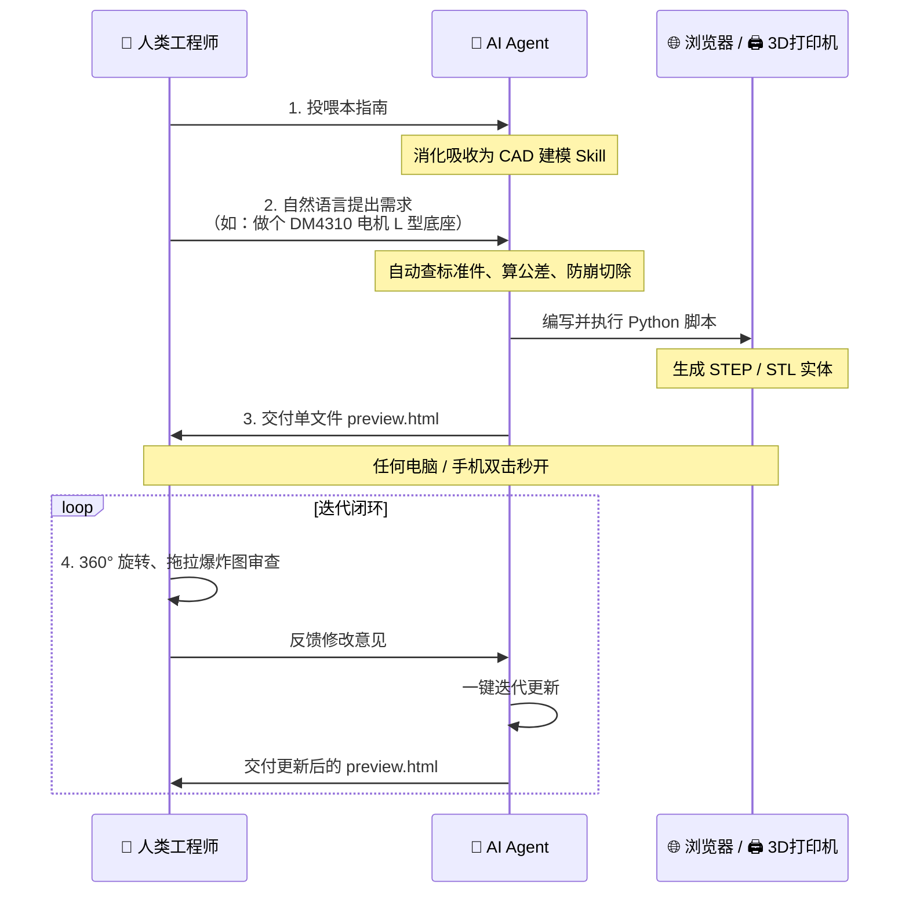
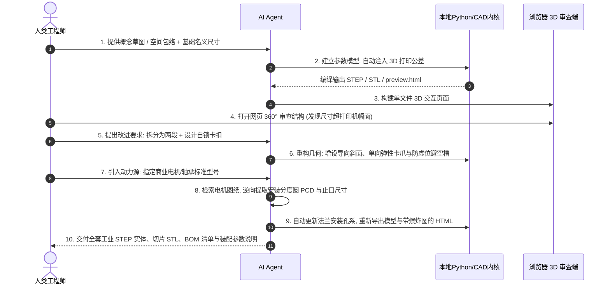
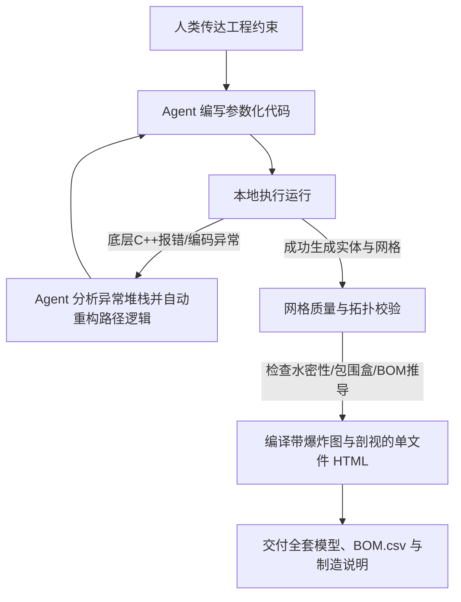
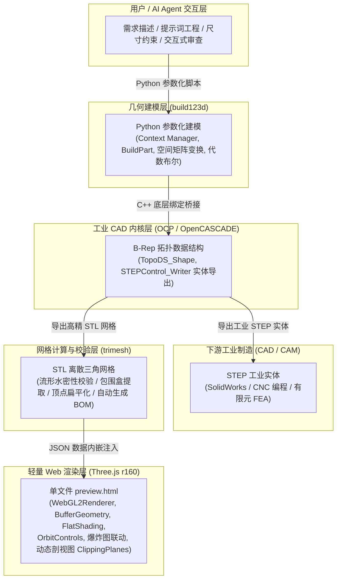

<!-- markdownlint-disable MD013 MD025 MD033 -->

> **定位**：面向工业研发、结构机构设计与增材制造（3D 打印）的 **系统级开发指南与人机协同工程手册**。  
> **核心范式**：**人类定义工程意图、包络约束与装配逻辑 + AI Agent 自动化几何构建与仿真验证 + 零门槛浏览器单文件 3D 交互审查**。

## 💡 【致人类读者：3 分钟上手与协作指引】

> **写在前面：您完全不需要亲自学习或死记硬背复杂的 3D 几何 API、Three.js 源码或 CAD 代码。**  
> 本指南的本质是一套**已在工业实战中闭环验证的“AI CAD 专家级工程规约系统”**。您只需理解以下极简协作闭环，即可把繁琐的几何构建、公差计算与前端渲染全权委托给 AI Agent。

### 1. 人机协同工作逻辑（极简三步法）



1. **第一步（给 AI 装载技能）**：将本文档提供给 AI Agent（Cursor、Windsurf、Antigravity、Claude 等），让其自动解析整理为专属的 3D 建模 Skill。
2. **第二步（人类提需求，AI 跑代码）**：您只需用工程自然语言给出名义尺寸与使用场景，AI 会自动按本规范注入 FDM 配合公差（滑动 0.2mm/紧配 0.12mm）、查国标螺栓孔距、实施通孔出头防崩并导出工业 STEP/切片 STL。
3. **第三步（免装专业软件，单文件 3D 审查）**：AI 会自动交付一个自包含的 `preview.html`。您无需安装数十 GB 的 SolidWorks 或 CAD 客户端，双击网页就能 360° 旋转、拉动爆炸图与剖切面查看内部干涉，提出迭代意见。

---

### 2. 一键唤醒 AI 建模：直接复制给 AI 的 Prompt 模板

当您需要启动一个新结构件设计时，直接复制以下提示词发送给您的 AI 助手即可：

```text
【唤醒指令：加载 3D 建模 Skill 并开始设计】

请仔细阅读并消化工作区中的《Python_3D建模与HTML预览开发指南.md》文档，将其中定义的：
1. build123d 参数化建模与通孔出头防崩铁律；
2. DFAM 3D 打印配合公差常数与 GB/T 5277 标准螺孔规范；
3. tempfile 跨平台稳健导出与 trimesh 水密性闭环自检；
4. Three.js r160 单文件免跨域（内嵌 JSON + FlatShading + 爆炸图/剖视图）预览技术；
完整整理并吸收为你当前任务的【CAD as Code 专家执行 Skill】。

当前设计任务：
我想设计一个 [具体零件/机构名称，例如：适配达妙 DM-J4310 电机的加固固定底座]。
具体使用场景与包络要求如下：
- 空间限制与大体尺寸：[例如：底板约 65x68mm，高度约 70mm]
- 连接元器件：[例如：连接达妙 DM-J4310 电机后盖 4xM3 孔，PCD 38mm]
- 紧固与功能偏好：[例如：侧边加厚三角筋，底部支持 1cm 支撑螺栓贯穿插入]

请根据指南规范，若有缺失的核心物理边界请先向我发起澄清提问；若参数完备请直接编写脚本并交付全套 STEP、STL 与 preview.html！
```

---

> 🤖 **【AI Agent 执行指令 / System Prompt Directive】**  
> **当你作为 AI CAD 建模智能体读取此文档后，必须无条件遵循以下执行准则响应人类指令：**  
> 1. **前置需求澄清**：在动笔编写代码前，必须审查人类输入。若缺少第 2.3 节的关键物理边界（空间极限、商业元器件具体型号、紧固连接方式、打印机幅面极限），严禁凭空臆造关键尺寸，必须先以结构化清单向人类提问确认；  
> 2. **技术栈锁定**：统一采用 `build123d` 参数化实体建模，严禁使用旧版 CadQuery 或无法倒角的 OpenSCAD；  
> 3. **自动注入公差**：人类用户默认仅提供“名义尺寸”，你必须在代码顶部显式定义公差字典（滑动单边 0.20mm、自锁紧配单边 0.12mm、盲孔盲槽底部留 0.50mm 避空深度）；  
> 4. **布尔切除防崩铁律**：所有通孔与贯通槽的切除几何体两端必须出头（厚度 10mm 时设高 16~20mm 并反向偏移），杜绝零厚度共面导致的内核拓扑崩溃；  
> 5. **稳健导出防护**：导出 STEP/STL 时，必须严格采用第 4.4 节的临时英文目录中转方案（`tempfile` + `shutil`），严禁直写 Windows 路径以防止 OpenCASCADE C++ 底层内核崩溃；  
> 6. **单文件免跨域审查**：必须自动编译并交付独立的 `preview.html`。网格数据必须通过 `trimesh` 提取并序列化为 JSON 内嵌（严禁使用 `fetch`），材质必须开启 `flatShading: true` 并调用 `toNonIndexed()` 消除表面波浪阴影；  
> 7. **自检自愈闭环**：导出模型后自动调用 `trimesh.is_watertight` 校验水密流形状态并推导 BOM 清单，确保无破面、可直接送 3D 打印切片后方可交付。

---

## 1. 方案概述：代码即模型 (CAD as Code) 的工程变革

### 1.1 传统 GUI CAD 的协作瓶颈
在传统的机械产品与结构件开发中，工程师高度依赖 SolidWorks、Inventor 或 Fusion 360 等图形化（GUI）建模软件。在敏捷研发和频繁方案探索阶段，传统 GUI 模式存在三大痛点：
1. **修改成本高且特征树脆弱**：在图形界面中修改一个顶层基准面或主尺寸，极易引发下游数十个倒角、切除特征出现“草图失联”、“拓扑丢失”而大面积报错飘红；
2. **无法融入自动化与 AI 协作流水线**：鼠标的点击、拖拽无法被大语言模型（LLM）高效编排与自动化回归测试；
3. **交付与跨职能评审门槛高**：专有 CAD 模型格式（如 `.sldprt`、`.step`）必须在装有数十 GB 昂贵客户端的专业电脑上才能打开，不便于现场装配工、测试员或项目负责人随时审查。

### 1.2 “AI Agent + CAD as Code” 的降维优势
“代码即模型（CAD as Code）” 将机械实体完全抽象为**参数化程序**，彻底改变了硬件设计的工作流：
* **几何资产完全参数化**：关键外廓、壁厚、间隙、螺栓分度圆（PCD）全部被定义为语义明确的顶层变量。改动一个变量，全装配体自动级联计算更新；
* **AI Agent 闭环落地**：人类工程师用自然语言或概念草图传达意图，Agent 能够自主查阅标准件规范、编写参数化代码、执行几何内核并输出成品；
* **超轻量化零服务交付**：将 3D 模型轻量化编译为独立的 HTML 单文件，**任何电脑或手机双击浏览器即刻 360° 旋转、平移观察、拉动滑块查看内部配合爆炸图与内部剖视图**。

### 1.3 实体 B-Rep 与多边形 Mesh 的双轨制输出
本方案同时支持两套完全不同的行业标准格式输出，打通从研发到加工的完整链路：
* **工业实体 (`.STEP`)**：采用标准边界表示法（B-Rep），由严格的解析几何曲面（平面、圆柱面、NURBS 曲面）构成。可无损导入 SolidWorks、UG NX 进行 CNC 刀轨编程与有限元受力分析（FEA）；
* **高精离散网格 (`.STL` / `.3MF`)**：由细密三角面构成的流形多边形网格，专供 Bambu Studio、PrusaSlicer 等 3D 打印切片软件进行层厚分切与 G 代码生成。

---

## 2. AI Agent 人机协同工程范式 (核心方法论)

硬件设计的人机协作核心，绝非让人类去手写冷门的 CAD 语法，而是**人类主导系统级设计决策，AI Agent 承揽具体工程落地**。

### 2.1 人机分工与协作边界矩阵

| 协作维度 | 人类工程师 (主导设计意图与决策) | AI Agent (自主执行几何与工艺落地) |
| :--- | :--- | :--- |
| **系统架构** | 定义功能机构、空间包络尺寸、自由度与运动方向 | 将功能需求解耦为参数变量、空间坐标变换与几何拓扑 |
| **标准件选型** | 指定商用标准元器件（如标准电机、轴承、导轨） | 检索标准件图纸，逆向提取 PCD、安装沉孔、止口与轴径尺寸 |
| **制造工艺** | 指定加工工艺（FDM 3D 打印、SLA 光固化、CNC 加工） | 自动注入制造公差（配合间隙、盲槽避空槽、45° 免支撑斜角） |
| **评审与交付** | 在浏览器中交互旋转、拖拉爆炸图审查配合合理性 | 自动运行代码、处理底层 C++ 报错、导出 STEP/STL 并打包 HTML |

---

### 2.2 渐进式协作迭代全流程图



---

### 2.3 建模前必须向人类确认的关键参数清单 (Pre-flight Questionnaire)

在实际工程协作中，人类给出的初始意图往往较为简练（例如：“帮我做个转接盘装个电机”）。**合格的 AI 严禁在关键物理边界缺失时凭空瞎猜臆造**，必须在动笔写代码前主动发起确认。

#### 1. AI 必须区分：哪些可自主决策 vs 哪些必须停下发问

| 参数类型 | AI 处理策略 | 具体参数范围与行业惯例 |
| :--- | :--- | :--- |
| **可由 AI 自主决策的工艺细节**<br>*(无需打扰人类，直接按最优规约注入)* | **直接按行业最优实践预设** | • **3D 打印配合公差**：自动预留（滑动 0.20mm、自锁紧配 0.12mm、盲孔避空槽 0.50mm）；<br>• **标准紧固件孔径**：按 GB/T 5277 自查沉头与穿孔尺寸；<br>• **抗断裂圆角**：直角受力交界处自动添加 $R1.0\sim R2.0\text{mm}$ 倒角；<br>• **免支撑悬垂角**：悬空面自动设计为 $45^\circ$ 倒角避免拉丝。 |
| **严禁擅自猜测的核心物理约束**<br>*(若人类提示词中缺失，必须主动发问)* | **必须前置向人类发起结构化确认** | • **空间极限与干涉包络**：最大允许长宽高限制，是否有必须避让的相邻零件；<br>• **标准商业元器件规格**：电机型号、轴承具体规格（轴径/外径/厚度）、传感器孔心距；<br>• **运动与配合性质**：各零件间是【永久固定】、【插拔滑动】还是【旋转轴承】；<br>• **紧固与连接偏好**：螺栓穿孔+螺母沉槽、预埋热熔铜螺母、还是纯塑料自攻牙；<br>• **设备行程与材料**：用户打印机物理幅面大小（是否接受超长分段榫接）。 |

#### 2. AI 必须向人类提问的“五大黄金问题”清单 (问卷标准模版)

当人类用户的需求缺失关键约束时，AI 必须暂停写代码，主动发送以下结构化问卷：

```text
【AI 建模前置澄清问卷】
在开始为您编写参数化代码前，为确保生成的 3D 模型能够严密装配并顺利成型，请先确认以下关键参数：

1. 空间包络与干涉禁区：
   - 构件的最大长、宽、高物理极限是多少？是否有必须避开的相邻构件？
2. 商业标准件具体型号（如涉及）：
   - 电机/轴承/传感器的具体型号是什么？（例如：NEMA 17 电机、608ZZ 轴承；或提供轴径与安装 PCD 孔距）
3. 零件间的运动与配合形式：
   - 各构件之间是【永久固定锁死】、【频繁插拔滑动】还是【旋转副配合】？
4. 紧固与连接工艺偏好：
   - 构件之间计划如何紧固？（A. 普通 M3/M4 螺栓+螺母沉槽；B. 预埋热熔铜螺母；C. 免螺丝卡扣自锁）
5. 制造设备极限：
   - 您的 3D 打印机最大成型尺寸是多少？（若长臂超出幅面，是否接受对半拆分并做榫接自锁？）
```

---

### 2.4 如何向 AI Agent 高效描述机械需求 (提示词工程)

与 AI 协作硬件设计时，掌握正确的提示词方法至关重要。核心三原则：
1. **名义尺寸先行，公差交给 AI**：无需手动心算槽深放大多少，只需给零件名义尺寸，要求“为 FDM 打印预留合适滑动配合公差”；
2. **明确相对空间拓扑与接口标准**：说明轴心对齐、法兰盘分度圆（PCD）孔数与紧固件规格（M3/M4）；
3. **指明制造物理约束**：明确打印机幅面限制、成型受力方向（便于 AI 添加抗剪切倒角与免支撑倒角）。

#### 四大实操阶段的标准 Prompt 模版：

##### 阶段一：初版概念构形与草图输入
```text
【通用提示词模板：概念构形】
我要为 [项目名称] 设计一套 [机械结构/安装支架/设备外壳]，采用 3D 打印快速原型验证。
参考草图/空间约束如下：
1. 总体外廓包络：长 [X]mm × 宽 [Y]mm × 高 [Z]mm。
2. 核心构件：包含一个基座安装板与一个动力输出滑块。
3. 接口关系：基座中心开设直径 [D1]mm 的通孔，外侧均布 [N] 个 [M3/M4] 螺栓固定孔，分度圆直径 (PCD) 为 [D2]mm；滑块通过滑动导轨与基座配合。
4. 制造方式：FDM 增材制造。
请使用 Python build123d 编写完整的参数化建模脚本，为 3D 打印预留合理的配合公差，导出 STEP 与高精 STL，并生成一个独立的 preview.html 供我 3D 交互审查。
```

##### 阶段二：超幅拆分与自锁榫卯设计
```text
【通用提示词模板：超限拆分与自锁配合】
构件 [零件名称] 的全长达到了 [L]mm，超出了我的 3D 打印机最大打印行程。
请帮我做工程拆分：
1. 将其拆分为两段可独立成型的构件；
2. 在断开连接结合面设计高强度的【自锁卡扣榫接结构】；
3. 设计要求：公头带有导向斜角，母槽单边预留 0.2mm 打印公差，槽底增加 0.5mm 避空深度以防转角积料，插入后咔哒自锁，具备高抗弯刚度；
4. 更新 HTML 预览脚本，在网页中提供装配/拆解动态滑块，直观展示插拔配合过程。
```

##### 阶段三：商业标准元器件自适应适配
```text
【通用提示词模板：商业标准件适配】
我们的执行机构确定选用标准件：[标准件型号，例如：NEMA 17 步进电机 / 608ZZ 轴承 / MG996R 舵机]。
请你：
1. 检索/提取该标准件的官方机械安装图纸关键尺寸（包括安装孔距 PCD、止口凸台直径与高度、轴径）；
2. 自动调整零件连接端面的安装法兰孔位、中心通孔及避空沉槽，确保与标准件严丝合缝；
3. 标注螺栓穿孔（按沉头或平头标准预留过孔公差），重新导出模型与网页。
```

##### 阶段四：网页 3D 交互与装配爆炸图审查
```text
【通用提示词模板：多部件爆炸图审查】
当前装配体包含 [零件A、零件B、零件C] 多个独立部件。
请更新 Three.js 网页预览程序：
1. 采用不同工程对比配色区分各零部件，表面开启 Flat Shading 消除波浪假阴影；
2. 增加“机构爆炸图”滑块控件，拖动时各零部件沿各自的装配分解方向平滑平移；
3. 增加“动态剖视图 (Section View)”滑块与“线框/实体”切换功能，便于检查内部榫卯干涉；
4. 在页面左上角悬浮显示各部件的关键包络尺寸与装配配合状态。
```

---

### 2.5 低效提示词 vs 工业级高效提示词对照表

| 比较维度 | ❌ 低效提示词 (AI 易产生幻觉或劣质模型) | ✅ 高效工程提示词 (AI 一次生成工业可用模型) |
| :--- | :--- | :--- |
| **几何与约束** | “画一个电机支架，能把电机放进去固定住。” | “设计一个用于 NEMA 17 电机的 L 型支架，板厚 6mm。立板开设 $\Phi 23\text{mm}$ 止口通孔，4 个 M3 孔 PCD 为 31mm，预留 0.4mm 过孔公差；底板设 2 个 M4 腰形安装孔。” |
| **机械配合** | “做两个零件，要能拼在一起装配起来。” | “零件 A 为公榫（截面 $15\times 8\text{mm}$），零件 B 为开槽母孔。采用插拔配合，单边预留 0.2mm 间隙，槽底留 0.5mm 避空深度以消除积料虚位。” |
| **制造工艺** | “这个模型要能用 3D 打印做出来。” | “采用 FDM 成型工艺。所有悬垂面做 $45^\circ$ 倒角免支撑，直角过渡交界处加 $R1.5\text{mm}$ 圆角以消除层间剪切应力集中，大平面平躺摆放。” |

---

### 2.6 Agent 的“生成-执行-自愈-校验”自闭环机制

一个成熟的 AI Agent 必须具备执行反馈闭环，而非单次输出代码：



1. **异常拦截与自愈（Self-Healing）**：
   * 当底层 OpenCASCADE C++ 写入 Windows 中文路径报 `RuntimeError` 时，Agent 会自动识别编码问题，切换为纯英文临时目录中转写入并原子化复制；
2. **网格水密性自检（Watertightness Assert）**：
   * 导出 STL 后，Agent 自动调用 `trimesh.load()` 验证模型是否为流形水密实体（`is_watertight`）。若存在破面或共面歧义，立即微调布尔出头尺寸重新编译；
3. **制造参数推导与 BOM 导出**：
   * Agent 依据实体几何体积与材料密度，自动计算每个零件的重量与打印耗材预算，导出规范的 `BOM.csv`。

---

## 3. 核心工具链深度解析与技术栈全景

为实现真正的自动化与轻量化，整个技术栈由 **几何建模层、底层 B-Rep 内核、网格计算层、前端呈现层与系统安全管道** 五大部分严密协同构成。

### 3.1 全栈技术拓扑架构 (Mermaid)



---

### 3.2 六大核心工具库职责与底层原理剖析

#### 1. `build123d` (顶层参数化 CAD 框架)
* **定位**：下一代 Pythonic 工业级 CAD 建模框架（优于 OpenSCAD 和 CadQuery）；
* **选型优势**：
  * 相比 **OpenSCAD**：OpenSCAD 只支持 CSG 多边形网格，倒圆角极其困难，且无法输出工业 STEP 实体；
  * 相比 **CadQuery**：build123d 拥有更现代的上下文管理器语法（`with BuildPart():`），支持简洁的代数矩阵运算（`Pos(x, y, z) * Rot(rx, ry, rz)`），代码天然模拟机加工工序；
* **核心职责**：构建母体、几何布尔运算（`ADD`、`SUBTRACT`、`INTERSECT`）、边缘选择过滤及倒角（`fillet`）、倒斜角（`chamfer`）。

#### 2. `OCP` (OpenCASCADE Python C++ Wrapper)
* **定位**：世界著名的开源工业级 CAD 几何内核 OpenCASCADE Technology (OCCT) 的 Python 原生绑定；
* **核心职责**：
  * `build123d` 底层构建的每一个三维对象，实质上都是一个由 OCP 托管的 C++ 实体类 `TopoDS_Shape`；
  * 当导出工业标准的 `.STEP` 格式时，正是直接调用 `OCP.STEPControl_Writer`，将严格的解析几何边界曲面无损写入文件，供下游 SolidWorks 或 CNC 机床识别。

#### 3. `trimesh` (工业级三角网格计算与分析)
* **定位**：高性能 3D 网格拓扑运算与几何分析库；
* **核心职责**：
  * **流形水密性校验 (`mesh.is_watertight`)**：确保 3D 打印模型无破面、无孔洞、无自交面，防止切片软件漏层报错；
  * **包围盒校对 (`mesh.bounding_box`)**：自动读取长宽高极限尺寸，验证是否超出打印机物理行程；
  * **物理量计算与 BOM 生成**：极速读取几何体积（`mesh.volume`），结合材料密度自动推算打印耗材克重；
  * **轻量化数据扁平化**：极速提取顶点数组与面片索引，序列化为紧凑 JSON 用于网页端渲染。

#### 4. `Three.js` (现代浏览器 WebGL 3D 渲染引擎)
* **定位**：全球最成熟的纯前端三维交互引擎；
* **核心职责**：
  * 依托 `BufferGeometry` 与 `Float32BufferAttribute` 高性能承载三维网格顶点流；
  * 提供工业质感 PBR 材质（`MeshStandardMaterial`）与光影投射体系（`AmbientLight` + `DirectionalLight`）；
  * **消除硬表面褶皱**：配合 `flatShading: true`，完美消除机械平面上的波浪假阴影；
  * **工程剖视能力**：利用 `clippingPlanes` 硬件加速实时剖切模型，审查内部装配干涉。

#### 5. `OrbitControls` (视口交互控制器)
* **定位**：Three.js 官方视口相机手势控制扩展；
* **核心职责**：
  * 赋能网页专业级 CAD 查看体验：鼠标左键全方位球形旋转（Orbit）、右键平移（Pan）、滚轮推拉缩放（Zoom）；
  * 原生支持移动端单指旋转与双指捏合手势，内置物理惯性阻尼（Damping），手感顺滑。

#### 6. 系统安全管道 (`tempfile` / `shutil` / `json`)
* **`tempfile`**：在 Windows 平台上，OpenCASCADE 底层 C++ 写入非 ASCII/中文路径时极易引发内核级内存异常崩溃。通过纯英文临时目录中转，彻底消除路径崩溃；
* **`shutil`**：跨平台安全移动文件到用户指定目录；
* **`json`**：将三维网格序列化为结构化数据并内嵌至 HTML，绕开浏览器的同源策略（CORS）拦截。

---

### 3.3 下游制造与工业软件生态衔接

本方案导出的标准文件可直接融入主流工业软件链路：
* **3D 打印切片软件 (STL / 3MF 输出)**：
  * 直供 **Bambu Studio (拓竹)**、**PrusaSlicer**、**OrcaSlicer**、**Cura**；
  * 网格拓扑完全闭合水密，免去任何“修复非流形网格”的繁琐步骤；
* **工业 CAD / CAM 软件 (STEP 输出)**：
  * 导入 **SolidWorks**、**Siemens NX (UG)**、**PTC Creo**、**CATIA**；
  * 识别为原生几何实体（可直接卡尺测量、选面画图打孔、绘制 2D 工程图、CNC 编程与有限元受力分析）。

---

### 3.4 运行环境安装与一键健康自检

在本地运行仅需安装两个顶层 Python 包（底层的 C++ OCP 会自动作为预编译 wheel 下载绑定，全平台免编译）：
```bash
pip install build123d trimesh
```

**环境健康探测脚本**：运行以下命令，可一键验证 CAD 实体内核与网格引擎是否完全就绪：
```python
# check_cad_env.py
import sys

def verify_stack():
    print(f"1. Python 版本: {sys.version.split()[0]}")
    try:
        import OCP
        print("2. ✓ OCP (OpenCASCADE 工业 C++ 内核) 就绪")
        from build123d import BuildPart, Box
        with BuildPart() as p:
            Box(10, 10, 10)
        assert p.part.is_valid, "几何有效性异常"
        print("3. ✓ build123d 参数化建模引擎运行正常")
        import trimesh
        m = trimesh.creation.box(extents=[10, 10, 10])
        assert m.is_watertight, "网格水密性自检异常"
        print("4. ✓ trimesh 网格拓扑引擎就绪")
        print("\n🎉 恭喜！全套 CAD as Code 自动化运行环境完全健康！")
    except Exception as e:
        print(f"\n❌ 环境探测未通过: {e}")

if __name__ == "__main__":
    verify_stack()
```

---

### 3.5 高安全与离线内网部署方案 (脱离外网 CDN)

默认生成的 HTML 页面通过 CDN 加载 `three.min.js` 与 `OrbitControls.js`。若在**保密机房、车间离线工控机或军工内网**等无外网环境下，可采用两种离线方案：
1. **同级目录离线携带法（推荐）**：
   * 将 `three.min.js` 与 `OrbitControls.js` 放置在与网页相同的 `libs/` 目录下，在 HTML 头部通过相对路径引用：
     ```html
     <script src="./libs/three.min.js"></script>
     <script src="./libs/OrbitControls.js"></script>
     ```
2. **源码绝对单文件内嵌法（Zero-Dependency Inlining）**：
   * Python 脚本直接读取本地 `three.min.js` 的源码字符串，通过 `<script>...JS源码...</script>` 将渲染引擎与网格数据一并写入单一 `.html` 中；
   * 产出的 HTML 单文件体积约 $1.5\text{MB}$，具备**百分之百断网可用、插 U 盘到任何电脑均能秒开**的绝对健壮性。

---

## 4. Python 通用参数化建模核心范式 (build123d)

### 4.1 参数化代数建模与空间布尔拓扑运算 (通孔出头防崩铁律)

在 `build123d` 中，设计理念是**将空间拓扑视为代数矩阵运算**。在编写布尔切除时，必须牢记“通孔两端微量出头”原则：

```python
from build123d import *

# 1. 顶层工程参数字典 (变量解耦)
CFG = {
    "BASE_L": 80.0, "BASE_W": 60.0, "BASE_H": 12.0,
    "BORE_RADIUS": 12.0,
    "PCD_RADIUS": 22.0,
    "SLOT_WIDTH": 16.0,
    "FIT_TOLERANCE": 0.20 # 3D 打印配合单边公差
}

with BuildPart() as base:
    # 2. 基础母体 (默认 Mode.ADD)
    Box(CFG["BASE_L"], CFG["BASE_W"], CFG["BASE_H"])
    
    # 3. 空间矩阵定位与特征切除 (Mode.SUBTRACT)
    # 【铁律】：通孔切除圆柱的高度必须大于基体厚度（如厚度12mm，圆柱设20mm居中Z=0贯穿），
    # 两端各向外微量出头 4mm，彻底杜绝零厚度共面（Coincident Faces）导致的 OpenCASCADE 底层拓扑崩溃！
    with Locations(Pos(0, 0, 0)):
        Cylinder(radius=CFG["BORE_RADIUS"], height=20, mode=Mode.SUBTRACT)
        
    # 4. 环形螺栓孔阵列 (PCD, Pitch Circle Diameter)
    for angle in [0, 90, 180, 270]:
        with Locations(Rot(0, 0, angle) * Pos(CFG["PCD_RADIUS"], 0, 0)):
            # 切除 M3 螺栓过孔（同样高度 20mm 居中贯穿两端出头）
            Cylinder(radius=1.7, height=20, mode=Mode.SUBTRACT)
            
    # 5. 开设带公差补偿的导向滑槽
    slot_actual_width = CFG["SLOT_WIDTH"] + 2 * CFG["FIT_TOLERANCE"]
    with Locations(Pos(0, 0, 3)):
        Box(slot_actual_width, CFG["BASE_W"] + 2, 6, mode=Mode.SUBTRACT)
        
    # 6. 受力边缘倒圆角 (消除应力集中)
    fillet(base.edges().filter_by(Axis.Z), radius=2.0)

solid_base = base.part
```

---

### 4.2 面向增材制造 (DFAM) 的公差与机械配合设计准则

在 FDM/SLA 3D 打印中，熔融塑料挤出时的横向胀大与冷却收缩必然造成配合误差。必须建立标准公差常数：

```python
# ==================== 全局制造与配合公差常数 ====================
CLEARANCE_SLIDING = 0.20   # 顺滑滑动/插拔单边间隙 (mm)
CLEARANCE_SNAP    = 0.12   # 卡扣紧配合/定位自锁单边间隙 (mm)
RELIEF_BLIND_SLOT = 0.50   # 盲孔/盲槽底部避空进深 (mm)
# ===============================================================
```

#### 工程设计三大铁律：
1. **插接榫卯“双边补偿”法则**：
   * 榫头（公头）按名义尺寸 $W \times H$ 制作；母槽开孔尺寸必须为 $(W + 2 \times \text{CLEARANCE}) \times (H + 2 \times \text{CLEARANCE})$；
2. **盲槽端面“0.5mm 避空”法则**：
   * 盲槽的轴向深度必须比公头长度长出 `0.5mm`。由于 3D 打印机喷嘴拐角减速时易在孔底堆积微量熔料，增加避空槽能彻底消除端面虚位，保障装配基准面贴合；
3. **45° 免支撑成型斜角**：
   * 零件悬空面应尽量设计为 $45^\circ \sim 60^\circ$ 的过渡斜角，避免添加支撑材料导致的表面粗糙与后处理人工。

#### 4. `chamfer`（倒斜角）与 `fillet`（倒圆角）的选型决策

在 `build123d` 中，`fillet` 和 `chamfer` 都用于处理零件棱边，但适用场景不同：

| 特征 | `fillet`（圆角） | `chamfer`（斜角） |
| :--- | :--- | :--- |
| **几何形态** | 圆弧过渡（需指定半径 $R$） | 直线切角（指定长度 $L$ 或角度） |
| **FDM 适配性** | 水平底面倒圆角需要打印支撑 | **45° 倒角完全免支撑** ✅ |
| **应力效果** | 更优异的应力消散（推荐用于受力件） | 应力消散略逊，但结构刚度足够 |
| **内核稳定性** | 多次布尔运算后容易报 `StdFail_NotDone` | **几乎不会失败** ✅（计算更简单） |
| **典型用途** | 法兰端面、旋转件外圆、高疲劳交界处 | 底座棱边、零件进料口导向斜面、3D 打印悬垂面 |

```python
from build123d import *

with BuildPart() as bracket:
    Box(50, 40, 10)
    
    # 1. 受力关键交界处：倒圆角消除应力集中
    top_edges = bracket.edges().filter_by(Axis.Z).filter_by(lambda e: e.center().Z > 4)
    fillet(top_edges, radius=2.0)
    
    # 2. 底面棱边：倒斜角免支撑 (45° 等腰直角斜角)
    bottom_edges = bracket.edges().filter_by(Axis.Z).filter_by(lambda e: e.center().Z < -4)
    chamfer(bottom_edges, length=1.5)
    
    # 3. 不等边倒斜角 (例如导向斜面，水平 2mm、垂直 1mm)
    # chamfer(some_edges, length=2.0, length2=1.0)
```

> **实用建议**：当 `fillet` 在复杂布尔运算后报错崩溃时，可以尝试用 `chamfer` 替代——几何计算更简单，几乎不会触发 OpenCASCADE 内核拓扑异常。

#### 5. `BuildSketch` 草图拉伸范式（复杂截面推荐）

除了直接使用 `Box` / `Cylinder` 等原始体之外，`build123d` 还提供了强大的 **二维草图 → 拉伸成型** 工作流。在处理三角加强肋、异形截面和参数化轮廓时，`BuildSketch` 比原始体拼接更直观、更灵活：

```python
from build123d import *

# 示例：三角加强肋（底边 25mm，高度 30mm，厚度 10mm）
with BuildPart() as rib:
    # 1. 在 XZ 平面绘制三角形截面草图
    with BuildSketch(Plane.XZ) as sketch:
        with BuildLine() as line:
            Line((0, 0), (25, 0))        # 底边（水平方向）
            Line((25, 0), (0, 30))       # 斜边（底角到顶角）
            Line((0, 30), (0, 0))        # 立边（垂直方向）
        make_face()                       # 将封闭线框转为二维面
    
    # 2. 沿 Y 轴拉伸成三维实体（双侧各拉 5mm = 总厚 10mm）
    extrude(amount=5.0, both=True)

# 示例：带沉孔的法兰盘环形截面
with BuildPart() as flange:
    with BuildSketch() as sk:
        Circle(radius=30)                # 外圆 Φ60mm
        Circle(radius=12, mode=Mode.SUBTRACT)  # 中心通孔 Φ24mm
        # 环形分布 6 颗 M4 过孔
        for angle in range(0, 360, 60):
            with Locations(Rot(0, 0, angle) * Pos(22, 0)):
                Circle(radius=2.2, mode=Mode.SUBTRACT)
    extrude(amount=8)
```

> **何时使用 `BuildSketch`？**
> * 截面是非矩形/非圆形的异形轮廓（三角形、L 形、梯形、T 形型材）；
> * 需要在同一截面上同时做多处开孔/开槽；
> * 需要先草图画轮廓再旋转（`revolve`）生成旋转体（如锥形圆台）。

---

### 4.3 紧固件与螺栓标准过孔规范 (GB/T 5277 / ISO 273)

在机械结构设计中，严禁随意开螺孔。必须遵循工程标准（按中等/粗糙级装配过孔设计）：

| 螺栓规格 | 穿孔直径 (过孔) | 沉头孔直径 | 沉头深度 | 螺母对边沉槽宽度 |
| :--- | :--- | :--- | :--- | :--- |
| **M3** | $\Phi 3.4\text{ mm}$ | $\Phi 6.2\text{ mm}$ | $3.5\text{ mm}$ | $5.8\text{ mm}$ (厚 $2.8\text{ mm}$) |
| **M4** | $\Phi 4.4\text{ mm}$ | $\Phi 8.2\text{ mm}$ | $4.5\text{ mm}$ | $7.4\text{ mm}$ (厚 $3.6\text{ mm}$) |
| **M5** | $\Phi 5.5\text{ mm}$ | $\Phi 9.8\text{ mm}$ | $5.5\text{ mm}$ | $8.6\text{ mm}$ (厚 $4.5\text{ mm}$) |

---

### 4.4 工业级 STEP 与高精 STL 稳健导出技术 (突破 Windows 编码与 C++ 崩溃)

OpenCASCADE C++ 底层对 Windows 的非 ASCII 编码（中文用户名、特殊符号路径）极易抛出不可拦截的内核级 `RuntimeError: Failed to write STEP file`。

**工业级稳健导出管道实现**：
```python
import os, tempfile, shutil
from build123d import export_stl
from OCP.STEPControl import STEPControl_Writer, STEPControl_StepModelType
from OCP.IFSelect import IFSelect_ReturnStatus

def export_step_robust(shape, output_filepath):
    """
    稳健 STEP 导出器：
    利用纯英文系统临时目录绕过 OpenCASCADE 底层 C++ 字符串编码异常，
    确保在任意 Windows 路径下稳定写入。
    """
    with tempfile.TemporaryDirectory() as temp_dir:
        temp_file = os.path.join(temp_dir, "export_temp.step")
        writer = STEPControl_Writer()
        wrapped_shape = shape.wrapped if hasattr(shape, "wrapped") else shape
        writer.Transfer(wrapped_shape, STEPControl_StepModelType.STEPControl_AsIs)
        if writer.Write(temp_file) != IFSelect_ReturnStatus.IFSelect_RetDone:
            raise RuntimeError("STEP 内核导出失败")
        
        os.makedirs(os.path.dirname(os.path.abspath(output_filepath)), exist_ok=True)
        shutil.copy(temp_file, output_filepath)

def export_stl_robust(shape, output_filepath, tolerance=0.01, angular_tolerance=0.1):
    """
    高精度 STL 导出器：
    设定微米级弦高容差 (0.01mm) 与小角度容差 (0.1rad)，消除多边形锯齿棱角。
    """
    with tempfile.TemporaryDirectory() as temp_dir:
        temp_file = os.path.join(temp_dir, "export_temp.stl")
        export_stl(shape, temp_file, tolerance=tolerance, angular_tolerance=angular_tolerance)
        os.makedirs(os.path.dirname(os.path.abspath(output_filepath)), exist_ok=True)
        shutil.copy(temp_file, output_filepath)
```

---

### 4.5 工业级工程交付：BOM 物料清单自动推导与大装配网格轻量化 (减面)

#### 1. 自动生成工程 BOM 清单 (`BOM.csv`)
在真实工业场景中，建模脚本不仅仅要出 3D 文件，还应当伴随输出**采购与制造物料清单**。通过 `trimesh` 提取几何物理量，自动推导生成：
```python
def generate_bom_csv(parts_dict, output_csv="BOM.csv", material_density=1.24):
    """
    自动推导工业 BOM 清单:
    parts_dict: {"零件名": trimesh_obj, ...}
    material_density: 常用 PLA/PETG 密度约为 1.24 ~ 1.27 g/cm³
    """
    rows = [["零件名称", "成型工艺", "外廓长(mm)", "外廓宽(mm)", "外廓高(mm)", "体积(cm³)", "预估耗材克重(g)"]]
    for name, mesh in parts_dict.items():
        extents = mesh.bounding_box.extents.round(1)
        vol_cm3 = round(mesh.volume / 1000.0, 2)
        weight_g = round(vol_cm3 * material_density, 1)
        rows.append([name, "FDM 3D打印", extents[0], extents[1], extents[2], vol_cm3, weight_g])
        
    with open(output_csv, "w", encoding="utf-8-sig") as f:
        for r in rows:
            f.write(",".join(map(str, r)) + "\n")
```

#### 2. 大装配体网格轻量化策略 (Decimation)
当装配体超过 10~20 个构件时，若所有构件都采用极致精度导出，内嵌 JSON 会使单个 HTML 达到数十兆字节。
* **分级精度法**：核心配合面（滑轨、轴承位）保持 `tolerance=0.01`，外壳与装饰面采用 `tolerance=0.04`；
* **Python 网格快速减面**：在将网格传入 HTML 前，调用二次误差减面算法：
  ```python
  # 将超过 5 万面的复杂网格无损压缩至 1 万面供 Web 极速渲染
  if len(mesh.faces) > 50000:
      mesh = mesh.simplify_quadric_decimation(10000)
  ```

### 4.6 多构件装配体 STEP 导出 (Compound Assembly)

在涉及多零件装配体时，除了逐个零件单独导出 STEP 之外，有时需要将整套装配体打包为**一个包含多个命名部件的复合 STEP 文件**，以便于在 SolidWorks / NX 中一次性导入完整装配关系。

#### 方案一：简单复合体导出（推荐，兼容性最佳）

将多个 `Part` 合并为 `Compound`，通过 `STEPControl_Writer` 一次性写出：

```python
import os, tempfile, shutil
from build123d import Compound
from OCP.STEPControl import STEPControl_Writer, STEPControl_StepModelType
from OCP.IFSelect import IFSelect_ReturnStatus

def export_assembly_step(parts_list, output_path):
    """
    将多个 build123d Part 对象组合为复合体并导出为单一 STEP 文件。
    parts_list: [part_a, part_b, part_c, ...]
    """
    compound = Compound(children=parts_list)
    
    with tempfile.TemporaryDirectory() as tmp:
        tmp_path = os.path.join(tmp, "assembly.step")
        writer = STEPControl_Writer()
        writer.Transfer(compound.wrapped, STEPControl_StepModelType.STEPControl_AsIs)
        if writer.Write(tmp_path) != IFSelect_ReturnStatus.IFSelect_RetDone:
            raise RuntimeError("装配体 STEP 导出失败")
        shutil.copy(tmp_path, output_path)

# 使用示例
export_assembly_step([hub_part, base_part, clamp_part], "assembly.step")
```

#### 方案二：带命名标签的 XDE 装配体导出（高级）

若需要在 STEP 中保留每个零件的名称标签（便于 SolidWorks 自动识别装配层级），需要使用 OpenCASCADE 的 XDE (eXtended Data Exchange) 框架：

```python
from OCP.XCAFApp import XCAFApp_Application
from OCP.XCAFDoc import XCAFDoc_DocumentTool
from OCP.TCollection import TCollection_ExtendedString
from OCP.TDocStd import TDocStd_Document
from OCP.STEPCAFControl import STEPCAFControl_Writer

def export_named_assembly_step(named_parts, output_path):
    """
    named_parts: [("Hub", hub_part), ("Base", base_part), ...]
    """
    app = XCAFApp_Application.GetApplication_s()
    doc = TDocStd_Document(TCollection_ExtendedString("mdtv-xcaf"))
    app.InitDocument(doc)
    shape_tool = XCAFDoc_DocumentTool.ShapeTool_s(doc.Main())
    
    for name, part in named_parts:
        wrapped = part.wrapped if hasattr(part, "wrapped") else part
        label = shape_tool.AddShape(wrapped)
        from OCP.TDataStd import TDataStd_Name
        TDataStd_Name.Set_s(label, TCollection_ExtendedString(name))
    
    writer = STEPCAFControl_Writer()
    writer.Transfer(doc)
    writer.Write(output_path)
```

> **注意**：方案二需要对 OCP 的 XDE 子系统有一定了解，且部分下游 CAD 软件对 XDE 标签的解析程度不同。对于大多数场景，**方案一（Compound 导出）已完全够用**。

---

## 5. 单文件 HTML 3D 交互预览技术 (Three.js)

### 5.1 突破浏览器同源策略 (CORS)：网格数据直接内嵌方案

在没有本地 HTTP 服务器（如 Nginx、Node.js）的环境下，浏览器直接双击打开本地 HTML 时，安全沙箱会禁止 `fetch('part.stl')` 读取磁盘文件，导致黑屏报错：`CORS request not HTTP`。

**数据内联解决方案**：
在 Python 导出模型后，用 `trimesh` 提取顶点与面片索引，**直接格式化为 JSON 字符串写入 HTML 源码内部**：
```python
import trimesh, json

mesh = trimesh.load("part.stl")
geo_payload = {
    "v": mesh.vertices.flatten().round(3).tolist(), # 保留 3 位小数减小文件体积
    "f": mesh.faces.flatten().tolist()
}
# 写入 HTML 模板：const PART_DATA = {json.dumps(geo_payload)};
```
生成的网页完全自包含，邮件或微信发给任何人均能**双击秒开**！

---

### 5.2 消除视觉光影褶皱：硬表面法线渲染 (Flat Shading) 机理解析

#### 现象痛点
机械零件在 Three.js 默认着色下，平整表面经常出现波浪状、明暗相间的黑灰色光影条纹（常被误认为是模型破面或凹凸褶皱）。

#### 机理解析
WebGL 默认对共享顶点的相邻三角面进行**法线平滑插值（Gouraud/Phong Shading）**。在机械硬表面上，平面与圆柱孔侧壁交汇处的法线被强行平均拉扯，导致光照反射方向偏折，在平整基面上产生了平滑过渡的虚假暗影。

#### 解决方案
1. **解耦顶点索引为独立面片**：调用 `geometry.toNonIndexed()`，使每个三角形拥有独立的 3 个物理法线顶点；
2. **重算法线并声明硬着色**：调用 `geometry.computeVertexNormals()`，并在材质中声明 `flatShading: true`。

```javascript
// 1. 构建独立面片几何体
const rawGeometry = new THREE.BufferGeometry();
rawGeometry.setAttribute('position', new THREE.Float32BufferAttribute(data.v, 3));
rawGeometry.setIndex(data.f);

const crispGeometry = rawGeometry.toNonIndexed(); // 关键：解耦共享顶点
crispGeometry.computeVertexNormals();

// 2. 机械级材质配置
const material = new THREE.MeshStandardMaterial({
    color: 0x3b82f6,
    roughness: 0.3,
    metalness: 0.15,
    flatShading: true // 关键：硬表面锐利着色，平面如镜面般平整纯净
});
```

---

### 5.3 装配体动态爆炸图 (Exploded View) 算法实现

通过在 HTML 中嵌入范围滑块控件，可驱动各构件沿其装配轴平移展开：

```javascript
// 为装配体构件定义位移基准与展开方向矢量
const assemblyParts = [
    { mesh: meshBase,    vector: new THREE.Vector3(0, 0, 0),  maxDistance: 0  },
    { mesh: meshSlider,  vector: new THREE.Vector3(0, 0, 1),  maxDistance: 45 } // 沿 Z 轴向外拉伸
];

// 监听爆炸图滑块数值变化 (0.0 ~ 1.0)
const explodeSlider = document.getElementById('explodeSlider');
explodeSlider.addEventListener('input', (e) => {
    const progress = parseFloat(e.target.value);
    assemblyParts.forEach(part => {
        const offset = part.vector.clone().multiplyScalar(part.maxDistance * progress);
        part.mesh.position.copy(offset);
    });
});
```

---

### 5.4 工业级内部干涉审查：动态剖视图 (Clipping Planes)、线框切换与视角复位

在装配机构审查时，光看外部视图无法验证内部配合是否干涉。Three.js 提供了硬件级的裁剪平面（Clipping Planes），能以 60 FPS 动态“剖开”模型：

```javascript
// 1. 开启渲染器局部裁剪平面支持
renderer.localClippingEnabled = true;

// 2. 创建剖切平面 (例如垂直于 Z 轴，初始常数 100mm)
const sectionPlane = new THREE.Plane(new THREE.Vector3(0, 0, -1), 100);

// 3. 将剖切平面赋给零件材质
// 【核心防坑】：必须显式声明 side: THREE.DoubleSide，否则剖切开后模型背面不着色，会呈现空心纸片假象！
material.side = THREE.DoubleSide;
material.clippingPlanes = [sectionPlane];
material.clipShadows = true;

// 4. 监听剖切滑块，实时平移剖切面观察内部榫槽
const sectionSlider = document.getElementById('sectionSlider');
sectionSlider.addEventListener('input', (e) => {
    sectionPlane.constant = parseFloat(e.target.value);
});

// 5. 线框/实体一键切换 (便于审查拓扑密度)
let isWireframe = false;
wireframeBtn.addEventListener('click', () => {
    isWireframe = !isWireframe;
    parts.forEach(p => p.mesh.material.wireframe = isWireframe);
});

// 6. 相机视角一键复位
resetCameraBtn.addEventListener('click', () => {
    camera.position.set(90, 110, 130);
    controls.target.set(0, 0, 0);
    controls.update();
});
```

---

### 5.5 前端工程稳定性：Three.js 版本锁定与 API 防错准则

* **必须锁定版本号（推荐 `r160`）**：
  Three.js 每年更新十余个次版本，且历史上存在大量破坏性变更（例如 `Geometry` 被弃用强制全面使用 `BufferGeometry`，灯光光衰计算从物理衰减到自然衰减的变化等）。r160 相比早期 r128 版本在 WebGL2 默认启用、内存管理、`dispose()` 安全性等方面均有重大改善，且 API 已趋于稳定。
* **生产环境必须锁定静态 CDN 或本地脚本**：
  严禁使用未指定版本的通配链接（如 `three.js/master/three.js`）。推荐固定引入：
  ```html
  <script src="https://cdnjs.cloudflare.com/ajax/libs/three.js/r160/three.min.js"></script>
  <script src="https://cdn.jsdelivr.net/npm/three@0.160.0/examples/js/controls/OrbitControls.js"></script>
  ```
* **从 r128 迁移到 r160 的注意事项**：
  * `WebGLRenderer` 在 r160 中默认使用 WebGL2 上下文，无需额外配置；
  * `OrbitControls` 的导入路径和 API 保持兼容，无需改动；
  * `flatShading` / `clippingPlanes` / `DoubleSide` 等机械渲染核心 API 完全向后兼容。

---

## 6. 开箱即用通用极简模板工程 (Quickstart Master Demo)

将以下完整代码保存为 `make_cad_assembly.py`，直接运行即可体验**全套工业级闭环**：
* 包含“通孔两端出头防崩”参数化实体建模；
* 导出工业 `.STEP` 与高精 `.STL`；
* **包含 `trimesh.is_watertight` 水密性自检断言**；
* **自动导出工业物料清单 `BOM.csv`**；
* 自动生成集成**【装配爆炸图 + 动态剖视图 + 线框/实体切换 + 视角复位】**的单文件 `preview.html`。

```python
"""
=======================================================================
通用的“CAD as Code”工业级全流程工程：
参数建模 -> 水密校验 -> BOM推导 -> 稳健导出 -> 3D高级交互网页
=======================================================================
"""
import os, json, tempfile, shutil, trimesh
from build123d import *
from OCP.STEPControl import STEPControl_Writer, STEPControl_StepModelType
from OCP.IFSelect import IFSelect_ReturnStatus

def robust_export(shape, step_path, stl_path):
    """跨平台安全导出 STEP 工业实体与 STL 网格"""
    with tempfile.TemporaryDirectory() as tmp:
        t_stl = os.path.join(tmp, "t.stl")
        t_step = os.path.join(tmp, "t.step")
        
        # 1. 导出高精细分网格 STL
        export_stl(shape, t_stl, tolerance=0.01, angular_tolerance=0.1)
        
        # 2. 导出工业 B-Rep 实体 STEP
        writer = STEPControl_Writer()
        wrapped = shape.wrapped if hasattr(shape, "wrapped") else shape
        writer.Transfer(wrapped, STEPControl_StepModelType.STEPControl_AsIs)
        if writer.Write(t_step) != IFSelect_ReturnStatus.IFSelect_RetDone:
            raise RuntimeError("STEP 内核导出失败")
            
        shutil.copy(t_stl, stl_path)
        shutil.copy(t_step, step_path)

print(">>> [1/5] 正在执行参数化几何建模 (应用通孔出头防崩原则)...")

# 零件 A：通用法兰安装基座
with BuildPart() as p_base:
    # 主体基板 (60x60x10mm)
    Box(60, 60, 10)
    # 中心定位轴孔 (高度20mm居中贯通，上下各出头5mm，彻底避免共面)
    with Locations(Pos(0, 0, 0)):
        Cylinder(radius=10, height=20, mode=Mode.SUBTRACT)
    # 环形分度圆 (PCD 40mm) 均布 4 个 M3 螺栓过孔
    pcd = 40.0
    for angle in [0, 90, 180, 270]:
        with Locations(Rot(0, 0, angle) * Pos(pcd / 2, 0, 0)):
            Cylinder(radius=1.7, height=20, mode=Mode.SUBTRACT)
    # 导向装配滑槽 (名义 15mm，预留单边 0.2mm 公差，槽宽 15.4mm)
    with Locations(Pos(0, 0, 3)):
        Box(15.4, 62, 6, mode=Mode.SUBTRACT)

# 零件 B：导向配合插块
with BuildPart() as p_joint:
    # 榫头公头 (按名义尺寸 15mm 制作)
    Box(15.0, 58, 6)
    # 顶部动力转接台阶
    with Locations(Pos(0, 0, 6)):
        Cylinder(radius=12, height=8)
    # 顶部轴孔 (出头贯通)
    with Locations(Pos(0, 0, 3)):
        Cylinder(radius=4, height=16, mode=Mode.SUBTRACT)

base_solid = p_base.part
joint_solid = p_joint.part

print(">>> [2/5] 正在安全导出 STEP 与 STL 文件...")
robust_export(base_solid, "base_flange.step", "base_flange.stl")
robust_export(joint_solid, "slider_joint.step", "slider_joint.stl")

print(">>> [3/5] 正在执行网格水密性自检 (Watertightness Check)...")
m_base = trimesh.load("base_flange.stl")
m_joint = trimesh.load("slider_joint.stl")

# 执行水密流形断言自检
for name, m in [("基座法兰", m_base), ("导向滑块", m_joint)]:
    assert m.is_watertight, f"【自检报警】: {name} 网格非闭合水密，可能导致 3D 打印切片漏层！"
    print(f"  ✓ {name}: 水密性验证通过 (流形闭合体)")

print(">>> [4/5] 正在自动推导并导出物料清单 BOM.csv...")
bom_lines = ["零件名称,材质,外廓长(mm),外廓宽(mm),外廓高(mm),体积(cm³),预估耗材克重(g),工艺建议"]
for name, m in [("基座法兰 (base_flange)", m_base), ("导向滑块 (slider_joint)", m_joint)]:
    ext = m.bounding_box.extents.round(1)
    v_cm3 = round(m.volume / 1000.0, 2)
    w_g = round(v_cm3 * 1.24, 1) # PLA 密度 1.24 g/cm³
    bom_lines.append(f"{name},PLA/PETG,{ext[0]},{ext[1]},{ext[2]},{v_cm3},{w_g},大底面平躺打印")

with open("BOM.csv", "w", encoding="utf-8-sig") as f:
    f.write("\n".join(bom_lines) + "\n")
print("  ✓ BOM.csv 导出成功！")

print(">>> [5/5] 正在编译集成【爆炸图+剖视图+线框切换】的单文件 preview.html...")
mesh_payload = {
    "base": { "v": m_base.vertices.flatten().round(3).tolist(), "f": m_base.faces.flatten().tolist() },
    "joint": { "v": m_joint.vertices.flatten().round(3).tolist(), "f": m_joint.faces.flatten().tolist() }
}

html_source = f"""<!DOCTYPE html>
<html lang="zh-CN">
<head>
    <meta charset="utf-8">
    <meta name="viewport" content="width=device-width, initial-scale=1.0">
    <title>3D 机构高级审查 (装配爆炸图与剖视图)</title>
    <style>
        * {{ box-sizing: border-box; margin: 0; padding: 0; }}
        body {{ overflow: hidden; background: #0b0f19; font-family: -apple-system, BlinkMacSystemFont, "Segoe UI", Roboto, sans-serif; }}
        #hud {{
            position: absolute; top: 16px; left: 16px;
            background: rgba(17, 24, 39, 0.88); backdrop-filter: blur(8px);
            border: 1px solid rgba(255, 255, 255, 0.12); border-radius: 10px;
            padding: 16px 20px; color: #f3f4f6; max-width: 330px;
            box-shadow: 0 10px 25px -5px rgba(0, 0, 0, 0.5);
        }}
        .title {{ font-size: 14px; font-weight: 700; color: #60a5fa; margin-bottom: 6px; }}
        .desc {{ font-size: 11px; color: #9ca3af; line-height: 1.4; margin-bottom: 12px; }}
        .ctrl-group {{ margin-top: 10px; }}
        .ctrl-label {{ display: flex; justify-content: space-between; font-size: 12px; color: #d1d5db; margin-bottom: 4px; }}
        input[type=range] {{ width: 100%; accent-color: #3b82f6; cursor: pointer; }}
        .btn-row {{ display: flex; gap: 8px; margin-top: 14px; }}
        button {{
            flex: 1; padding: 6px 10px; font-size: 11px; font-weight: 600;
            background: #1f2937; color: #e5e7eb; border: 1px solid #374151;
            border-radius: 6px; cursor: pointer; transition: 0.2s;
        }}
        button:hover {{ background: #374151; border-color: #60a5fa; color: #ffffff; }}
        .legend {{ display: flex; gap: 12px; margin-top: 12px; font-size: 11px; color: #9ca3af; }}
        .dot {{ display: inline-block; width: 8px; height: 8px; border-radius: 50%; margin-right: 4px; }}
    </style>
    <!-- 锁定 r160 版本 CDN 确保 API 绝对稳定 -->
    <script src="https://cdnjs.cloudflare.com/ajax/libs/three.js/r160/three.min.js"></script>
    <script src="https://cdn.jsdelivr.net/npm/three@0.160.0/examples/js/controls/OrbitControls.js"></script>
</head>
<body>
    <div id="hud">
        <div class="title">⚙️ 机构 3D 工业级装配审查</div>
        <div class="desc">鼠标左键旋转 / 右键平移 / 滚轮缩放</div>
        
        <div class="ctrl-group">
            <div class="ctrl-label"><span>装配爆炸展开</span><span id="explodeVal">0 mm</span></div>
            <input type="range" id="explodeSlider" min="0" max="50" value="0" step="0.5">
        </div>

        <div class="ctrl-group">
            <div class="ctrl-label"><span>内部干涉剖切 (Z 轴)</span><span id="clipVal">未剖切</span></div>
            <input type="range" id="clipSlider" min="-15" max="75" value="75" step="0.5">
        </div>

        <div class="btn-row">
            <button id="wireframeBtn">🔲 线框模式</button>
            <button id="resetCamBtn">🎯 视角复位</button>
        </div>

        <div class="legend">
            <span><span class="dot" style="background:#3b82f6"></span>基座法兰</span>
            <span><span class="dot" style="background:#10b981"></span>导向滑块</span>
        </div>
    </div>

    <script>
        const payload = {json.dumps(mesh_payload)};

        // 1. 初始化场景与相机
        const scene = new THREE.Scene();
        const camera = new THREE.PerspectiveCamera(45, window.innerWidth / window.innerHeight, 1, 1000);
        camera.position.set(90, 110, 130);

        const renderer = new THREE.WebGLRenderer({{ antialias: true }});
        renderer.setSize(window.innerWidth, window.innerHeight);
        renderer.setPixelRatio(window.devicePixelRatio);
        // 【关键】启用渲染器局部剖切支持
        renderer.localClippingEnabled = true;
        document.body.appendChild(renderer.domElement);

        const controls = new THREE.OrbitControls(camera, renderer.domElement);
        controls.enableDamping = true;
        controls.dampingFactor = 0.05;

        // 2. 布光体系与网格地面
        scene.add(new THREE.AmbientLight(0xffffff, 0.75));
        const keyLight = new THREE.DirectionalLight(0xffffff, 0.85);
        keyLight.position.set(100, 150, 80);
        scene.add(keyLight);

        const fillLight = new THREE.DirectionalLight(0x93c5fd, 0.35);
        fillLight.position.set(-80, -50, -60);
        scene.add(fillLight);
        scene.add(new THREE.GridHelper(200, 20, 0x374151, 0x1f2937));

        // 3. 定义全局剖切平面 (初始常数设为 75mm，位于完全爆炸体外侧)
        const clipPlaneZ = new THREE.Plane(new THREE.Vector3(0, 0, -1), 75);

        // 4. 构建高精硬表面几何体辅助函数 (FlatShading + 剖切面绑定 + 双面渲染)
        const materials = [];
        function createCrispMesh(data, hexColor) {{
            const raw = new THREE.BufferGeometry();
            raw.setAttribute('position', new THREE.Float32BufferAttribute(data.v, 3));
            raw.setIndex(data.f);
            const crisp = raw.toNonIndexed();
            crisp.computeVertexNormals();

            const mat = new THREE.MeshStandardMaterial({{
                color: hexColor,
                roughness: 0.28,
                metalness: 0.12,
                flatShading: true,
                side: THREE.DoubleSide, // 剖切时渲染模型内壁，杜绝空心纸片薄壳感
                clippingPlanes: [clipPlaneZ],
                clipShadows: true
            }});
            materials.push(mat);
            return new THREE.Mesh(crisp, mat);
        }}

        const meshBase = createCrispMesh(payload.base, 0x3b82f6);
        const meshJoint = createCrispMesh(payload.joint, 0x10b981);
        meshJoint.position.set(0, 0, 3); // 初始就位

        scene.add(meshBase);
        scene.add(meshJoint);

        // 5. 爆炸图联动控制
        const explodeSlider = document.getElementById('explodeSlider');
        const explodeVal = document.getElementById('explodeVal');
        explodeSlider.addEventListener('input', (e) => {{
            const dist = parseFloat(e.target.value);
            explodeVal.innerText = dist.toFixed(1) + " mm";
            meshJoint.position.z = 3 + dist;
        }});

        // 6. 剖切平面控制
        const clipSlider = document.getElementById('clipSlider');
        const clipVal = document.getElementById('clipVal');
        clipSlider.addEventListener('input', (e) => {{
            const val = parseFloat(e.target.value);
            clipPlaneZ.constant = val;
            clipVal.innerText = val >= 75 ? "未剖切" : val.toFixed(1) + " mm";
        }});

        // 7. 线框/实体模式切换
        let isWireframe = false;
        document.getElementById('wireframeBtn').addEventListener('click', () => {{
            isWireframe = !isWireframe;
            materials.forEach(m => m.wireframe = isWireframe);
        }});

        // 8. 视角一键复位
        document.getElementById('resetCamBtn').addEventListener('click', () => {{
            camera.position.set(90, 110, 130);
            controls.target.set(0, 0, 0);
            controls.update();
        }});

        window.addEventListener('resize', () => {{
            camera.aspect = window.innerWidth / window.innerHeight;
            camera.updateProjectionMatrix();
            renderer.setSize(window.innerWidth, window.innerHeight);
        }});

        function renderLoop() {{
            requestAnimationFrame(renderLoop);
            controls.update();
            renderer.render(scene, camera);
        }}
        renderLoop();
    </script>
</body>
</html>"""

with open("preview.html", "w", encoding="utf-8") as f:
    f.write(html_source)

print("✓ 自动化流水线执行完毕！")
print("  - 实体模型: base_flange.step, slider_joint.step")
print("  - 切片模型: base_flange.stl, slider_joint.stl")
print("  - 物料清单: BOM.csv (含包围盒、体积、预估重量)")
print("  - 高级网页: preview.html (支持爆炸图、动态剖切、线框切换、视角复位)")
```

---

## 7. 常见工程问题与踩坑排错手册 (FAQ)

### Q1: 导出的 `.STEP` 实体与直接导出的 `.STL` 有何本质区别？
* **工业意义**：
  * `.STL` 是**多边形离散网格**，原本平滑的圆柱孔会被离散为成百上千个微小三角形，导入 SolidWorks 等软件后无法被识别为标准孔特征，无法测量孔心距或用于数控 CNC 刀轨编程。
  * `.STEP` 是**解析边界实体（B-Rep）**，完整保留圆弧半径、平面方程与装配几何约束。在 SolidWorks 中可直接点击表面使用卡尺测量、选面画草图打孔、修改倒角，或在装配体中添加“同轴心”与“重合配合”。

### Q2: 3D 打印件在装配时经常“插不进”或“晃动严重”，如何系统解决？
* **成因**：主要由 FDM 喷嘴沿切线转向时的熔体胀大以及塑料冷却收缩引起。
* **对策**：
  * **太紧插不进**：将代码中 `FIT_TOLERANCE` 由 `0.15` 提高至 `0.20 ~ 0.25`，或在切片软件中启用“外轮廓横向补偿（XY Hole/Contour Compensation）”，设置 `-0.08mm`；
  * **太松晃动**：将间隙缩小为 `0.08 ~ 0.10`，并在公母接触面上设计 $0.1\text{mm}$ 的弹性微筋进行干涉过盈消除晃动。

### Q3: 为什么有时生成的 HTML 页面在电脑或手机上旋转很卡？
* **成因**：网格细分过度导致三角面数突破数十万面。
* **对策**：在调用 `export_stl` 时，将弦高容差 `tolerance` 控制在 `0.01 ~ 0.03mm`，角度容差 `angular_tolerance` 保持在 `0.1 ~ 0.2 rad`。此区间既能在视觉上获得无缝圆滑外观，又能将单构件体积控制在 1MB 左右，保障 WebGL 稳定满帧 60 FPS。

### Q4: 当零件包含多重特征时，布尔运算切除容易报错失败？
* **成因**：OpenCASCADE 对“零厚度重合面”（Coincident Faces）极其敏感。例如打通孔时，如果打孔圆柱的高度正好等于基板厚度（两端端面与板面绝对重合），由于浮点数微小误差极易判定拓扑歧义。
* **对策**：采用“通孔两端微量出头”原则，例如厚度 10mm 的基板，打孔柱体高度设为 16~20mm 并向下偏移 3~5mm，使切除柱体充分贯穿基体，布尔运算即可百分之百成功。

### Q5: 布尔切除后对棱边执行 `fillet()` 总是报 `StdFail_NotDone` 异常？
* **成因**：这是 `build123d` (OpenCASCADE) 中最常见的“后期倒角报错”问题。通常原因有三：
  1. **圆角半径过大**：倒角半径超过了相邻两面中较短那面的宽度/高度，导致几何无法生成合法曲面；
  2. **棱边选择器包含了退化边**：`filter_by(Axis.Z)` 有时会把已被布尔截断的微短残余边也选中；
  3. **布尔残余拓扑碎片**：多次切除后留下几何歧义的微小棱边。
* **对策**（按优先级）：
  1. **减小倒角半径**：先尝试把 `radius` 缩小到 $1.0\text{mm}$ 甚至 $0.5\text{mm}$，排除尺寸冲突；
  2. **调整倒角顺序**：将 `fillet()` 提前到大量布尔切除操作**之前**执行，先倒角再开孔；
  3. **过滤掉短边**：`edges().filter_by(Axis.Z).filter_by(lambda e: e.length > 2.0)` 排除过短残边；
  4. **改用 `chamfer()`**：斜角计算远比圆弧简单，几乎不会触发拓扑异常（参见 §4.2 第 4 条）；
  5. **分段倒角**：不要一次性把所有边都选中，逐批分段执行 `fillet()`，定位报错的具体边。

```python
# 实用示例：安全倒角模式（先大面倒圆角，再开孔切除）
with BuildPart() as safe_part:
    Box(60, 60, 12)
    # ✅ 先对母体倒圆角（此时拓扑最干净）
    fillet(safe_part.edges().filter_by(Axis.Z), radius=3.0)
    # ✅ 再执行布尔切除
    with Locations(Pos(0, 0, 0)):
        Cylinder(radius=10, height=20, mode=Mode.SUBTRACT)
```

### Q6: 大型装配体建模时 Python 内存溢出 (MemoryError) 或运行极慢？
* **成因**：每个 `BuildPart` 上下文生成的 `TopoDS_Shape` 都占用大量 C++ 堆内存。当构件超过 20 个且含大量倒角/圆弧面时，内存峰值可达 2~4 GB。
* **对策**：
  * **分段构建、逐件导出**：每构建完一个零件就立即导出 STEP/STL，然后删除引用（`del part_obj`）让 Python GC 释放底层 C++ 对象；
  * **降低导出精度**：非核心构件的 STL 导出容差从 `0.005` 放宽至 `0.02~0.03`，面数减半内存减半；
  * **网格阶段延迟加载**：不要一次性 `trimesh.load()` 所有零件的 STL 到内存，改用逐件加载、提取顶点数据、写入 JSON 后立即释放。

### Q7: 生成的 HTML 在手机上滑动体验不佳？
* **成因**：`OrbitControls` 默认行为下，单指滑动会同时触发页面滚动与相机旋转，导致操作冲突。
* **对策**：在 HTML 的 `<body>` 标签上声明 `style="touch-action: none;"` 禁用浏览器默认手势，让 Three.js 完全接管触摸事件：
  ```html
  <body style="overflow: hidden; touch-action: none;">
  ```
  同时在 `OrbitControls` 初始化后启用阻尼与触摸旋转灵敏度微调：
  ```javascript
  controls.enableDamping = true;
  controls.dampingFactor = 0.08;
  controls.rotateSpeed = 0.8;   // 降低移动端旋转灵敏度
  controls.panSpeed = 0.6;
  ```

---

## 8. 附录：开箱即用 IDE 规则配置文件 (.cursorrules)

将以下配置内容保存为项目根目录下的 **`.cursorrules`** 或 **`.github/copilot-instructions.md`**。配置后，您的 Cursor、Windsurf 或 Copilot 将永久自动变身为遵循本指南规范的工业级 CAD 建模智能体：

```markdown
# Role: 工业级 CAD as Code 机械建模专家

当你接收到用户的机械机构设计、3D 参数化建模或打印外壳需求时，必须严格执行以下工程规范：

## 1. 强制技术栈
- CAD 建模内核：统一使用 Python build123d 库；
- 实体导出：统一通过 OCP.STEPControl 原生导出工业级 .STEP；
- 网格校验：使用 trimesh 自检 is_watertight 水密性并导出 .STL；
- 网页交互交付：编译生成纯单文件 preview.html，内嵌 JSON 网格数据（Three.js r160 + FlatShading + OrbitControls）。

## 2. 建模前置澄清清单 (Pre-flight Questionnaire)
在动笔编写任何代码前，若用户需求中缺少以下关键物理边界，严禁擅自凭空臆造，必须主动列出清单向用户提问确认：
1. 空间包络长宽高物理极限；
2. 商业标准件型号（如电机/轴承具体规格，或 PCD 与轴径）；
3. 零件间配合性质（固定锁死、滑动导轨、还是轴承转动）；
4. 紧固偏好（螺母沉槽、预埋热熔螺母、还是纯塑料卡扣）；
5. 3D 打印机最大成型尺寸上限。

## 3. 增材制造 (DFAM) 公差与防崩铁律
- 必须在 Python 脚本顶部显式定义配合公差常数：
  - 滑动插拔配合：单边间隙 0.20mm；
  - 卡扣紧配合：单边间隙 0.12mm；
  - 盲孔/盲槽底部：必须留出 0.50mm 避空深度以防转角积料虚位；
- 紧固件过孔：M3 穿孔 Φ3.4mm/沉头 Φ6.2mm；M4 穿孔 Φ4.4mm/沉头 Φ8.2mm；
- 布尔切除防崩：所有打通孔与贯通开槽的切除体，高度必须大于被切基体并在两端微量出头，严禁零厚度共面；
- 悬空倒角：受力直角交界处必须加 R1.0~R2.0mm 圆角，悬空面做 45° 免支撑倒角（优先使用 chamfer 倒斜角）；
- fillet 安全准则：当 fillet 在复杂布尔运算后报 StdFail_NotDone 时，优先尝试：减小半径、调整倒角顺序（先倒角再开孔）、过滤掉短边、改用 chamfer 替代。

## 4. 稳健导出防护管道
严禁在 Windows 下将 STEP 文件直写目标中文路径。必须统一使用 tempfile.TemporaryDirectory() 生成临时英文路径写出，再通过 shutil.copy() 安全搬运至目标路径。

## 5. 网页预览审查规范
导出的 preview.html 必须满足：
- 零跨域要求：通过 trimesh 提取顶点并序列化为 JSON 内联嵌入，严禁使用 fetch('xxx.stl')；
- 硬表面无痕渲染：BufferGeometry 必须调用 toNonIndexed() 并开启 flatShading: true，彻底消除平面波浪阴影；
- 提供动态装配爆炸图滑块、内部干涉剖视图 (Clipping Planes) 滑块、线框切换按钮与视角复位按钮；
- 移动端适配：body 标签声明 touch-action: none，OrbitControls 启用阻尼并适当降低触摸灵敏度。
```

---

> 本文同步发布于 CSDN（作者同名技术专栏）：[AI Agent 驱动的 3D 参数化建模与 Web 交互审查全流程开发指南 (CAD as Code)](https://blog.csdn.net/Qnesp/article/details/165362149)
